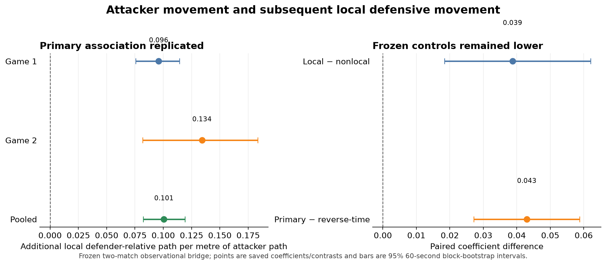
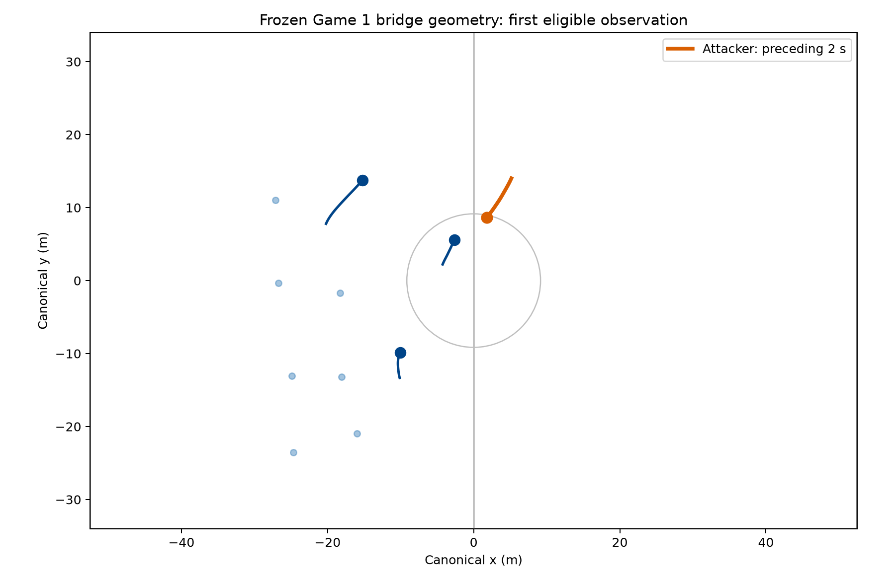

# Moving the Defense

**Measuring Defensive Responses to Attacking Movement in Football**

In football we often say an attacker pulled a defender away, pinned a full-back, or forced a line to adjust. Tracking data records where players moved, but not why. **Moving the Defense** builds the measurement foundation needed to test those claims without treating movement as proof of tactical intent.

The formal research question is:

> **How can tracking data measure defensive responses to attacking movement in open-play football?**

The motivating football question is:

> **When an attacker does not receive the ball, can we measure what they made the defence do?**

The governing distinction is:

> **Football concept ≠ tracking measurement ≠ theoretical mechanism.**

**Current status — FINAL BRIDGE A; FINAL FOOTPRINT A; FINAL RESPONSE FORM B:** across both Metrica sample matches, greater attacker movement was associated with greater subsequent defender movement relative to the defensive unit, localized more strongly among near than middle defender ranks. Signed movement in the attacker's preceding direction showed the same positive near-minus-middle pattern in both matches, but the held-out paired excess over the temporal control did not exclude zero. These are observational geometric associations, not causal estimates or tactical labels.

## Why this is hard

If a whole back line shifts five metres left, every defender moves substantially without necessarily changing their relationship to the unit. If one defender steps while the others hold or drop, that individual change can be hidden inside the shared shift. Nearby defenders may also be moving before the attacker acts, and movement is serially dependent through time. A temporal association still does not establish causation, marking responsibility, or tactical success.

The project separates three observable pieces:

1. **Attacking movement:** how far an attacker travels during a fixed interval, without using the later defensive outcome to define it.
2. **Collective defensive movement:** how the other defending outfield players move as a unit.
3. **Local defensive movement relative to the unit:** how much a nearby defender moves differently from that collective reference in the following interval.

For focal defender $d$,

$$
\mathbf r_d(t)=\mathbf x_d(t)-\mathbf c_{-d}(t),
$$

where $\mathbf c_{-d}(t)$ is the centroid of the other available defending outfield players, excluding the goalkeeper. The accumulated path of $\mathbf r_d(t)$ is a replicated geometric primitive. It measures **how much a defender moved differently from the rest of the defensive unit**; it does not say why.


The bridge test uses non-overlapping windows:

```text
strictly prior defensive context      attacker movement       subsequent defender movement
            [-4 s, -2 s]                  [-2 s, 0 s]                    [0 s, +2 s]
```

This ordering keeps the adjustment context strictly before the attacker exposure and measures the defensive geometry only afterward.

## Main result: a replicated observational bridge

The frozen two-match test classified **FINAL BRIDGE A**.

> **Greater observed attacker movement was associated with greater subsequent local defensive movement relative to the defensive unit, beyond prespecified strictly prior defensive-motion context.**

The association replicated across the two Metrica sample matches under the frozen within-provider bridge protocol.

Game 2 was conditionally held out for this bridge relationship and was executed unchanged after the Game 1 development result; it was not pristine or untouched for all earlier project work.

The pooled coefficient was **0.100592 metres of additional local defender-relative path per metre of attacker path** (95% blocked-bootstrap interval **[0.082406, 0.119233]**). In plain language, the model estimated roughly **10 centimetres more subsequent local defensive movement for each additional metre the attacker travelled**, conditional on the specified earlier defensive-motion context.

That is an observational geometric association—not evidence that the attacker caused the movement or that the defender made a particular tactical decision.



| Estimate | Coefficient or contrast | 95% blocked-bootstrap interval |
|---|---:|---:|
| Game 1 local attacker path | 0.095957 m/m | [0.075594, 0.114331] |
| Game 2 local attacker path | 0.134222 m/m | [0.081738, 0.183570] |
| Pooled local attacker path | 0.100592 m/m | [0.082406, 0.119233] |
| Pooled local minus nonlocal control | 0.038738 | [0.018392, 0.062082] |
| Pooled primary minus reverse-time placebo | 0.042994 | [0.027143, 0.058787] |
| Pooled top-1%-trimmed local estimate | 0.099103 m/m | [0.079920, 0.118125] |

The primary estimate was positive in both matches. The local relationship exceeded both a farthest-three-attacker control and a reverse-time placebo in pooled paired comparisons. Removing the most extreme 1% of attacker-path observations barely changed the pooled estimate.

- **Local versus nonlocal:** the local coefficient was larger than the farthest-three-attacker control, arguing against the result being only shared match activity.
- **Forward versus reverse time:** the primary coefficient was larger than the reverse-time placebo, supporting the prespecified temporal ordering rather than a symmetric association.



*The geometry panel is the first eligible Game 1 observation under the deterministic protocol—not a hand-selected tactical example or validation label.*

## Validation stack

The bridge rests on several narrower results, each with its own claim boundary:

- **Defender-relative movement:** focal-relative path replicated from Metrica Game 1 to held-out Game 2 and then across seven professional IDSSE matches from one independent provider environment. It is a movement primitive, not tactical response.
- **Attacker movement:** fixed-window signed displacement, path length, and straightness classified A on Game 1 and held-out Game 2, including all frozen 25/10 Hz frequency checks.
- **Contextual expectation:** future defender-relative path was predictably structured, but nearly 90% of the tested gain came from the defender’s own recent movement.
- **Opponent information:** prospectively selected opponent geometry added only a small, mixed predictive increment; nearest-opponent primacy was not established.
- **Final bridge:** the attacker-path association passed every frozen primary, local-versus-control, temporal-placebo, horizon, extreme-exposure, hard-QC, and deterministic-reproduction criterion. All **32/32 hard-QC checks passed**, and all **16/16 governed scientific files reproduced byte-identically**.
- **Response form:** attacker-direction near-minus-middle structure was positive in both matches and pooled data, but Game 2's paired excess over the temporal control crossed zero; the frozen final classification is **B**.

## What failed—and changed the project

Negative results changed the research direction rather than being hidden:

- a reception-anchored relational-validation route classified **C** because shifted controls and ordinary active-play movement reproduced the apparent effects;
- speed-valley segmentation retained useful lower-speed geometry but fragmented too often;
- a prominence filter reduced fragmentation but created unacceptable merging;
- a two-dimensional change-point method fragmented almost everything at its frozen minimum duration;
- continuation innovation did not validate a universal defensive-response onset.

These failures argued against forcing football into universal states or post-hoc episode boundaries. The successful bridge instead uses continuous fixed-window geometry and prespecified controls.

## What this result does not show

The current evidence does **not** establish:

- attacker causation or influence;
- marking, assignment, responsibility, or attention;
- pinning, dragging, tracking, covering, handoffs, or another tactical label;
- whether the defender’s movement was correct, successful, or valuable;
- relational reconfiguration as a validated construct;
- gravity or off-ball player value;
- space creation, positional-versus-functional play, or energy expenditure;
- general validity in professional football;
- bridge portability beyond the two Metrica sample matches.

Metrica Sample Game 3 remains untouched.

## Current frontier

The evidence ladder is conditional:

```text
football question
  → measurable attacker movement
  → measurable defender movement relative to the unit
  → contextual expectation
  → opponent association
  → tactical interpretation
  → attacker attribution
  → attacking value
```

The next legitimate question is not whether this coefficient is a value metric. The unchanged spatial footprint has now replicated within the two Metrica sample matches. Current steps are:

1. preserve the completed observational footprint and its inference limits;
2. preserve the completed mixed directional response-form result and its temporal-control caveat;
3. seek external/native-frequency attacker-to-defender and footprint replication;
4. only later revisit football concepts and off-ball influence.

Potential later applications include defensive-style profiling, opponent-specific analysis, scouting descriptions, analyst-facing clip surfacing, and video indexing. These are research directions, not current products or validated claims.

## Read and reproduce

- [Project explainer](docs/project_explainer.md) — football-first account of the problem and research path.
- [Claim-status ledger](docs/claim_status.md) — authoritative current claim boundaries.
- [Attacker representation protocol](docs/protocols/attacking_continuous_movement_v1.md), [Game 1 result](docs/results/attacking_continuous_movement_game1_v1.md), and [held-out Game 2 result](docs/results/attacking_continuous_movement_game2_v1.md).
- [Game 1 bridge development result](docs/results/attacker_defender_bridge_game1_v1.md).
- [Final bridge result](docs/results/attacker_defender_bridge_game2_v1.md) — full held-out and pooled result.
- [Frozen bridge protocol](docs/protocols/attacker_defender_bridge_v1.md) — prespecified design and criteria.
- [Spatial-footprint protocol](docs/protocols/spatial_defensive_response_footprint_v1.md), [Game 1 development result](docs/results/spatial_defensive_response_footprint_game1_v1.md), [unclassified Game 2 result](docs/results/spatial_defensive_response_footprint_game2_v1.md), and [pooled/final result](docs/results/spatial_defensive_response_footprint_final_v1.md).
- [Local response-form protocol](docs/protocols/local_defensive_response_form_v1.md), [Game 2 result](docs/results/local_defensive_response_form_game2_v1.md), and [pooled/final B result](docs/results/local_defensive_response_form_final_v1.md).
- [Research log](docs/research_log.md) — complete chronology, including rejected ideas.
- [Research roadmap](docs/research_roadmap.md) and [Sloan-readiness assessment](docs/sloan_readiness.md).
- [Reproducibility guide](docs/reproducibility.md) — environments, data layout, and execution paths.
- [Documentation guide](docs/README.md) — routes for practitioners, technical reviewers, and collaborators.

Protocols were frozen before governed results; the Game 2 bridge ran unchanged; 60-second block bootstrap resampling preserved temporal dependence; all 32 final hard checks passed; and all 16 governed scientific files reproduced byte-identically. Code, tests, reports, and derived results are version-controlled, while provider data remain subject to their source licences.

Data roles:

- Metrica Sample Game 1 — development;
- Metrica Sample Game 2 — conditionally bridge-held-out replication;
- seven IDSSE matches — external validation of defender-relative movement and earlier predictive work, not the final bridge;
- Metrica Sample Game 3 — untouched.

Code and documentation are released under the [MIT License](LICENSE). Provider data remain subject to their source terms.
