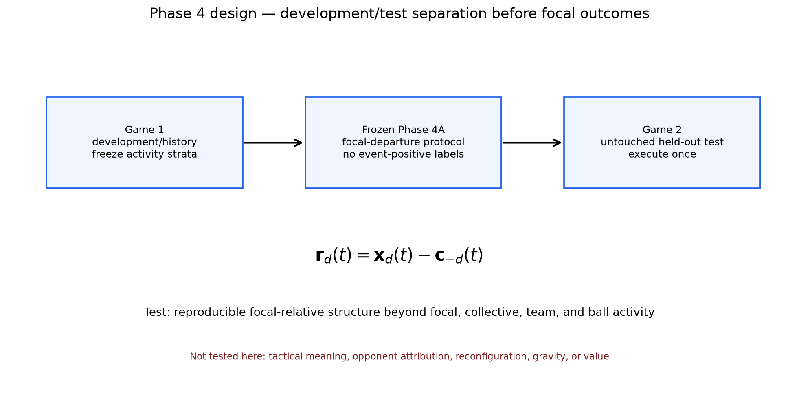
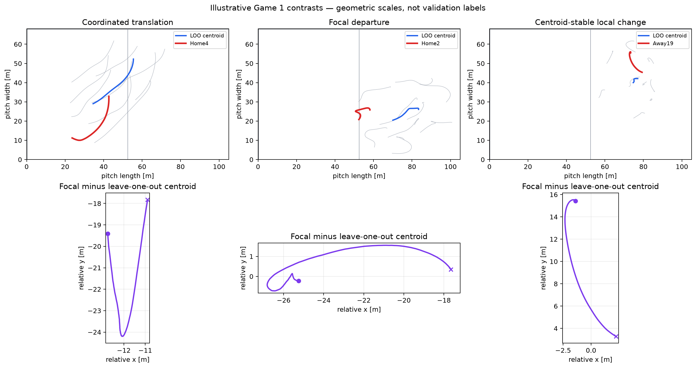

# Asking Questions

**Asking Questions** is a soccer-tracking research project with one formal primary research question:

> **How can tracking data measure defensive responses to attacking movement in open-play football?**

Its motivating football question is more intuitive: **When an attacker does not receive the ball, can we measure what they made the defense do?** A downstream translation question asks whether concepts such as pinning, dragging, tracking, covering, handing off, and stretching can eventually be translated into validated, interpretable tracking patterns. That translation is a later research problem, not an established capability.

“Defensive response” is a broad behavioral umbrella: observable individual or collective defensive behavior occurring in the context of attacking positioning or movement. Tracking records positions and movement—not cognition, attention, responsibility, instruction, intention, decisions, or psychological workload. Association, attribution, causation, and value are separate evidentiary levels.

## Current empirical foundation

The current validated foundation is **focal departure from collective defensive motion**:

$$
\mathbf r_d(t)=\mathbf x_d(t)-\mathbf c_{-d}(t),
$$

where $\mathbf x_d(t)$ is an outfield defender’s physical pitch position and $\mathbf c_{-d}(t)$ is the centroid of the other available defending outfield players, excluding the goalkeeper.

Phase 4B tested this quantity under the frozen Phase 4A protocol. The supported claim is deliberately narrow:

> **Focal-relative path is a reproducible focal-versus-collective geometric primitive with stable activity-context structure in these two sample matches.**

All 9/9 frozen activity cells met the compatibility rule, activity relationships retained direction, and every frozen window/smoothing sensitivity preserved the qualitative result. Focal departure nevertheless remains substantially associated with generic activity; focal absolute-path correlations were 0.541 and 0.462. Phase 4B did not estimate an activity-free effect or establish a tactical response.



## Where the project stands

- **Game 1 is development/history.** It supported dataset exploration and a sequence of deliberately narrow construct diagnostics.
- **Game 2 completed the first held-out validation.** Phase 4B executed the unchanged frozen protocol and is closed.
- **Phase 4B validates geometry only.** It does not establish pinning, dragging, tracking, covering, handoffs, tactical defensive response, attacker attribution, or value.
- **Relational reconfiguration remains unvalidated.** Phase 3 did not distinguish it from general event-associated activity.
- **Gravity and off-ball value are downstream hypotheses.** No gravity, attention, responsibility, ambiguity, recovery-burden, or player-value metric exists.

## The larger “Asking Questions” hypothesis

In soccer language, an attacking position, run, or rotation can “ask a question” by creating a problem the defense may need to solve. The long-term hypothesis is that some attacking actions are systematically associated with observable defensive responses even without a reception or immediate space gain. Attribution and causation require later evidence.

The current inference chain is conditional:

**physical movement → collective defensive movement → individual/local behavior relative to collective movement → contextual expectation → defensive response → attacker association → attribution → attacking value**

Every arrow can fail. A successful project may stop after establishing—or rejecting—a useful geometric primitive.

## Major findings and failures

### Descriptively established in Sample Game 1

- A whole-team or leave-one-out centroid is a useful baseline for collective translation, but it is not a complete representation of defensive structure.
- Large raw movement can shrink substantially in a collective-relative coordinate frame.
- Small centroid movement can coexist with substantial local and opponent-relative change.
- Pairwise closure, defender absolute approach, attacker approach, collective translation, and defender residual movement are distinct geometric quantities.
- Local configuration change is broader than compression and depends materially on which players define the local set.
- Collective translation and focal-relative movement are distinguishable geometric scales in fixed illustrative cases.
- Generic defensive activity is a major confound for event-anchored relational analysis.



### Weakened or rejected

- The historical mutually exclusive **Structure / Track / Close / Recover** state machine is not supported as the primary representation.
- A nearly fixed attacker-relative Cartesian position is not a general Track primitive.
- Local compression is not a universal or membership-robust description of defensive reorganization.
- Generic persistent multi-channel change overcalls ordinary active play and is not a general reconfiguration detector.
- Receptions are temporal anchors, not positive labels for relational reconfiguration.
- The Phase 3 reception-based matched validation design failed its frozen support criterion and produced a result of **C**.

Phase 3 retained 315 reception candidates but matched only 46 controls (14.6%, below the frozen 70% requirement). Reception windows showed more collective and focal-relative movement, but within-possession shifted anchors reproduced or exceeded the main apparent effects. Pre-anchor activity matching removed those contrasts while retaining only 15 matches. This is both a design limitation and counterevidence against a reception-specific relational signature.


## Why Phase 4 was narrower

Phase 3 attempted to validate an umbrella construct using an indirect event anchor. Phase 4 instead tested one basic geometric primitive on deterministic five-second intervals sampled independently of event outcomes.

The primary quantity was seven-frame-smoothed focal-relative path length. Path length was used because a defender can leave and return, producing little endpoint change despite substantial accumulated relative movement. It replicated geometrically, but tactical meaning remains withheld.

Outcome-blind readiness passes:

| Readiness quantity | Game 1 | Game 2 |
|---|---:|---:|
| Eligible five-second intervals | 422 | 407 |
| Defender-interval observations | 4,220 | 4,070 |
| Smallest frozen activity cell | 74 | 75 |

Full rules are in the [Phase 4 protocol](docs/phase4_focal_departure_validation_protocol.md); the committed outcome is in the [Phase 4B results](docs/phase4b_focal_departure_validation_results.md).

## Translating football concepts

The post-validation program asks whether football ideas such as pinning, dragging, tracking, covering, passing on, stretching, squeezing, overloading, recovering, and decoy movement can be connected to validated tracking signatures. The governing rule is:

> **Football concept ≠ tracking measurement ≠ theoretical mechanism.**

Candidate signatures and their alternatives are specified in the [football-concept translation framework](docs/football_concept_translation_framework.md). Relational reconfiguration is retained as one possible intermediate form of defensive response, not the project's single central phenomenon, and remains unvalidated.

## Evidence levels

This repository distinguishes:

- **Observed:** directly present in tracking/event files.
- **Calculated:** a reproducible geometric or statistical quantity.
- **Interpreted:** a soccer-readable description consistent with the geometry.
- **Hypothesized:** a proposition requiring a future test.
- **Rejected or falsified:** an operationalization or design contradicted by its diagnostic or frozen test.

See the central [claim-status ledger](docs/claim_status.md) before citing a result.

## Data and reproducibility

The project uses the public [Metrica Sports sample-data repository](https://github.com/metrica-sports/sample-data):

- Sample Game 1: development/history;
- Sample Game 2: completed first held-out validation.

Raw files belong under `data/metrica_sample_game_1/` and `data/metrica_sample_game_2/`. The entire `data/` directory is ignored except for `.gitkeep`. Game 2 checksums are frozen in the Phase 4 JSON config.

Coordinates are converted from provider-normalized values to a documented 105 × 68 m pitch without clipping. Earlier notebooks retain raw normalized coordinates where that was the phase’s explicit scope. Tracking is 25 Hz. Derivative notebooks use documented centered 5/7/9-frame smoothing; Phase 4 freezes a centered seven-frame primary with 5/9-frame sensitivity and no interpolation.

```bash
python3 -m venv .venv
source .venv/bin/activate
python -m pip install -r requirements-phase0.txt
jupyter notebook
```

Recommended execution order is chronological only when reconstructing history. Phase 4B is complete. Future data roles are prospectively separated in the [post–Phase 4 data strategy](docs/post_phase4_data_strategy.md); no additional tracking dataset has been inspected for the next phase.

Reproducibility seeds and protocol sources of truth:

- Phase 3: [`config/phase3a_validation_protocol.json`](config/phase3a_validation_protocol.json), seed `20260828`;
- Phase 4: [`config/phase4a_focal_departure_validation_protocol.json`](config/phase4a_focal_departure_validation_protocol.json), seed `20260829`.

## Reading guide

- [Project explainer](docs/project_explainer.md) — verbal explanation in soccer and technical language.
- [Claim-status ledger](docs/claim_status.md) — what is established, provisional, rejected, or hypothetical.
- [Conceptual framework](docs/conceptual_framework.md) — equations, terminology, and construct history.
- [Football-concept translation framework](docs/football_concept_translation_framework.md) — disciplined bridge from football hypotheses to observable consequences.
- [Post–Phase 4 data strategy](docs/post_phase4_data_strategy.md) — prospective roles for external replication and later modeling data.
- [Research roadmap](docs/research_roadmap.md) — conditional path and legitimate stopping points.
- [Phase 4 protocol](docs/phase4_focal_departure_validation_protocol.md) — current frozen empirical design.
- [Research log](docs/research_log.md) — full chronological audit trail.
- [Documentation index](docs/README.md) — reading routes for different audiences.

## Repository map

```text
config/      frozen machine-readable research protocols
docs/        current explanations, protocols, claims, roadmap, and audit trail
figures/     reproducible documentation figures and generation code
notebooks/   executed diagnostics and validation notebooks by phase
references/  verified bibliography and acknowledged literature gaps
data/        local ignored raw Metrica files
```

## Submission horizon

The repository now contains one successful narrow held-out geometric validation, not yet a conference-level tactical contribution. Before manuscript drafting becomes rational, the primitive must generalize across matches/providers and earn a football interpretation beyond generic differential movement. See [Sloan-readiness gaps](docs/sloan_readiness.md).

## License

Code and documentation are released under the [MIT License](LICENSE). Metrica sample data remain subject to the source repository’s terms.
