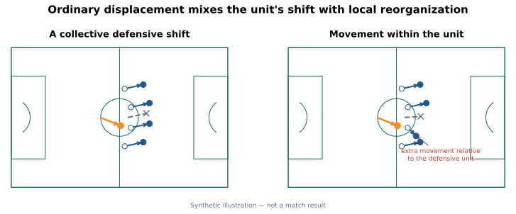
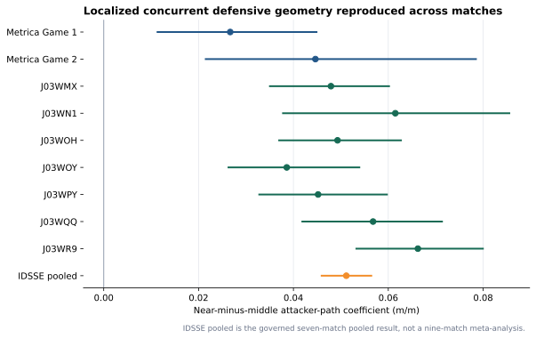
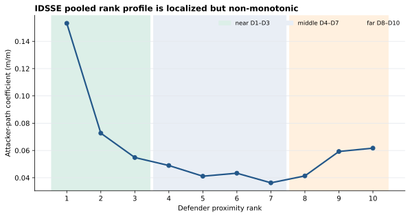
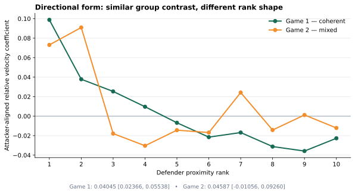
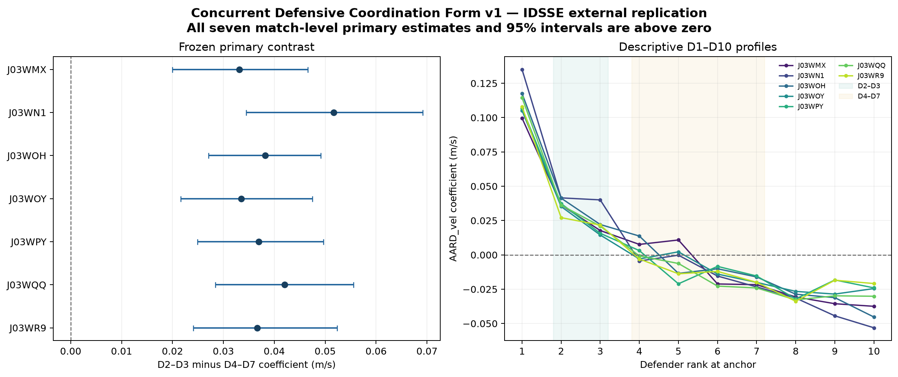

# Moving the Defense

**Measuring Defensive Responses to Attacking Movement in Football**

> **When an attacker moves without receiving the ball, can tracking data identify the defensive reorganization associated with that movement?**

Football language is full of claims that a run pinned a defender, pulled a line apart, or created space. Tracking data records where everyone moved, but it does not tell us why they moved. **Moving the Defense** is building the measurement foundation needed to test those ideas without treating movement as proof of tactical intent.

## The football problem

Ordinary defender displacement mixes together two different things:

- a **collective shift**, when the defensive unit moves together; and
- **movement within the defensive structure**, when one or more defenders move differently from the unit.

If a back line slides five metres left, every defender moves even if its internal organization barely changes. If one defender steps while the others hold or drop, that local adjustment can be hidden inside the shared shift.



*Synthetic illustration—not a match example or validation result. The project subtracts the contemporaneous movement of the other defending outfield players to describe how one defender moved differently from the unit.*

This geometric measurement is deliberately narrower than a football interpretation. It observes movement within the defensive unit; it does not identify marking responsibility, attention, tactical intent, or causation.

## What has been demonstrated

The strongest current result is a replicated observational association between attacker movement and localized concurrent defensive geometry.

> **Greater attacker movement was associated with a stronger concurrent defender-relative movement coefficient among the nearest three defenders than among the middle four defenders, conditional on the frozen model.**

The result was supported in Metrica Sample Game 1, heldout Metrica Sample Game 2, and all seven matches in an independent IDSSE provider environment.



The governed pooled IDSSE near-minus-middle estimate was **0.05115 metres per metre**, with 95% interval **[0.04595, 0.05642]**. An intuitive—but still observational—translation is that each additional metre of attacker movement was associated with about **5.1 centimetres more concurrent defender-relative movement among the three nearest defenders than the middle group**, conditional on the specified model.

The pattern is not a simple decline with distance. Nearby ranks were elevated relative to the middle group, but the pooled rank profile was non-monotonic and the far ranks rebounded.



This matters because two off-ball movements of similar length can coincide with very different defensive behavior. One may be handled mainly by one defender, another may coincide with broader movement within the unit, and another may be largely ignored. Measuring those differences is a prerequisite for studying when and how off-ball movement relates to defensive structure.

## Important boundary: reorganization is not opportunity

The first prospectively defined downstream test was negative. In Metrica Game 1, greater focal-local defensive geometric change was **not** associated with relatively improved nearest-defender separation for other initially local attackers:

- Opportunity Redistribution v1: $\beta_D=-0.02407$
- 95% interval: **[-0.09392, 0.04776]**

The robustness results did not rescue the hypothesis. This is an important scientific boundary: measurable defensive reorganization has **not** been shown to imply teammate separation, space creation, tactical success, gravity, or attacking value.

## Current directional evidence

A newer experiment asks whether nearby movement within the defensive unit is specifically aligned with the attacker's concurrent direction of travel.

| Match | D2–D3 minus D4–D7 | 95% interval | Frozen status |
|---|---:|---:|---|
| Metrica Game 1 | 0.04045 m/s | [0.02366, 0.05538] | Development coherent |
| Metrica Game 2 | 0.04587 m/s | [-0.01056, 0.09260] | Replication mixed |



Game 2 had a similar group-level point estimate, but substantially greater uncertainty and a less orderly individual-rank profile. The point direction replicated; the prospectively required interval support did not within Metrica.

The unchanged construct then passed its prospective external test across all seven governed IDSSE matches: every primary estimate was positive with an interval strictly above zero, and every 1.5 Hz sensitivity remained positive. The seven primary contrasts ranged from **0.03317 to 0.05165 m/s**. This is external support for the observational directional geometry—not for tactics, reaction, or attacker influence.



A subsequent frozen expectation test asked whether defending-side identity within each match improved heldout prediction beyond attacker movement and compact spatial context. It did **not**: E2b worsened E1 macro MAE by 0.0616%, improved 0/7 matches, and failed both the paired interval and shifted-label gates. The formal result is **NOT SUPPORTED**. Spatial context itself produced a small 0.535% improvement over the movement baseline in all seven matches, but this does not establish a stable team signature or tactical style.

## What the evidence does not mean

The current results do **not** establish:

- attacker causation or influence;
- defender attention, reaction latency, marking, assignment, or responsibility;
- pinning, dragging, tracking, covering, handoffs, or another tactical label;
- space creation, tactical success, defensive quality, gravity, or off-ball value;
- one universal response that every defense should produce; or
- tactical or causal validity of the externally replicated coordination form.

Defensive behavior is tactical and team-dependent. More defensive movement is not automatically better attacking play, and less movement is not automatically successful defending.

## How the research reached this point

The project has retained negative and mixed findings rather than optimizing them away:

- A reception-anchored relational-validation route classified **C** because ordinary active-play movement and shifted controls reproduced its apparent effects.
- Attacker-only speed-valley segmentation retained lower-speed movement but fragmented too often.
- A prominence filter reduced fragmentation but caused unacceptable merging.
- A two-dimensional change-point method fragmented almost every trajectory at its frozen minimum duration.
- Constant-velocity continuation innovation did not validate a universal response-onset instant.
- Opponent information added only a small, mixed predictive increment beyond the non-opponent baseline.
- Opportunity Redistribution v1 was negative.
- Defensive Coverage Redistribution v1 was rejected prospectively; its narrower v2 successor was invalid before estimation because complete support left its mandatory period-2 model column constant. No matching-geometry effect was estimated.
- Game 2 directional coordination-form replication was mixed before the unchanged construct was supported in all seven governed IDSSE matches.
- The frozen match-side expectation increment was not supported: it worsened heldout prediction in all seven IDSSE matches.

Those results moved the project away from universal state labels and post-hoc episode selection toward continuous, fixed-window geometry with prospective controls and explicit inference limits.

## Current scientific frontier

The project is moving from:

> **Can defensive reorganization associated with attacking movement be measured reproducibly?**

toward:

> **Which observable context explains variation in that geometry without prematurely treating match-side identity as stable tactical style?**

A longer-term possibility is to judge observed reorganization relative to what a particular defense normally does in comparable situations. That contextual opponent model has not been built or validated.

The evidence ladder remains conditional:

```text
attacker movement
  → defender movement relative to the unit
  → contextual expectation
  → opponent association
  → tactical interpretation
  → attacker attribution
  → attacking value
```

Every arrow can fail. The next question is not simply whether nearby defenders move again, and the current coefficients are not player-value metrics.

## Reproducibility and data

Scientific protocols were frozen before governed results. Implementations, focused tests, machine-readable derived outputs, provenance ledgers, and result reports are version-controlled. Block bootstrap procedures preserve temporal grouping, and governed executions are independently reproduced byte-for-byte where specified.

Data roles:

- **Metrica Sample Game 1:** development;
- **Metrica Sample Game 2:** heldout replication for governed constructs;
- **seven IDSSE matches:** external replication of established geometric measurements in one independent provider environment;
- **Metrica Sample Game 3:** untouched.

Provider data remain subject to their original licences and are not redistributed here.

## Repository guide

Start here:

- [Project explainer](docs/project_explainer.md) — football-first account of the question and research path.
- [Claim-status ledger](docs/claim_status.md) — authoritative current claim boundaries.
- [Research roadmap](docs/research_roadmap.md) — completed evidence and current priorities.
- [Research log](docs/research_log.md) — chronological freezes, executions, negative results, and reinterpretations.
- [Reproducibility guide](docs/reproducibility.md) — environment, data layout, and execution paths.
- [Documentation guide](docs/README.md) — reading paths for practitioners, technical reviewers, and collaborators.

Key result trails:

- [Concurrent geometry: Game 1](docs/results/concurrent_attacker_defensive_geometry_game1_v1.md), [heldout Game 2](docs/results/concurrent_attacker_defensive_geometry_game2_v1.md), and [seven-match IDSSE replication](docs/results/concurrent_attacker_defensive_geometry_idsse_v1.md)
- [Opportunity Redistribution v1 negative result](docs/results/opportunity_redistribution_game1_v1.md)
- [Coordination Form v1: Game 1](docs/results/concurrent_defensive_coordination_form_game1_v1.md), [Game 2 mixed replication](docs/results/concurrent_defensive_coordination_form_game2_v1.md), and [seven-match IDSSE external replication](docs/results/concurrent_defensive_coordination_form_idsse_v1.md)
- [Final attacker-to-defender bridge result](docs/results/attacker_defender_bridge_game2_v1.md)
- [Final spatial footprint result](docs/results/spatial_defensive_response_footprint_final_v1.md)
- [Final directional response-form result](docs/results/local_defensive_response_form_final_v1.md)

The figure source is [reproducible](src/generate_readme_research_visuals.py) and reads only closed governed artifacts for empirical plots. Code and documentation are released under the [MIT License](LICENSE).
