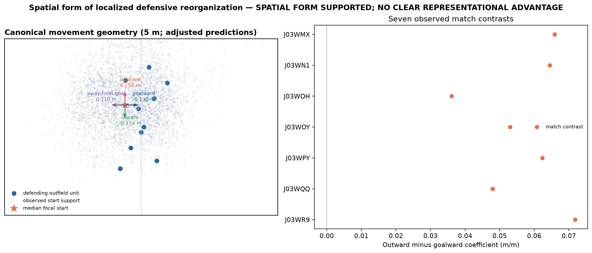

# Measuring Localized Defensive Reorganization Associated with Off-Ball Movement in Football

*Working paper from the `moving-the-defense` repository.*

> **Reproduce the current paper:** start with [REPRODUCE.md](REPRODUCE.md).
> It is the short human-first path; [the technical reproducibility guide](docs/reproducibility.md)
> retains the full protocol and audit detail.

**How is off-ball movement associated with reorganization within a defensive
unit, and how does that association vary with an attacker's starting geometry
and movement direction?**

Football analysts often say that a movement pulled a defender away, moved a
line, or opened space. Tracking data shows where players went, but it does not
show why. This project measures a narrower, observable question: after
separating a shared defensive shift from movement within the defensive unit,
which attacker movements are associated with more localized defensive
reorganization?

## The football problem

Raw defender displacement confounds a **collective shift**—the defensive unit
moving together—with movement **within** the defensive structure, where one or
more defenders move differently from the unit. The measurement compares each
defender's movement with the contemporaneous movement of the other defending
outfield players, then compares the nearby three defenders with a
middle-ranked reference group. It is geometry, not a claim about marking,
responsibility, attention, intent, or causation.

*Synthetic illustration, not a match example or validation result.*

## Headline findings

### Time-ordered localized reorganization

Preceding attacker movement was associated with stronger subsequent
defender-relative movement among nearby than middle-ranked defenders.

| Environment | Near-minus-middle association | Frozen interval |
|---|---:|---:|
| Metrica Games 1–2, pooled | 0.05029 m/m | [0.03433, 0.06858] |
| IDSSE, seven matches | 0.06115 m/m | [0.05579, 0.06681] |
| IDSSE paired forward-minus-reverse excess | 0.02455 m/m | [0.01932, 0.02985] |

All seven IDSSE match-specific primary signs were positive, as were all seven
paired forward-minus-reverse signs. The reverse-time comparison retained
directional structure itself, while the correctly ordered association exceeded
it under the predeclared paired comparison. This supports a time-ordered
observational association; it does not establish that an attacker caused a
response.

*Panel A is an explanatory, deterministic heldout Metrica Game 2 passage. The
defensive unit shifts goalward and laterally; D2 and D3 move less goalward than
their unit reference, whereas D1 moves more goalward. Panels B–C show the
governed Metrica and IDSSE evidence. The example assigns neither marking nor
cause.*

### Starting geometry matters

In the frozen seven-match IDSSE Context v1 study, localized reorganization was
larger when an attacker started less far goalward relative to the defensive
unit and closer to the ball:

| Starting relationship | Association | 97.5% CI |
|---|---:|---:|
| Attacker goalward offset relative to the unit | −0.010161 m/m | [−0.011805, −0.008499] |
| Attacker–ball distance | −0.007533 m/m | [−0.008864, −0.006245] |

Both had the same direction in 7/7 match fits and 7/7 leave-one-match-out fits;
their frozen trims passed. These are observed starting relationships, not
explanations for why a defensive unit moved.

### Outward and goalward movement are not geometrically equivalent

At equal movement magnitude and comparable frozen starting geometry, **outward**
attacker displacement was associated with greater subsequent localized
defender-relative reorganization than **goalward** displacement:

| Environment | Outward minus goalward | 95% CI | Direction consistency |
|---|---:|---:|---|
| IDSSE | 0.056856 m/m | [0.051358, 0.062430] | 7/7 match; 7/7 LOMO positive |
| SkillCorner Open Data | 0.048883 m/m | [0.042940, 0.054707] | 9/9 match; 9/9 LOMO positive |

The frozen IDSSE illustration translates a 5 m outward-versus-goalward
comparison into approximately **0.284 m** more subsequent localized
defender-relative reorganization under equal path magnitude and frozen context.
Movement toward goal and movement associated with reorganization of a defensive
unit are not the same geometric phenomenon. This is not a claim that outward
movement is better, creates value, or should be preferred.

*Closed IDSSE Spatial Form v1 figure. Left: frozen 5 m canonical geometric
descriptions. Right: all seven match-specific outward-minus-goalward contrasts
are positive. No cross-provider pooled estimate was created.*

## Why a football analyst might care

Traditional movement analysis often privileges progression toward goal. These
results show that the direction associated with localized defensive
reorganization is not identical to goalward progression. A measurement layer
that separates collective defensive movement from internal reorganization can
help analysts surface and contextualize off-ball actions for later video and
tactical review. It does not judge an action, identify its cause, or measure
player value.

## Response scale and mechanism boundary

A secondary, nonclassifying centroid result was positive: the frozen 5 m
goalward-versus-outward defensive-centroid translation contrast was **2.962709
m** [2.870720, 3.048322], positive in 7/7 match and 7/7
leave-one-match-out fits.

That does not establish a mechanism. The primary inward-narrowing/defensive
width hypothesis was **MIXED**: **0.134003 m** [−0.006622, 0.273430], with only
5/7 positive match contrasts. Different geometric response scales are visible,
but the proposed inward-narrowing mechanism was not established. This branch is
closed for the Sloan paper rather than retuned.

## What the evidence does **not** establish

- attacker causation or influence;
- defender attention, reaction latency, marking, assignment, or responsibility;
- pinning, dragging, tracking, covering, handoffs, or another tactical label;
- space creation, teammate separation, tactical success, defensive quality,
  gravity, or off-ball value; or
- a single response every defensive unit should produce.

A predeclared Metrica Game 1 Opportunity Redistribution test was negative: it
did not support equating localized defensive geometry with improved
nearest-defender separation for other attackers. Context-adjusted Defensive
Reorganization Departure (DRD) remains **MIXED** and is not used here for
retrieval, ranking, or tactical interpretation.

## Current scientific frontier

The core measurement question—whether localized defensive reorganization can
be measured reproducibly—has been answered at an observational level. The
frontier is what football mechanisms and consequences underlie the replicated
directional asymmetry, and how the measurement can support analyst workflows
without overinterpretation. Semantic and video validation are important future
directions; artificial-transition work is post-Sloan. No mechanism experiment
is currently underway.

Negative and mixed results remain part of the record: outcome-blind
segmentation fragmentation, the negative teammate-separation test, mixed
coverage geometry, unsupported match-side identity effects, and the mixed
narrowing mechanism. See the [claim-status ledger](docs/claim_status.md) and
[research log](docs/research_log.md).

## Reproduce the paper

**[REPRODUCE.md](REPRODUCE.md)** is the human-first path from data and
environment setup to the paper's compact results and figures. For deeper audit
detail, use the [technical reproducibility guide](docs/reproducibility.md),
frozen [protocols](docs/protocols/), and compact governed
[results](docs/results/).

## Data and external validation

| Data source | Role in this paper |
|---|---|
| Metrica Sample Game 1 | Development environment |
| Metrica Sample Game 2 | Heldout validation and explanatory flagship passage |
| IDSSE / DFL XML | Seven-match external validation environment |
| SkillCorner Open Data | Third, broadcast-derived tracking environment for frozen outward-versus-goalward external replication |
| Metrica Sample Game 3 | Untouched |

SkillCorner Open Data is open source, but this project keeps raw provider files,
row-level data, and reconstructive derivatives local. Public materials include
compact governed results, code, figures, frozen protocols/configurations, and
provenance ledgers. IDSSE is seven matches in one independent provider
environment, not seven providers.

## Repository guide

| If you want to… | Start here |
|---|---|
| **Reproduce the paper** | [REPRODUCE.md](REPRODUCE.md) |
| **Audit research history and claim limits** | [Claim-status ledger](docs/claim_status.md) and [research log](docs/research_log.md) |
| **Continue the research** | [Research roadmap](docs/research_roadmap.md) |
| Understand the football question first | [Project explainer](docs/project_explainer.md) |
| Inspect protocols, results, and reading paths | [Documentation guide](docs/README.md) |

The figure sources are [reproducible](src/generate_readme_research_visuals.py)
and use closed governed artifacts for empirical plots. Code and documentation
are released under the [MIT License](LICENSE).
