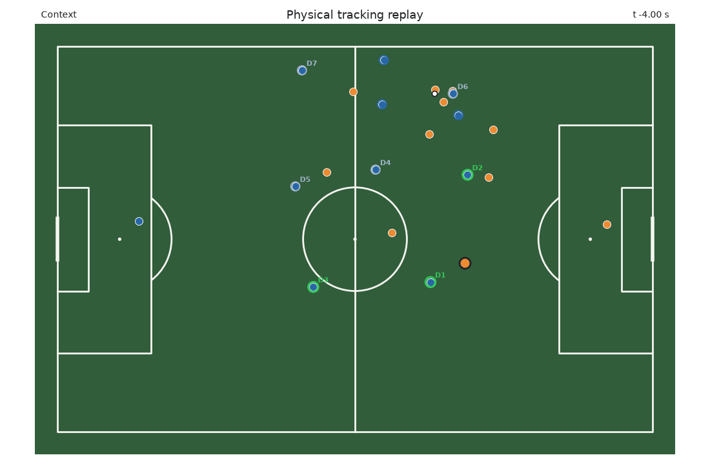
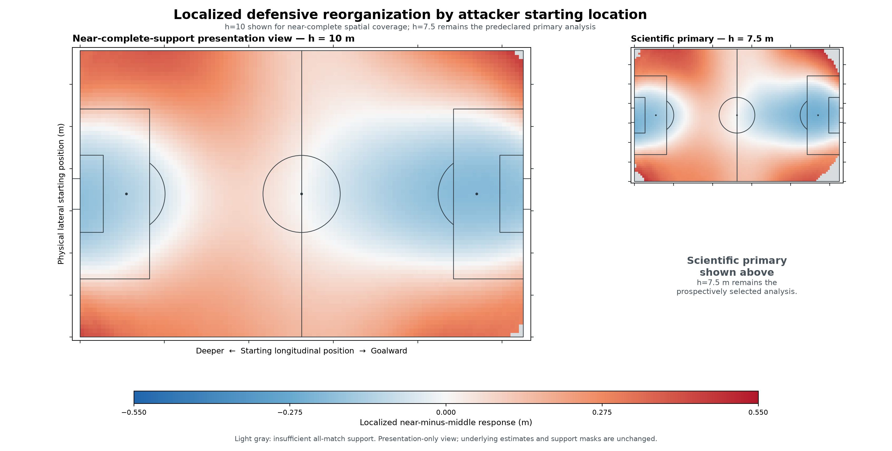

# Off-Ball Movement Direction and Localized Defensive Reorganization in Football

A defence can shift together while nearby defenders also move within the unit. This project measures that second geometry: movement by defenders nearest an off-ball attacker relative to the wider defensive unit. It compares the average accumulated defender-relative path of the nearest three defenders with that of four middle-ranked defenders, with ranks fixed before the defender interval.

**Main finding:** movement away from the pitch centreline (“outward”) was associated with greater subsequent localized defensive reorganization than comparable movement toward goal.

For the prespecified comparison of straight 5 m outward versus straight 5 m goalward movement, holding modeled path magnitude and starting context equal, the contrast was approximately **28 cm in IDSSE** and **24 cm in SkillCorner**. These are differences in the near-minus-middle group-average defender-relative path—not extra movement by each defender.

The directional difference appeared in separate analyses of seven IDSSE and nine SkillCorner matches; every match contrast was positive. The tracking environments were not pooled.

The measurement could organize candidate passages for later video review; its football interpretation and review usefulness remain unvalidated. It does not establish causation, marking responsibility, tactical effectiveness, or attacking value.

**Reproduce and inspect:** start with [REPRODUCE.md](REPRODUCE.md), or browse the [frozen protocols](docs/protocols/), [public result summaries](docs/results/), and [tests](tests/).

## Main finding: directional replication

**Primary evidence — separate directional analyses**

*Separate pooled estimates are shown for IDSSE and SkillCorner: all 7/7 IDSSE
and all 9/9 SkillCorner match-level outward-minus-goalward contrasts are
positive. No cross-provider pooled estimate was calculated. The figure reports
observational geometry, not value.*

| Environment | Outward minus goalward | 95% CI | Direction consistency |
|---|---:|---:|---|
| IDSSE | 0.056856 m/m | [0.051358, 0.062430] | 7/7 match; 7/7 leave-one-match-out positive |
| SkillCorner Open Data | 0.048883 m/m | [0.042940, 0.054707] | 9/9 match; 9/9 leave-one-match-out positive |

The IDSSE modeled comparison corresponds to approximately **0.284 m** greater
near-minus-middle group-average accumulated defender-relative path for a 5 m
outward rather than 5 m goalward displacement, under equal path magnitude and context.
Defensive reorganization was therefore not simply aligned with movement toward
goal. This does not mean outward movement is better, more valuable, or a
preferred tactical action.

## What the measurement separates

Raw defender movement combines collective unit shift and movement within the
unit. The measurement separates these by expressing each outfield defender's
movement relative to the contemporaneous movement of the other nine defending
outfield players. D1–D3 and D4–D7 are proximity groups fixed before the defender
interval, not inferred marking assignments. Attacker movement is measured over
the preceding two seconds; defender-relative path over the subsequent two seconds.

**Supporting evidence — temporal association and reverse-time comparison**

*Panel A illustrates one fixed passage; panels B–C report statistical evidence.
The fixed Metrica Game 2 passage contrasts absolute defender paths with net
defender-relative displacement over the same subsequent interval. The statistical
outcome is accumulated defender-relative path, not the illustrated net arrows.*

### Illustrative replay

This six-second Metrica Game 2 replay illustrates the fixed passage used in
Figure 1. It shows tracking geometry only; it is not human validation or
independent evidence of tactical meaning.

**Run or reproduce locally:** use the output-free
[tracking replay notebook](notebooks/tracking_animation_prototype.ipynb) with
the public Game 2 files available locally.

Tracking data: [Metrica Sports sample data](https://github.com/metrica-sports/sample-data).
Animation rendered by Moving the Defense; no original match video is included.

### Temporal results

Preceding attacker movement was associated with greater subsequent defender
movement relative to the defensive unit among the nearest defenders than the
middle group. Here, **m/m** expresses the near-minus-middle group-average
accumulated defender-relative path contrast in metres per metre of attacker
movement, not additional movement by every defender.

| Environment | Near-minus-middle association | Interval |
|---|---:|---:|
| Metrica Games 1–2, pooled | 0.05029 m/m | [0.03433, 0.06858] |
| IDSSE, seven matches | 0.06115 m/m | [0.05579, 0.06681] |
| IDSSE forward-minus-reverse difference | 0.02455 m/m | [0.01932, 0.02985] |

All seven IDSSE primary estimates and all seven forward-minus-reverse
differences were positive. Reverse-time structure also remained positive: the
evidence is that the correctly ordered association exceeded the reverse-time
comparison, not that shared temporal structure disappeared.

## What this could be used for

The measurement could organize candidate passages for later video review.
Its football interpretation and review usefulness remain unvalidated. It can
describe local movement separately from a shared defensive shift, but does not
automatically assign tactical labels, rank players, or measure value.

The contribution is not a new centroid or generic tracking primitive. It is a
prospectively tested and externally replicated temporal measurement of internal
defensive reorganization, combined with a replicated directional difference in
the defensive geometry associated with outward versus goalward off-ball
movement—without requiring inferred marking assignments or a value model.

## Boundaries and secondary findings

### Collective translation and width

Goalward movement showed a strong **secondary, nonclassifying** association with
collective defensive translation: the frozen 5 m goalward-versus-outward
contrast was 2.962709 m [2.870720, 3.048322], positive in 7/7 match and 7/7
leave-one-match-out fits.

The proposed inward-versus-outward narrowing mechanism was **MIXED**:
0.134003 m [−0.006622, 0.273430], with 5/7 positive match contrasts. Different
geometric response scales are visible, but the mechanism behind the directional
difference remains unresolved.

### Starting geometry

Localized reorganization tended to be larger when attackers started closer to
the ball and less far goalward relative to the defensive unit.

| Starting relationship | Association | 97.5% CI |
|---|---:|---:|
| Attacker goalward position relative to the unit | −0.010161 m/m | [−0.011805, −0.008499] |
| Attacker–ball distance | −0.007533 m/m | [−0.008864, −0.006245] |

Both relationships had the same direction in all 7/7 match and
leave-one-match-out fits, and passed their predeclared trims. They characterize
where the observed geometry was larger; they do not explain why defenders moved.

### What the evidence does not establish

The evidence does not establish attacker causation or influence; defender
attention, marking, assignment, or responsibility; tactical success; space
creation; player quality; gravity; or off-ball value.

A direct consequence test was negative: Opportunity Redistribution in Metrica
Game 1 estimated `beta_D = -0.02407` [−0.09392, 0.04776]. Under that test,
localized defensive reorganization did not imply improved nearby teammate
separation. A context-adjusted retrieval model also remained **MIXED** after
missing its predeclared application threshold. Negative and mixed findings are
retained in the [claim-status ledger](docs/claim_status.md) and
[research log](docs/research_log.md), not tuned away.

## Additional descriptive spatial view

**Descriptive secondary result — IDSSE only**

An additional descriptive map summarizes the contrast by attacker starting
location.

*The scientific primary remains h=7.5 m, selected by human review of
response-blind support and frozen before response access. Shown here is the
predeclared h=10 m sensitivity as a near-complete-support presentation view;
its Conservative support covers 99.89% of the legal pitch. Its tighter display
scale is presentation-only and does not change the scientific primary. This is
not a significance map or a hotspot test.*

## Data and engineering

| Data source | Role |
|---|---|
| Metrica Sample Game 1 | Open/public development environment |
| Metrica Sample Game 2 | Open/public heldout validation and real explanatory example |
| IDSSE / DFL XML | Seven-match public research release; [IDSSE/DFL Figshare dataset](https://doi.org/10.6084/m9.figshare.28196177.v1), CC BY 4.0 |
| SkillCorner Open Data | Open third, broadcast-derived environment for directional replication |
| Metrica Sample Game 3 | Untouched |

Current publication policy excludes raw provider files and new reconstructive
provider-linked row artifacts without explicit approval; historical tracked
artifacts retain their governed provenance.
Compact governed results, code, figures, protocols, configurations, and
provenance ledgers are public.

## Reproduce, audit, or continue

| Goal | Start here |
|---|---|
| **Reproduce the paper** | [REPRODUCE.md](REPRODUCE.md) |
| Inspect technical reproduction detail | [Technical reproducibility guide](docs/reproducibility.md) |
| **Audit research history and claim limits** | [Claim-status ledger](docs/claim_status.md) and [research log](docs/research_log.md) |
| **Continue the research** | [Research roadmap](docs/research_roadmap.md) |
| Understand the football question | [Project explainer](docs/project_explainer.md) |
| Inspect protocols and results | [Documentation guide](docs/README.md) |

## Current frontier

The next scientific challenge is semantic and applied: determine what these
replicated geometric patterns correspond to in football practice and how
analysts should use them without converting observable reorganization into
unsupported claims of influence or value. Artificial-transition work is a
post-Sloan extension, not a current mechanism search.

Figure sources use closed governed artifacts. Code and documentation are
released under the [MIT License](LICENSE).
