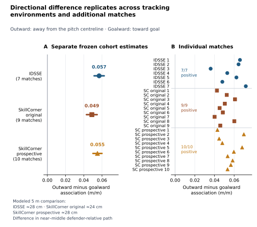
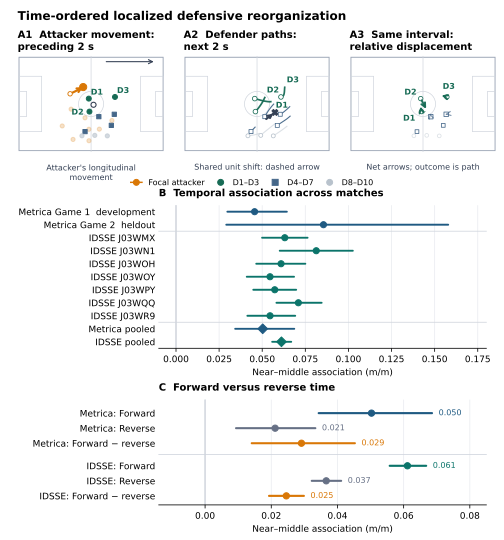
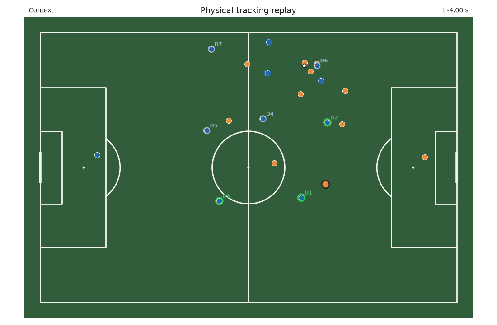
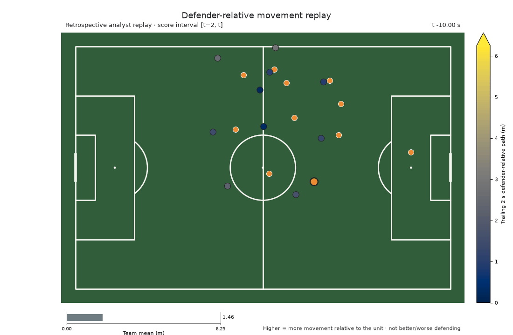
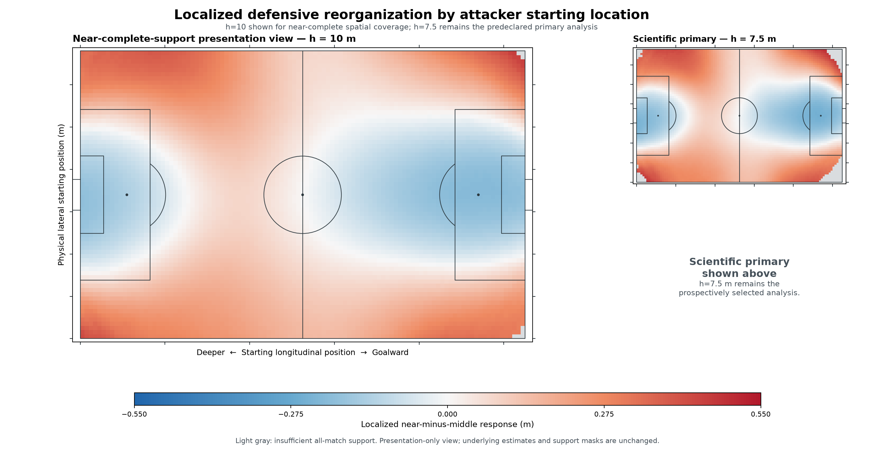

# Off-Ball Movement Direction and Localized Defensive Reorganization in Football

A defence can shift together while nearby defenders also move within the unit. This project measures that second geometry: movement by defenders nearest an off-ball attacker relative to the wider defensive unit. It compares the average accumulated defender-relative path of the nearest three defenders with that of four middle-ranked defenders, with ranks fixed before the defender interval.

**Main finding:** movement away from the pitch centreline (“outward”) was associated with greater subsequent localized defensive reorganization than comparable movement toward goal.

For the prespecified comparison of straight 5 m outward versus straight 5 m goalward movement, holding modeled path magnitude and starting context equal, the contrast was approximately **28 cm in IDSSE**, **24 cm in the original SkillCorner cohort**, and **28 cm in the prospective additional SkillCorner cohort**. These are differences in the near-minus-middle group-average defender-relative path—not extra movement by each defender.

The directional difference appeared in separate analyses of seven IDSSE and nine original SkillCorner matches, then prospectively replicated in ten additional nonoverlapping SkillCorner matches. Every match contrast was positive. The cohorts and tracking environments were not pooled.

The measurement could organize candidate passages for later video review; its football interpretation and review usefulness remain unvalidated. It does not establish causation, marking responsibility, tactical effectiveness, or attacking value.

## SSAC27 submission: reviewer quick path

- **Submission artifact:** [Candidate V1 PDF](submission/SSAC27_abstract_candidate_v1.pdf) and its [manifest](submission/ssac27_abstract_candidate_v1_manifest.json).
- **Canonical text:** [structured abstract and manuscript](docs/manuscript_skeleton.md).
- **Main evidence:** [Figure 1 — temporal measurement](docs/figures/sloan/temporal_footprint_flagship.svg) and [Figure 2 — directional replication](docs/figures/sloan/directional_replication.svg).
- **Reproduction:** [human-first paper guide](REPRODUCE.md), [technical guide](docs/reproducibility.md), and [claim-status ledger](docs/claim_status.md).
- **Public data provenance:** [Metrica Sample Games](https://github.com/metrica-sports/sample-data), [IDSSE/DFL](https://doi.org/10.6084/m9.figshare.28196177.v1), and [SkillCorner Open Data](https://github.com/SkillCorner/opendata).

The two governed figures and the results summarized above are the submission
evidence. Replays, match-review tools, possession context, ball alignment, and
attacker-linked review are exploratory analyst applications. They illustrate
possible workflows but are not additional validation or confirmed paper
results.

## Main finding: directional replication

**Primary evidence — separate directional analyses**



*Separate estimates are shown for IDSSE, original SkillCorner, and the
prospective additional SkillCorner cohort: all 7/7, 9/9, and 10/10 match-level
outward-minus-goalward contrasts are positive. No cross-provider or pooled
19-match estimate was calculated. The figure reports observational geometry,
not value.*

| Environment | Outward minus goalward | 95% CI | Direction consistency |
|---|---:|---:|---|
| IDSSE | 0.056856 m/m | [0.051358, 0.062430] | 7/7 match; 7/7 leave-one-match-out positive |
| SkillCorner Open Data | 0.048883 m/m | [0.042940, 0.054707] | 9/9 match; 9/9 leave-one-match-out positive |
| SkillCorner prospective additional cohort | 0.055007 m/m | [0.050064, 0.060021] | 10/10 match; 10/10 leave-one-match-out positive |

The IDSSE modeled comparison corresponds to approximately **0.284 m** greater
near-minus-middle group-average accumulated defender-relative path for a 5 m
outward rather than 5 m goalward displacement, under equal path magnitude and context.
Defensive reorganization was therefore not simply aligned with movement toward
goal. This does not mean outward movement is better, more valuable, or a
preferred tactical action.

## What the measurement separates

Raw defender movement combines collective unit shift and movement within the
unit. The measurement separates these by expressing each outfield defender's
movement relative to the contemporaneous movement of the other nine defending
outfield players. D1–D3 and D4–D7 are proximity groups fixed before the defender
interval, not inferred marking assignments. Attacker movement is measured over
the preceding two seconds; defender-relative path over the subsequent two seconds.

**Supporting evidence — temporal association and reverse-time comparison**



*Panel A illustrates one fixed passage; panels B–C report statistical evidence.
The fixed Metrica Game 2 passage contrasts absolute defender paths with net
defender-relative displacement over the same subsequent interval. The statistical
outcome is accumulated defender-relative path, not the illustrated net arrows.*

## Exploratory analyst applications — not paper evidence

The following artifacts demonstrate how the measurement could support later
analyst review. They do not change the frozen scientific result or establish
the football meaning, usefulness, or tactical interpretation of the retrieved
passages.

### Illustrative replay



This six-second Metrica Game 2 replay illustrates the fixed passage used in
Figure 1. It shows tracking geometry only; it is not human validation or
independent evidence of tactical meaning.

**Run or reproduce locally:** use the output-free
[tracking replay notebook](notebooks/tracking_animation_prototype.ipynb) with
the public Game 2 files available locally.

Tracking data: [Metrica Sports sample data](https://github.com/metrica-sports/sample-data).
Animation rendered by Moving the Defense; no original match video is included.

### Defender-relative movement replay



This retrospective analyst replay colors defenders by accumulated movement
relative to the other nine defenders over the trailing two seconds. Values are
raw metres shown on one fixed 0–6.25 m scale. Attackers remain blue while only
defender marker fill uses the yellow-to-red score scale; the team meter is the arithmetic
mean across all ten supported defenders. The centered smoother requires raw
tracking just after the displayed time, so this is not a live detector. Missing
ten-player support is shown as unavailable rather than interpolated.
This retrospective trailing player-level visualization analogue is not the
paper's subsequent attacker-specific near-minus-middle inferential outcome.

The replay describes tracking geometry only. It does not diagnose defensive
quality, tactical error, marking, or causal attacker influence. Reproduce it
with the output-free
[defender-relative replay notebook](notebooks/defender_relative_replay_demo.ipynb)
and the public Metrica Game 2 files.

For an analyst-facing walkthrough, see the
[fixed-passage and full-match case study](docs/match_application_case_study.md).
The [local scoring API](docs/replay_scoring_api.md) exposes the same approved
retrospective measurement over normalized tracking without adding provider or
tactical logic.

### Apply the metric to a match

#### Analyst demo

The current demo separates five application layers: **team relational
reorganization** is the raw possession-agnostic score; **defensive
reorganization** adds valid defending context; **rapid defensive
reorganization** retrieves frozen one-second rises; **ball alignment** describes
movement orientation; and **attacker-linked review** describes concurrent
off-ball geometry only.

Build the compact Game 2 review from the hash-validated closed public packages:

```bash
.venv/bin/python src/run_match_reorganization_demo.py \
  --game 2 --data-root data \
  --output-dir /tmp/moving_the_defense_match_demo --no-media
```

Use `--render-media` instead of `--no-media` to copy the deterministically
selected governed media into the local package. The fast demo does not rerun the
historical Games 1–2 pipelines; their full reproduction commands remain in the
[API guide](docs/replay_scoring_api.md).

Open the generated `analyst_review_index.html` directly in your browser; no
server is needed. It provides separate Representative, Diagnostic and Rejected
sections, direct static/GIF links, and a compact CSV alongside the detailed
export. Representative means a valid default review example; Diagnostic means
a valid special-context or methodological contrast; Rejected means failed QC
and never valid analyst evidence. With `--no-media`, media is explicitly marked
`not_rendered`.

This navigation pass reuses existing media. Longer attacker-linked clips,
capped link overlays and the missing contributor values for one representative
remain unresolved under the no-rescoring constraint; see the
[UX follow-up](docs/results/p1_demo_ux_polish_followup.md).

The facade keeps valid examples, special-context diagnostics and rejected
integrity examples structurally separate:

```python
from match_reorganization_review import analyze_match_reorganization

review = analyze_match_reorganization(
    ball_alignment_episode_records,
    attacker_linked_episode_records,
)

valid = review.representative_examples
special_context = review.diagnostic_examples
rejected = review.rejected_examples
```

The pooled-reference scanner keeps raw metres authoritative while adding a
descriptive Games 1–2 reference percentile. Advanced normalized-data use
remains documented in the API guide.

The primary review queue asks when the defensive unit began reorganizing much
more strongly than one second earlier. It ranks possession-eligible rapid rises
using the unchanged frozen threshold, then classifies open-play, transition and
restart context plus anonymized contribution breadth. Sustained high/low
retrieval remains available as extreme-state inspection and historical
provenance. The possession-aware layer keeps defensive-review passages only
when the scored team has been continuously and unambiguously out of possession
for at least two seconds.
Possession is conservatively reconstructed from Metrica events and is contextual
metadata, not provider ground truth. Transition/restart passages remain separate.
A strict event join reports score context preceding shots and goals. None of
these labels classifies tactics, quality, intent, or cause.

Local CLI over the public Metrica Sample Game 2 files:

```bash
.venv/bin/python src/run_rapid_change_defensive_review.py \
  --output-dir /tmp/moving_the_defense_rapid_change_review
```

The complete command creates all six rapid-review diagnostics and GIFs plus
secondary rapid-decrease diagnostics locally. The repository publishes only the
compact [Game 2 case study](docs/match_application_case_study.md), the rapid
timeline, and two deterministically diverse examples. Historical ungated v1
and possession-aware level v2 packages remain linked as provenance.

The case study also applies a frozen trajectory-integrity check and a
ball-alignment diagnostic to rapid passages. Rapid change identifies when
relational reorganization accelerates; the alignment layer distinguishes
movement directed substantially toward the ball from movement that is weakly
aligned or directed away. The public [low/high contrast](docs/match_application_case_study.md#trajectory-integrity-and-movement-toward-the-ball)
is descriptive review context only—it does not infer cause, defensive quality,
or tactical success.

A final descriptive layer reviews substantial off-ball attacker movement that
co-occurs with spatially related movement by the leading defender contributors
in integrity-clean, open-play, low-ballward passages. The public
[distributed, localized and no-link examples](docs/match_application_case_study.md#co-occurring-off-ball-attacker-movement)
use episode-local player labels and frozen Games 1–2 reference thresholds.
“Linked” means only that the geometric review rules were satisfied together;
it does not infer marking, causal attacker influence, tactical success, space
creation, or player value.

The flow is `football question/events → normalized tracking → trailing scores →`
`supported ranked windows → human video review`. See the
[API contract](docs/replay_scoring_api.md) and
[one-match case study](docs/match_application_case_study.md).
Detailed application outputs remain local by default. Missing support remains
missing; moment thresholds and event alignment tolerance are never relaxed.

The GIF and coach card support passage review. Detailed traces, event context,
CSV, and Parquet outputs belong in the analyst appendix. The workflow can claim
deterministic geometric retrieval for review; it cannot identify tactics,
intent, defensive quality, causation, success, or player value.

### Analyst review-pack product demo

The dependency-free local application starts with a football question: which
passages around shots, goals, or changes of possession are worth watching more
closely? It prepares
each match once, lets the analyst change the team, event, time window, and review
order quickly, renders only selected passages, and exports them as a portable
HTML review pack. Exact traces and technical fields remain in a separate analyst
appendix.

```bash
.venv/bin/python src/event_review_dashboard.py \
  --output-root /tmp/moving_the_defense_dashboard
```

Open `http://127.0.0.1:8765`, choose the match and football question, then:

1. **Prepare match review** once. Progress remains visible; later choices reuse
   the prepared match rather than processing it again.
2. Open a candidate and **Render this replay**. The GIF is cached for reuse.
3. **Keep** the passages that merit discussion and export the resulting ZIP.

“Possession changes” are event-derived: the first recorded pass, recovery, or
shot by a different team on the established possession-event clock. Restarts
are not review anchors, and challenges, ball-loss labels, tracking geometry,
and the movement score never infer possession. For the defending perspective,
the card describes the moment plainly as **Possession lost**—not a forced
turnover, press win, or tactical success.

The ZIP contains a portable `index.html`, its selected media, and a compact
record of what was selected. Runtime indexes, cards, GIFs, traces, and exports stay under the
configured temporary output root and are not repository artifacts. See the
[product and portfolio guide](docs/event_review_product_demo.md) for the user
journey, architecture, and demonstration script. This remains a bounded local
product demo—not a deployed service or a tactical classifier.

### Temporal results

Preceding attacker movement was associated with greater subsequent defender
movement relative to the defensive unit among the nearest defenders than the
middle group. Here, **m/m** expresses the near-minus-middle group-average
accumulated defender-relative path contrast in metres per metre of attacker
movement, not additional movement by every defender.

| Environment | Near-minus-middle association | Interval |
|---|---:|---:|
| Metrica Games 1–2, pooled | 0.05029 m/m | [0.03433, 0.06858] |
| IDSSE, seven matches | 0.06115 m/m | [0.05579, 0.06681] |
| IDSSE forward-minus-reverse difference | 0.02455 m/m | [0.01932, 0.02985] |

All seven IDSSE primary estimates and all seven forward-minus-reverse
differences were positive. Reverse-time structure also remained positive: the
evidence is that the correctly ordered association exceeded the reverse-time
comparison, not that shared temporal structure disappeared.

## What this could be used for

The measurement could organize candidate passages for later video review.
Its football interpretation and review usefulness remain unvalidated. It can
describe local movement separately from a shared defensive shift, but does not
automatically assign tactical labels, rank players, or measure value.

The contribution is not a new centroid or generic tracking primitive. It is a
prospectively tested and externally replicated temporal measurement of internal
defensive reorganization, combined with a replicated directional difference in
the defensive geometry associated with outward versus goalward off-ball
movement—without requiring inferred marking assignments or a value model.

## Boundaries and secondary findings

### Collective translation and width

Goalward movement showed a strong **secondary, nonclassifying** association with
collective defensive translation: the frozen 5 m goalward-versus-outward
contrast was 2.962709 m [2.870720, 3.048322], positive in 7/7 match and 7/7
leave-one-match-out fits.

The proposed inward-versus-outward narrowing mechanism was **MIXED**:
0.134003 m [−0.006622, 0.273430], with 5/7 positive match contrasts. Different
geometric response scales are visible, but the mechanism behind the directional
difference remains unresolved.

### Starting geometry

Localized reorganization tended to be larger when attackers started closer to
the ball and less far goalward relative to the defensive unit.

| Starting relationship | Association | 97.5% CI |
|---|---:|---:|
| Attacker goalward position relative to the unit | −0.010161 m/m | [−0.011805, −0.008499] |
| Attacker–ball distance | −0.007533 m/m | [−0.008864, −0.006245] |

Both relationships had the same direction in all 7/7 match and
leave-one-match-out fits, and passed their predeclared trims. They characterize
where the observed geometry was larger; they do not explain why defenders moved.

### What the evidence does not establish

The evidence does not establish attacker causation or influence; defender
attention, marking, assignment, or responsibility; tactical success; space
creation; player quality; gravity; or off-ball value.

A direct consequence test was negative: Opportunity Redistribution in Metrica
Game 1 estimated `beta_D = -0.02407` [−0.09392, 0.04776]. Under that test,
localized defensive reorganization did not imply improved nearby teammate
separation. A context-adjusted retrieval model also remained **MIXED** after
missing its predeclared application threshold. Negative and mixed findings are
retained in the [claim-status ledger](docs/claim_status.md) and
[research log](docs/research_log.md), not tuned away.

## Additional descriptive spatial view

**Descriptive secondary result — IDSSE only**

An additional descriptive map summarizes the contrast by attacker starting
location.



*The scientific primary remains h=7.5 m, selected by human review of
response-blind support and frozen before response access. Shown here is the
predeclared h=10 m sensitivity as a near-complete-support presentation view;
its Conservative support covers 99.89% of the legal pitch. Its tighter display
scale is presentation-only and does not change the scientific primary. This is
not a significance map or a hotspot test.*

A [prospectively frozen SkillCorner follow-up](docs/results/skillcorner_lateral_gradient_v1.md)
in the already-used nine-match sample found a positive lateral-starting-position
association ($\beta=0.00981$ m/m, 95% CI [0.00812, 0.01157]; all nine match slopes
positive). This supports the IDSSE-generated low-dimensional lateral hypothesis,
not the heatmap itself.

## Data and engineering

| Data source | Role |
|---|---|
| Metrica Sample Game 1 | Open/public development environment |
| Metrica Sample Game 2 | Open/public heldout validation and real explanatory example |
| IDSSE / DFL XML | Seven-match public research release; [IDSSE/DFL Figshare dataset](https://doi.org/10.6084/m9.figshare.28196177.v1), CC BY 4.0 |
| SkillCorner Open Data | Open third, broadcast-derived environment for the original directional replication and prospective ten-match nonoverlapping replication |
| Metrica Sample Game 3 | Untouched |

Current publication policy excludes raw provider files and new reconstructive
provider-linked row artifacts without explicit approval; historical tracked
artifacts retain their governed provenance.
Compact governed results, code, figures, protocols, configurations, and
provenance ledgers are public.

## Reproduce, audit, or continue

| Goal | Start here |
|---|---|
| **Reproduce the paper** | [REPRODUCE.md](REPRODUCE.md) |
| Inspect technical reproduction detail | [Technical reproducibility guide](docs/reproducibility.md) |
| **Audit research history and claim limits** | [Claim-status ledger](docs/claim_status.md) and [research log](docs/research_log.md) |
| **Continue the research** | [Research roadmap](docs/research_roadmap.md) |
| Understand the football question | [Project explainer](docs/project_explainer.md) |
| Inspect protocols and results | [Documentation guide](docs/README.md) |

## Current frontier

The next scientific challenge is semantic and applied: determine what these
replicated geometric patterns correspond to in football practice and how
analysts should use them without converting observable reorganization into
unsupported claims of influence or value. Artificial-transition work is a
post-Sloan extension, not a current mechanism search.

Figure sources use closed governed artifacts. Code and documentation are
released under the [MIT License](LICENSE).
