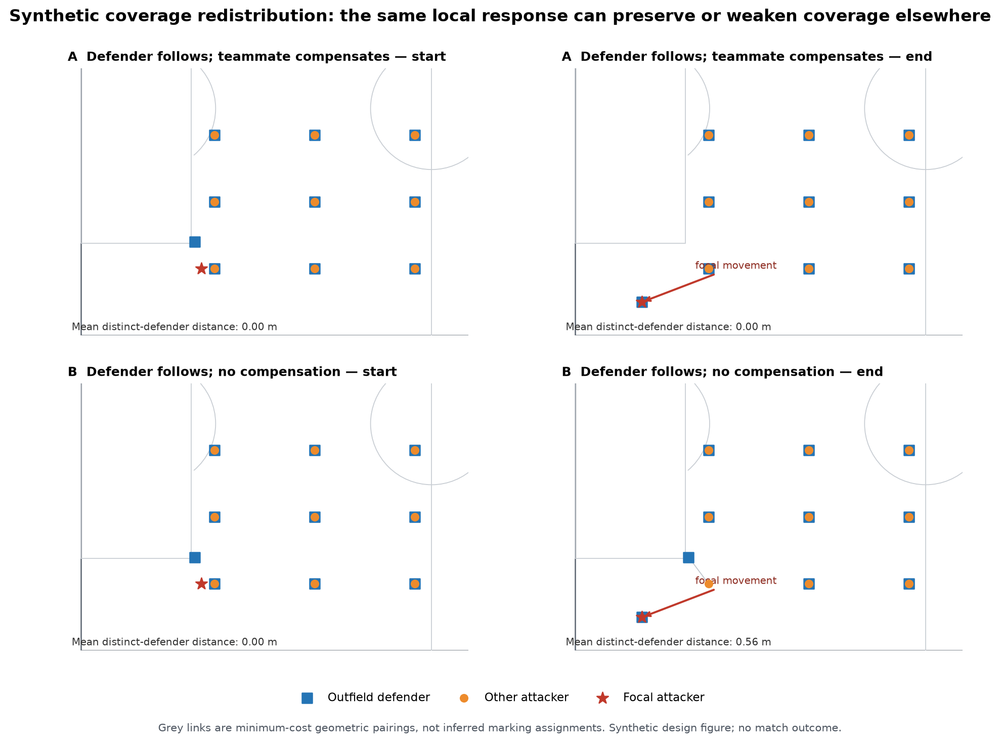

# Defensive Coverage Redistribution v1 — Method and Prior-Art Audit

**Audit date:** 2026-09-03
**Status:** completed prospectively; no protected coverage outcome inspected

## Why another consequence construct is justified

The project has replicated localized defender-relative movement and attacker-aligned response geometry, but [Opportunity Redistribution v1](results/opportunity_redistribution_game1_v1.md) was negative for a narrower proposition: stronger focal-local response did not correspond to better nearest-defender separation among other initially local attackers. That result is a boundary, not a metric to tune.

The present audit therefore asks a different geometric question: can the defence still provide **distinct simultaneous coverage** across all nine non-focal attacking outfield players? The proposed representation does not assume that larger distance is valuable, a pass is available, or any defender is responsible for an attacker.

## Closest methodological precedents

- **Bipartite defender–attacker networks.** Buldú et al. (2020) introduce tracking-derived marking and signed-proximity networks. Calero-Sanz et al. (2026) use proximity and directional alignment to construct open-play bipartite marking networks and study marking load, target similarity and coordination. These works motivate treating coverage as a many-player relation, but v1 borrows neither their marking semantics nor temporal network summaries.
- **Receiver availability and pressure geometry.** Dick, Link and Brefeld (2022) model whether a pass can reach a receiver using player and ball dynamics, interception and technical skill. Link, Lang and Seidenschwarz (2016) include defender distance and goal angle in a ball-carrier danger model. These show why geometric coverage must not be called availability or pressure.
- **Dominant region and pitch control.** Spearman (2018), Fernández and Bornn (2018), and later motion-model work estimate control or valued space with reachability, ball travel and/or field value. They are closer to actual accessibility but add assumptions that are unnecessary for the first multi-attacker geometric bridge.
- **Latent matchups in basketball.** Franks et al. (2015) infer defensive matchups from optical tracking. That literature motivates the simultaneous-coverage problem but also demonstrates why an optimized geometric pairing must not be presented as observed responsibility.
- **Coverage matching.** Rectangular minimum-cost bipartite matching is a standard deterministic optimization primitive. V1 uses it only to summarize the minimum average distance needed to pair nine attackers with nine different defenders. It does not label the selected edges as marking.

The earlier [Opportunity Redistribution methodology audit](opportunity_redistribution_v1_methodology.md), the [literature review](literature_review.md), and the [bibliography](../references/bibliography.md) retain the broader source record.

## Candidate consequence comparison

| Candidate | Information retained | Assumptions | Compensation behavior | Main construct risk | Decision |
|---|---|---|---|---|---|
| Multi-attacker nearest-$k$ coverage | Per-attacker proximity depth | Choose $k$; defenders can count for many attackers | A nearby replacement can help, but the same defender can unrealistically cover several attackers simultaneously | Still a direct extension of failed independent nearest-defender separation | Descriptive alternative only ($k=2$) |
| Distinct-defender minimum matching cost | All nine attackers, all ten defenders, one defender per attacker in the optimization | Euclidean distance and one-to-one capacity proxy | Explicitly neutral when a teammate replaces the departing defender at equal geometric cost | Pairing can be mistaken for marking; ignores zones and reachability | **Selected primary** |
| Thresholded bipartite coverage load | Number of attacker–defender edges and load distribution | Distance/alignment thresholds | Can represent shared load | Threshold scale is unvalidated and readily tuned | Rejected for v1 |
| Ball-to-attacker corridor obstruction | Straight route openness | Ball/carrier identity, corridor width, interception geometry | Captures a different form of cover | A clear corridor is not an executable pass | Deferred |
| Fixed-radius local density | Defender count around each attacker/region | Radius or kernel | Can show local compensation | Boundary discontinuity; arbitrary spatial scale | Rejected for v1 |
| Voronoi/dominant-region area | Territory closest/reachable to players | Pitch grid/boundary; optional motion model | Global redistribution visible | Control meaning depends on model and region aggregation | Deferred |
| Motion-aware pitch control | Probabilistic/relative access to locations | Velocity, acceleration, ball travel and control-rate calibration | Rich compensation and accessibility | Model assumptions define much of the consequence | Deferred |
| Receiver availability / value | Pass reachability or downstream value | Ball flight, skill, interception, learned/value model | Closest to attacking option quality | Jumps beyond geometric consequence into availability/value | Prohibited in v1 |
| Numerical superiority | Attackers/defenders in a region | Region and scale | Simple shared-cover view | Ignores distance/direction and is boundary sensitive | Rejected |

No candidate is universally correct. Minimum matching is selected because it is the lowest-assumption construct that (a) considers all other attackers jointly, (b) prevents one defender from simultaneously satisfying every attacker's coverage, and (c) passes the required compensation-versus-loss thought experiment.

## Exact borrowed and project-specific elements

**Borrowed:** Euclidean player proximity; bipartite attacker–defender representation; minimum-cost rectangular assignment; block bootstrap; standard pitch plotting.

**Project-specific governed combination:** the replicated leave-one-out focal-relative response contrast; all-nine non-focal attacker coverage; fixed two-second concurrent window; within-anchor focal comparison; protected development/held-out sequence; synthetic compensation gates; and strict nonclaims.

The potentially differentiated contribution is this governed bridge, not bipartite matching, proximity, coverage, pitch control or space creation.

## Consequence semantics

For focal attacker $a$, $G_a(u)$ is the minimum mean Euclidean distance when all nine other attackers are paired injectively to ten defenders. Its change $Y_a=G_a(t+2)-G_a(t)$ is the primary consequence.

The optimization answers a narrow capacity question: *how far apart are attackers and defenders under the best distinct geometric pairing available at that instant?* It does not answer:

- who is marking whom;
- whether zonal cover is adequate;
- whether a pass can be completed;
- whether an attacker is open, dangerous or valuable; or
- whether the focal movement caused the configuration.

The all-nine set is fixed prospectively and avoids local/remote recipient selection. Dynamic optimization is intentional: defender replacement is the phenomenon the construct must allow. A fixed-start pairing is therefore reported only as a descriptive comparator.

## Predictor, timing and adjustment

The observed predictor is the already replicated concurrent D1–D3 minus D4–D7 focal-relative path contrast, in metres. The response and coverage consequence share $[t,t+2]$. This supports association, not temporal mediation.

The compact model adjusts for focal movement, initial matching cost, mean movement of the other nine attackers, prior focal movement and prior response contrast. Within-anchor demeaning absorbs ball path, whole-defence translation, width/depth and broad phase shared by simultaneous focal perspectives. Independent movement of another attacker can change $G$ without any focal response; the synthetic fixture makes that limitation visible and motivates the other-attacker movement term.

## Control logic

- A within-anchor focal-identity permutation tests whether the focal-specific response–coverage link exceeds label-disrupted versions while preserving the anchor geometry.
- A remote-defender response comparator asks whether the established local response is more informative than D8–D10 relative movement.
- The already-closed extreme focal-movement threshold tests dependence on unusually large focal motion without deriving a new cutoff.
- Fixed-start matching and mean-two-nearest distance are nonclassifying descriptions. They cannot replace the primary if results are more attractive.
- Rigid-transform and relabeling invariance are hard geometry checks.

## Library decision

| Library | Relevant capability | Decision for v1 |
|---|---|---|
| SciPy | `linear_sum_assignment` | **Adopt** for the rectangular minimum-cost matching; SciPy is already pinned. |
| Matplotlib | Synthetic pitch explanation | **Adopt**; already pinned and sufficient. |
| mplsoccer | Football-native pitch drawing | **Defer** because it is not installed/pinned and offers presentation rather than scientific benefit here. |
| Kloppy | Provider-normalized tracking ingestion | **Integrate later** through the governed canonical adapter during execution; it does not define the consequence. |
| UnravelSports | Pressing, pitch objects, graph tooling | **Do not use for v1**; its pressure/graph semantics would introduce a second representation and are not governed substitutes. |
| floodlight | Discrete Voronoi and motion-based dominant regions | **Investigate later** if a reachability/control construct is independently justified; not needed for matching cost. |
| NetworkX | General graph representation/matching | **Do not add**; SciPy solves the exact rectangular assignment without another dependency. |

## Synthetic result before freeze

All six prospectively required fixtures passed:

| Fixture | Response contrast (m) | Coverage-cost change (m) | Required interpretation |
|---|---:|---:|---|
| Perfect compensation | 4.7075 | 0.0000 | High response, neutral coverage |
| No compensation | 3.3127 | 0.5556 | High response, worse geometric coverage |
| Collective translation | 0.0000 | 0.0000 | No common-motion false positive |
| Independent other-attacker movement | 0.0000 | 0.8889 | Consequence can change without focal response |
| Focal movement ignored | 0.0000 | 0.0000 | No response or redistribution |
| Multi-defender collapse | 6.1990 | 3.0578 | High response, larger coverage deterioration |

Values are synthetic implementation checks, not empirical estimates or effect thresholds.

Grey links show optimized geometric pairings only. The figure is synthetic and has no match outcome or tactical label.

## Sources

- Buldú, Javier M., et al. 2020. “Football Tracking Networks: Beyond Event-Based Connectivity.” arXiv:2011.06014. <https://arxiv.org/abs/2011.06014>
- Calero-Sanz, Jorge, et al. 2026. “Beyond Marking Networks in Soccer: Coordination, Similarity and Entropy.” *Chaos, Solitons & Fractals* 211: 118819. <https://doi.org/10.1016/j.chaos.2026.118819>
- Dick, Uwe, Daniel Link, and Ulf Brefeld. 2022. “Who Can Receive the Pass? A Computational Model for Quantifying Availability in Soccer.” *Data Mining and Knowledge Discovery* 36: 987–1014. <https://doi.org/10.1007/s10618-022-00827-2>
- Fernández, Javier, and Luke Bornn. 2018. “Wide Open Spaces: A Statistical Technique for Measuring Space Creation in Professional Soccer.” *MIT Sloan Sports Analytics Conference*. <https://www.lukebornn.com/papers/fernandez_ssac_2018.pdf>
- Franks, Alexander, Andrew Miller, Luke Bornn, and Kirk Goldsberry. 2015. “Characterizing the Spatial Structure of Defensive Skill in Professional Basketball.” *The Annals of Applied Statistics* 9 (1): 94–121. <https://doi.org/10.1214/14-AOAS799>
- Link, Daniel, Steffen Lang, and Philipp Seidenschwarz. 2016. “Real Time Quantification of Dangerousity in Football Using Spatiotemporal Tracking Data.” *PLOS ONE* 11 (12): e0168768. <https://doi.org/10.1371/journal.pone.0168768>
- Spearman, William. 2018. “Beyond Expected Goals.” *MIT Sloan Sports Analytics Conference*. <https://static.hudl.com/craft/downloads/SSAC2018_Beyond_Expected_Goals.pdf>
- Raabe, Dominik, et al. 2022. “floodlight — A High-Level, Data-Driven Sports Analytics Framework.” arXiv:2206.02562. <https://arxiv.org/abs/2206.02562>
