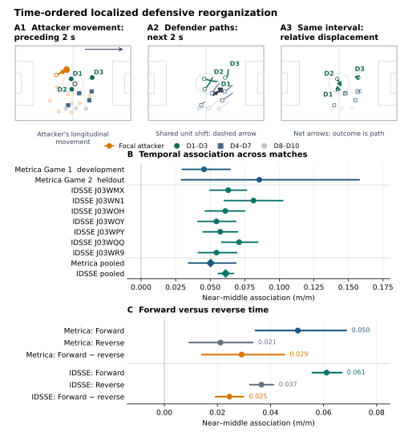
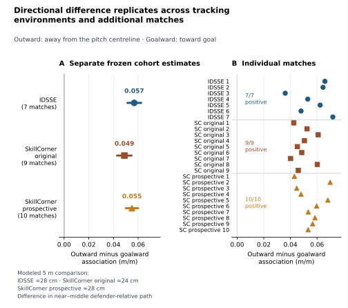

# Off-Ball Movement Direction and Localized Defensive Reorganization in Football

## Abstract

**Introduction.** Off-ball movement can coincide with a shared defensive shift
or with defenders changing position within the defensive unit. Tracking analyses
need to distinguish those geometries. We examine whether this localized movement
is associated differently with outward and goalward attacker movement, rather
than treating either direction as a tactical label or a measure of value.

**Methods.** Fixed windows measured attacker path before subsequent
defender-relative path. Start-fixed proximity ranks compared the three nearest
defenders with four middle-ranked defenders without inferring marking
assignments. The temporal design was developed and held out in Metrica, then
tested externally in seven IDSSE matches with a paired reverse-time comparison.
The directional comparison was separately replicated in nine SkillCorner
matches. The local outcome retained a shared defensive shift as context rather
than treating all observed defender movement as one quantity. Proximity was a
localization device, not an assignment of defensive responsibility.

**Results.** In pooled Metrica, the near-minus-middle association was 0.05029
m/m (97.5% interval [0.03433, 0.06858]). In IDSSE it was 0.06115 m/m (95% CI
[0.05579, 0.06681]), and the paired forward-minus-reverse excess was 0.02455
[0.01932, 0.02985]; both estimates were positive in all seven matches.
Reverse-time structure nevertheless remained positive. The central finding was
a replicated directional difference: conditional on path magnitude and starting
geometry, outward minus goalward movement was 0.056856 m/m [0.051358, 0.062430]
in IDSSE and 0.048883 m/m [0.042940, 0.054707] in SkillCorner. Goalward movement
was instead more strongly associated with secondary collective defensive
translation, while the proposed width-narrowing mechanism was not established.
The external environments were analysed separately under provider-compatible
specifications, so their agreement is replication evidence rather than a pooled
cross-provider effect.

**Conclusion.** The analysis provides a prospectively tested and externally
replicated temporal measure of localized defensive reorganization. It can help
structure later video review by separating internal movement from a shared
defensive shift. The findings are observational associations, not estimates of
causal influence, named tactical behaviour, or attacking value. The measure is
a descriptive layer for later football interpretation, not a tactical classifier.

## 1. Introduction

### 1.1 The football problem

Much of football's tactical language concerns movement away from the ball. An
attacker may be said to pull a defender, stretch a line, or make the defence
adjust. These descriptions are meaningful to analysts, but they are difficult
to translate into tracking-data measurements without adding assumptions that the
data do not directly identify. Player tracking records where players move; it
does not directly reveal defensive assignments, tactical instruction, or why a
particular defender changed position.

Absolute defender movement combines different geometries. A defensive unit can
slide together toward the ball or one side of the pitch while largely preserving
its internal relationships. In another passage, one or more defenders can move
differently from the unit around them even when the unit's overall movement is
modest. The first pattern is a shared defensive shift; the second is localized
internal reorganization. Both may occur together, and neither is inherently
good, intentional, or caused by a single attacker.

This distinction matters for movement direction. Football analysis naturally
privileges movement toward goal, but movement that changes width or moves away
from the pitch centreline may be associated with a different local defensive
geometry. A useful measurement should not treat raw displacement, movement
toward goal, and internal defensive change as interchangeable quantities.

The practical question is what comparison makes an attacker path meaningful for
the surrounding defensive unit. Comparing only an attacker with their nearest
opponent can conflate a local relation with a shared shift; comparing only
whole-team centroids can hide substantial movement within the unit. We retain
both levels of description and ask about their time-ordered association.

The distinction is useful before any football interpretation is attempted. It
allows a passage in which a back line has shifted together to be described
differently from a passage in which nearby defenders have also changed their
position within that shifting unit. Tracking cannot settle what either passage
means tactically, but it can make the geometry available for a more disciplined
subsequent comparison.

### 1.2 Measurement problem and research questions

Player-to-team geometry, relative phase, and collective coordination are
established parts of football-tracking research. They provide a useful
measurement substrate, but they do not by themselves define a local defensive
reorganization associated with attacking movement. This paper operationalizes a narrower,
observable estimand: subsequent movement by a defender relative to the other
defending outfield players after a fixed interval of off-ball attacker movement.
It asks whether near defenders show a different defender-relative association
from a pre-specified middle-ranked reference, without requiring a marking
assignment or a downstream value model.

The comparison is intentionally local rather than dyadic. The nearby group may
contain defenders with different football roles in a passage, and the
middle-ranked group is a reference rather than a claim that distant defenders
are irrelevant. What matters for the estimand is that both groups are defined
from the same observed defensive geometry before the later movement is measured.

The temporal ordering is deliberate. Attacker movement is measured in a
pre-specified interval before the defender outcome, and defender proximity is
fixed at the interval boundary before the later movement is observed. These
start-fixed proximity ranks are a localization safeguard: they prevent the
analysis from selecting defenders because their subsequent movement happened to
look interesting. They do not identify a marker, responsibility, or tactical
role.

The paper addresses three questions. First, is preceding off-ball attacker
movement associated with subsequent defender-relative movement more strongly
among near than middle-ranked defenders? Second, does that association differ
between outward and goalward movement? Third, how does starting geometry
characterize where it is larger or smaller?

### 1.3 Contribution and boundary

The contribution is a prospectively tested defender-relative temporal estimand,
not a new centroid primitive. It combines start-fixed localization with
protected Metrica testing, a paired reverse-time comparison, and external
analysis. Its main empirical result is a replicated directional difference:
conditional on path magnitude and starting geometry, outward movement was
associated with stronger subsequent localized defender-relative reorganization
than goalward movement in separate IDSSE and SkillCorner analyses. These are
observable geometric associations, not estimates of tactical preference,
attacker influence, or value.

## 2. Related work

### 2.1 Collective defensive geometry and player-team synchronization

Tracking research has long described football teams through centroids, width,
depth, surface area, interpersonal distances, and related measures of collective
organization. Sampaio and Maçãs (2012) used player distance to the team centre
and relative phase to study tactical behaviour. Duarte, Araújo, and Correia
(2013) examined team-team and player-team synchrony in professional football,
while Moura et al. (2016) used cross-correlation and vector coding to describe
coordination in the spread of opposing teams. Carrilho et al. (2020) likewise
used optical tracking to study player and team synchronization through
player-ball-goal geometry.

These studies establish player-relative-to-team geometry and temporal
coordination as established measurement families. The present analysis uses
that substrate to ask whether a prospectively defined attacker interval is
associated with later localized defender-relative movement. Its leave-one-out
reference preserves shared movement by the remaining defensive unit as context
while expressing the focal defender relative to teammates.

### 2.2 Attacker-defender pressure, dyads, and assignments

A second literature studies the spatial relations between opponents. Herold et
al. (2022) provide the closest direct off-ball precedent. They used
expert-annotated deep runs and changes of direction to examine how a
time-varying defensive-pressure measure changed over high-intensity off-ball
actions. Their target was individual pressure and separation, rather than
movement relative to a defending unit, but the study demonstrates that off-ball
actions can be connected to evolving defensive geometry.

Caetano et al. (2023) characterized lateral and longitudinal coordination
between nearest opposing players, while earlier work shows that direction and
distance can organize attacker-defender interactions (Narizuka & Yamazaki,
2016). Calero-Sanz et al. (2026) construct marking networks, and Groom et al.
(2026) infer time-resolved defensive roles. The present analysis does not
replace these methods: it fixes proximity ranks before the subsequent interval
as an assignment-free localization device rather than treating nearby defenders
as inferred markers or responsible players.

### 2.3 Off-ball movement, space, trajectories, and value

Off-ball research has also approached attacking movement through space,
availability, trajectory representation, and value. Fernández and Bornn (2018)
developed a pitch-control framework for spatial occupation and generation,
including the space that may be opened when an attacker attracts opponents.
Related space/control and receiver-availability work evaluates where a player
can receive the ball or which parts of the pitch are controllable. These are
important downstream questions, but generated space, receiver availability, and
attacking value are not equivalent to subsequent defender movement relative to a
defensive unit.

Trajectory and movement-effort research describe paths, speed, and direction
without supplying a single tactical interpretation. Esposito et al.'s (2026)
scoping review emphasizes heterogeneous definitions and limited integration of
opponents and context in elite off-ball tracking research. Accordingly, this
paper treats attacker path and signed displacement as geometric exposures, not
as evidence of generated space or attacking value. Recurrent-pattern work
(Beernaerts et al., 2020) likewise illustrates how relative movement can be
represented without making a path a single named football action.

### 2.4 Temporal disruption and directional movement

Temporal ordering is also established in adjacent work. Moura et al. (2016)
reported short lags in coordinated team spread. Forcher et al. (2021)
evaluated D-Def, a pass-triggered measure of changes in team and line
centroids, area, and spread during the seconds after a pass. Herold et al.
(2022) followed pressure trajectories through off-ball actions. These studies
show that delayed defensive change can be measured, but they use collective
disruption or pressure rather than a localized defender-relative outcome.

The present temporal comparison therefore does not treat a later interval as
proof of a discrete response onset. Its reverse-time construction asks whether
the ordered local association exceeds a matched background association in a
continuous game, where persistence and shared context are expected.

Directional coordination is likewise not new. Caetano et al. (2023) separated
lateral and longitudinal components of nearest-opponent coordination, and
Narizuka and Yamazaki (2025) decomposed goal- and opponent-oriented components
in a model of on-ball dribbling against the nearest defender. Those analyses
differ from the present question in their dyadic and on-ball focus. They do,
however, make clear that the current paper cannot claim novelty for temporal
response or directional coordination in general.

### 2.5 Precise gap

Existing tracking research has characterized collective defensive shape,
player-team synchronization, pressure, inferred marking relationships,
trajectories, and space/value outcomes. The present paper specifies an
assignment-free estimand linking a preceding attacker interval to subsequent
defender movement relative to the defensive unit, localized with relationships
fixed before that interval. The reviewed literature did not identify a direct
controlled outward-versus-goalward comparison against this kind of subsequent
localized defender-relative outcome. This is a bounded distinction from adjacent
work, not a claim that related football questions have not been studied.

## 3. Data

### 3.1 Metrica development and protected holdout

The temporal measurement was developed using Metrica Sample Game 1 and tested
without revision in Metrica Sample Game 2. These openly available sample
matches provide synchronized player and ball tracking with event context. The
analysis retained only supported open-play intervals after applying the
pre-specified coordinate, cadence, restart, and ball-out rules. Positions were
represented in standardized metric pitch coordinates.

Game 1 served as the development environment for the temporal design, while
Game 2 served as a protected within-provider holdout. The latter also provides
the paper's explanatory match-level example because it was not used to develop
the primary temporal analysis. The two matches are transparent samples rather
than a representative population of football, but they permit a clear
development-to-holdout sequence within a common coordinate and event setting.

### 3.2 IDSSE / DFL external validation

The principal external temporal analysis used seven complete professional
matches from the public IDSSE/DFL research release, *An integrated dataset of
spatiotemporal and event data in elite soccer* (Bassek et al., 2025; Figshare DOI:
10.6084/m9.figshare.28196177.v1; CC BY 4.0). This environment tested whether
the already specified temporal measurement and its time-ordered association
transported beyond the Metrica sample. It also supplied the primary external
analysis of starting-context characteristics and the movement-direction
comparison.

The seven matches are independent external matches, not seven provider
replications or a league-wide population estimate. The aim was replication of a
pre-specified measurement in a distinct tracking environment.

### 3.3 SkillCorner Open Data directional replication

A separate directional replication used nine usable 2024/25 A-League matches
from SkillCorner Open Data. This broadcast-derived tracking environment was used
only for the outward-versus-goalward comparison, under separate
provider-compatible rules. SkillCorner and IDSSE were analysed separately rather
than pooled across providers because their tracking and support conditions differ.

Across the closed analyses, the temporal sample contained 8,910 supported
attacker-time anchors in the two Metrica matches and 72,316 in the seven IDSSE
matches. The directional analyses contained 4,618 eligible anchors (64,805
analysis rows) in IDSSE and 5,458 eligible anchors (49,107 rows) in SkillCorner.
These are measurement samples under provider-specific support rules, not
population samples of football actions.

### 3.4 Availability and publication scope

Metrica, IDSSE/DFL, and SkillCorner data are available from their respective
public sources under their stated licenses. Reproducibility materials are public;
detailed implementation and data-access information are provided in the
supplement and repository documentation.

## 4. Methods

### 4.1 Analysis unit and attacker movement

The analysis unit was a supported attacker-time anchor during open play. Each
anchor defined three consecutive two-second intervals: context $[t-4,t-2]$,
attacker exposure $[t-2,t]$, and a subsequent defender interval $[t,t+2]$.
Attacker movement was treated as an observed exposure, not as a causal treatment
or tactical label.

For each eligible attacker and anchor, we calculated path length and signed
displacement from standardized tracking coordinates during exposure. Eligibility
required complete temporal support and excluded restarts, ball-out intervals,
and unsupported tracking; full support rules are reported in the supplement.
These restrictions define a reproducible measurement sample, not a set of
prejudged runs, threats, or otherwise meaningful attacking actions.

Standardized orientation made signed movement comparable within each environment
and separated path magnitude from its directional components. The subsequent
interval begins only after exposure ends, so later defender movement cannot
construct the attacker-movement quantity. This non-overlap matters because the
paper asks about ordered geometry, rather than describing a single simultaneous
configuration.

### 4.2 Defender-relative representation

For each focal defender $d$, position was expressed relative to the other
nine defending outfield players,

$$
\mathbf r_d(t)=\mathbf x_d(t)-\frac{1}{9}\sum_{j\ne d}\mathbf x_j(t),
$$

where $\mathbf x_d(t)$ is the focal defender's position. The primary local
outcome was accumulated path in $\mathbf r_d(t)$ over the subsequent interval.
It expresses how much the defender moved relative to the defensive unit and so
reduces the contribution of a shared translation. For a complete ten-defender
set, leave-one-out centering is a constant rescaling of ordinary
centroid-relative position; the derivation is provided in the supplement. The
representation does not remove collective movement from the passage. It makes
the focal defender's departure from that movement measurable alongside a
separate collective translation outcome and cannot mechanically create a
near-versus-middle rank pattern.

### 4.3 Temporal ordering and start-fixed proximity groups

At the boundary $t$, all ten defending outfield players were ranked by
Euclidean distance from the focal attacker and held fixed for the subsequent
interval. The primary group was the three nearest defenders (D1–D3); the
reference group was the four middle-ranked defenders (D4–D7). D8–D10 were
retained for descriptive profiles.

Fixing ranks before the subsequent interval avoids selecting defenders based on
their later movement while retaining the complete defensive block for the
leave-one-out reference. The ranks localize geometry; they do not infer marking
assignments or responsibility. They also avoid requiring a fixed radius to have
the same football meaning in every passage, where defensive density and spacing
can differ substantially. All ten defenders remain in the leave-one-out
reference, while D1–D3 and D4–D7 provide an interpretable local-versus-reference
comparison. The farthest group was retained to show the full descriptive rank
profile rather than to impose a monotonic relationship with distance.

### 4.4 Primary temporal association and reverse-time comparison

Each primary temporal-regression row was one start-fixed defender rank at one
supported attacker-time anchor. The outcome was that defender's subsequent
two-second defender-relative path. In raw-metre ordinary least squares, each
rank received its own intercept and coefficients for preceding attacker path,
that defender's strictly prior defender-relative path, and the strictly prior
path of the full defending-outfield centroid; pooled fits added only common
match indicators. The headline near-minus-middle contrast was the mean
attacker-path coefficient for D1–D3 minus the mean coefficient for D4–D7.

Writing $i$ for the attacker-time anchor and $k$ for the fixed defender
rank, the fitted rank-specific structure was

$$
Y_{ik}=\alpha_k+\beta_kX_i+\gamma_kB_{ik}+\eta_kC_i+\varepsilon_{ik},
$$

where $Y_{ik}$ is subsequent defender-relative path, $X_i$ is preceding
attacker path, $B_{ik}$ is the defender's strictly prior path, and $C_i$
is the strictly prior defending-unit-centroid path.

A positive contrast indicates a stronger association among near than
middle-ranked defenders; it does not establish causation or assignment.

The rank profile was retained rather than smoothed into a presumed monotonic
curve. The primary contrast is therefore a local-versus-reference comparison,
while the full D1–D10 profile remains descriptive evidence about the observed
spatial gradient. A positive near-minus-middle estimate means that the
attacker-path association is stronger locally than in the middle-ranked
reference; it does not say that individual defenders were engaged with, or
responsible for, the focal attacker.

To assess time ordering against background structure in continuous play, we
used a paired reverse-time comparison constructed with the same measurement
logic in the opposite temporal order. The relevant check was whether the
forward-time near-minus-middle association exceeded its paired reverse-time
counterpart. Reverse-time estimates were not expected to be zero: football
movement contains persistence and shared context in either direction. The
comparison therefore tests an ordered excess, not the absence of geometric
structure in the control. It is a deliberately limited check on temporal
ordering, not an estimator of a response onset or an intervention effect.

### 4.5 Movement-direction analysis

The directional analysis used one eligible attacker-time anchor per row, with
the near-minus-middle subsequent defender-relative-path contrast as the outcome.
It decomposed attacker displacement into the pre-specified goalward/away-from-
goal axis and outward/inward axis. Outward movement means movement away from
the pitch centreline under the standardized orientation; it does not mean
movement away from goal. Equal-match-weighted raw-metre OLS with match
intercepts estimated the outward-minus-goalward coefficient contrast, while
conditioning on exposure and prior attacker path, attacker depth relative to
the defensive unit, attacker-ball distance, defending-unit width and depth, and
ball depth relative to that unit. Thus the comparison holds overall path and
observed starting geometry in the model rather than treating movement
components as mutually exclusive football actions.

Equivalently, the directional model was

$$
Y_i=\alpha_{m(i)}+\beta_GG_i+\beta_OO_i+\boldsymbol\theta^\top\mathbf Z_i+\varepsilon_i,
$$

with $G_i$ and $O_i$ the goalward and outward displacement components and
$\mathbf Z_i$ the listed path and starting-geometry covariates. The reported
estimand was $\beta_O-\beta_G$.

IDSSE was the primary directional environment. SkillCorner provided a separate
provider-compatible replication under pre-specified rules; the environments
were analysed separately. Because a two-dimensional path can contain both
goalward and outward components, the model compares their conditional
associations rather than mutually exclusive football actions. It asks whether
comparable movements in observed starting contexts have different associations
with later local geometry, not whether one named action is intrinsically better
than another. Outward and goalward components may coexist within one path, which
is why the contrast conditions on total path magnitude instead of categorizing
episodes into exclusive movement types.

### 4.6 Starting-context characterization

Separate models characterized heterogeneity in the temporal association using
two observed quantities at the start of the exposure interval: the attacker's
goalward position relative to the defensive-unit centroid and the attacker's
distance from the ball. These models characterize where the local temporal
association was larger or smaller; they do not identify why that geometry
occurred. They were kept separate from the primary temporal and directional
estimands so that observed context is not silently promoted to a tactical class.
The two variables represent relative unit depth and immediate ball proximity,
respectively, rather than an exhaustive account of match state.

### 4.7 Response-scale follow-up

Defensive movement can be represented at several scales. In addition to the
established local defender-relative outcome, follow-up analyses retained
defensive-unit centroid translation and pitch-axis width as separate outcomes.
Centroid translation captures a shared shift, while width reduction tests one
proposed geometric mechanism. These secondary outcomes were analysed separately
from the local measure. They were not combined into a composite response score
or treated as exclusive components of total defensive movement. The two scales
remain complementary descriptions of the same passage, not rival measurements.

### 4.8 Validation and inference

The temporal measurement was developed in Metrica Game 1 and evaluated without
revision in protected Metrica Game 2. IDSSE tested the time-ordered association
in a distinct tracking environment, while SkillCorner separately tested the
directional comparison. These analyses were specified before their protected
outcomes were inspected.

Uncertainty used 2,000 deterministic 60-second match-period block-bootstrap
replicates, retaining complete anchor vectors and simultaneous attackers within
each resampled block; at least 1,900 finite, estimable replicates were required.
Metrica temporal and starting-context primary families used 97.5% percentile
intervals, while IDSSE temporal, IDSSE directional, SkillCorner directional,
and response-scale results used 95% percentile intervals. Match-level or
leave-one-match-out sign checks assessed concentration in a small number of
matches. Robustness checks included the reverse-time comparison, pre-specified
horizons and trimming, and complete-support checks. Detailed support,
provider-compatibility, and reproducibility checks are reported in the
supplement and repository materials. The resulting intervals are
provider-specific observational inferences, not pooled or causal estimates.
The staged sequence distinguishes development, protected testing, and external
transport without implying that agreement across environments reveals a common
causal mechanism. Exact support, compatibility, and numerical checks remain
supplementary rather than part of the main estimand. No model pooled IDSSE and
SkillCorner, because the separate
environments provide complementary replication rather than interchangeable
samples from one common tracking process.

## 5. Results

### 5.1 Time-ordered localized defensive reorganization

In pooled Metrica, preceding attacker path was more strongly associated with
subsequent defender-relative path among near than middle-ranked defenders: the
near-minus-middle association was 0.05029 m/m (97.5% interval [0.03433,
0.06858]). The positive estimate was present in both development and protected
holdout matches (0.04559 and 0.08553 m/m, respectively). Here, m/m denotes the
modelled difference in subsequent defender-relative path associated with one
additional metre of preceding attacker path. The heldout estimate was obtained
without revising the temporal representation, rank groups, or primary contrast
after Game 1 development.

The contrast compares the association for pre-defined nearby ranks with a
pre-defined middle reference, rather than comparing an attacker with a defender
chosen after the passage. Its positive sign therefore locates the association in
the local part of the defensive block without requiring a marking assignment.

The same time-ordered pattern appeared in IDSSE (0.06115 m/m, 95% CI [0.05579,
0.06681]), with a positive primary estimate in all 7/7 matches. Its paired
forward-minus-reverse excess was 0.02455 m/m [0.01932, 0.02985], also positive
in all 7/7 match-level estimates. Reverse-time structure nevertheless remained
positive, so the evidence is an ordered excess rather than a null control. The
primary direction also held under pre-specified duration and trimming checks.
The result therefore concerns localized defender-relative movement after the
attacker interval, rather than absolute defensive displacement alone.

The two Metrica matches provide a protected within-provider check, whereas the
IDSSE estimates test the same ordered association in professional tracking data.
Neither step turns the association into an attribution to one attacker; together
they establish that the localized pattern was not confined to a single
development match. The paired forward-minus-reverse result further qualifies
this replication: the observed forward ordering was stronger than a matched
ordering in the same continuous game, even though the control retained positive
movement structure.

Figure 1 pairs a protected-holdout Metrica passage with the population estimates
and forward-versus-reverse comparison. It illustrates defender-relative movement
alongside a shared defensive shift. The passage is explanatory rather than
evidence that one attacker caused the observed movement.

*Figure 1. Time-ordered localized defensive reorganization. Panel A is a real heldout Metrica Game 2 passage (period 1; anchor 2336.04 s) selected deterministically from attacker movement only. In the subsequent interval, the defensive unit shifts goalward and laterally; D2 and D3 move less goalward than that shared-unit reference, while D1 moves more goalward. Panels B and C show the Metrica and IDSSE time association and its forward-minus-reverse qualification; reverse-time structure remains positive. The passage is explanatory, and temporal ordering is observational rather than causal.*

### 5.2 Movement direction: outward-versus-goalward difference

Having established the time-ordered localized association, we tested whether it
differed by attacker movement direction. Outward movement was defined as movement
away from the pitch centreline under the standardized orientation.

In IDSSE, outward minus goalward displacement was associated with 0.056856 m/m
more subsequent localized defender-relative reorganization (95% CI [0.051358,
0.062430]), positive in all 7/7 match-specific and leave-one-match-out fits. A
5 m outward-versus-goalward comparison corresponded to approximately 0.284 m
more subsequent localized defender-relative reorganization under the model.
This is a descriptive translation of the conditional contrast, not an estimate
of the movement caused by an individual attacker.

The directional difference replicated in SkillCorner, a separate broadcast-
derived tracking environment: the estimate was 0.048883 m/m (95% CI [0.042940,
0.054707]), positive in all 9/9 match-specific and leave-one-match-out fits.
The environments were analysed separately under provider-compatible rules.

The estimates arise from separate models, samples, and inference procedures;
their common positive direction is replication evidence, not a pooled effect or
a claim that the environments share identical player populations or tactical
conditions. The path-magnitude and starting-geometry terms narrow the geometric
comparison, but do not eliminate unobserved football context.

The directional model does not divide passages into mutually exclusive outward
and goalward movement types. A two-dimensional path can contain both components;
the comparison asks whether their conditional associations with subsequent local
geometry differ after accounting for overall path magnitude and observed
starting geometry.

Figure 2 presents the two external analyses. Conditional on path magnitude and
starting geometry, localized defensive reorganization was not simply aligned
with movement toward goal. This is the paper's central directional finding:
comparable movement components can be associated with different localized
defensive geometry.

*Figure 2. Replicated movement-direction difference in localized defensive
reorganization. Positive outward-minus-goalward estimates indicate a stronger
association between outward attacker movement and subsequent localized
defender-relative movement than for goalward movement. Separately estimated
pooled effects were 0.056856 m/m (95% CI [0.051358, 0.062430]) in IDSSE and
0.048883 m/m (95% CI [0.042940, 0.054707]) in SkillCorner; all seven and nine
match-level contrasts, respectively, were positive. The tracking environments
were analysed separately; no cross-provider pooled estimate was calculated.
These estimates describe observational defensive geometry, not attacking value
or causal influence.*

### 5.3 Starting context

Starting context characterized where the localized temporal association was
larger or smaller. It declined with the attacker's goalward position relative to
the defensive unit (−0.010161 m/m, 97.5% CI [−0.011805, −0.008499]) and with
attacker-ball distance (−0.007533 m/m, 97.5% CI [−0.008864, −0.006245]). Thus,
localized reorganization was larger when attackers began less far goalward
relative to the unit and closer to the ball. Both directions were consistent
across match and leave-one-match-out checks and under trimming. These secondary
results characterize observed context rather than a tactical mechanism or an
optimal attacking position. The estimates were secondary to the directional
comparison and were not used to select passages, define a movement type, or
construct a response score. They show where the measured association was larger
or smaller in the IDSSE sample, not a complete account of the game state that
produced it.

### 5.4 Response-scale boundary

The secondary response-scale analysis found that a 5 m goalward-versus-outward
contrast was associated with 2.962709 m of collective defensive translation
(95% CI [2.870720, 3.048322]), positive in all 7/7 match-specific and leave-one-
match-out fits. The proposed inward-versus-outward width-narrowing mechanism had
mixed evidence: its contrast was 0.134003 m (95% CI [−0.006622, 0.273430]),
with positive estimates in 5/7 matches; the narrowing mechanism was not
established. Goalward and outward movement were therefore
associated with different geometric scales, but the mechanism behind the
directional difference remains unresolved. Because the outcomes were estimated
separately, they are not a decomposition of total defensive movement into
exclusive local and collective shares. The scale comparison instead sets an
interpretive boundary: collective defensive translation and localized
defender-relative reorganization can coexist in the same passage. The width
result therefore limits the proposed explanation without weakening the separate
observed directional contrast.

## 6. Discussion

### 6.1 What the temporal result establishes

When attacker movement was measured before the subsequent interval, nearby
defenders showed a stronger association in defender-relative movement than the
middle-ranked reference group. Because focal position was expressed relative to
the rest of the defensive unit, this is distinct from a statement that a
defender or team moved far in absolute coordinates. Start-fixed ranks also
ensure that locality was determined before later defender movement.

The paired reverse-time comparison matters for interpreting that result. The
control retained directional structure, as is plausible in a continuous game in
which player motion, team shape, and ball context persist across neighbouring
intervals. The forward association nevertheless exceeded the matched
reverse-time association. This supports a time-ordered geometric association;
it does not identify a response latency or convert the association into a
causal reaction signal.

Player-to-team geometry and temporal coordination are established tracking-data
substrates (Sampaio and Maçãs, 2012; Duarte, Araújo, and Correia, 2013;
Carrilho et al., 2020; Moura et al., 2016). The narrower contribution is an
ordered local-response estimand with pre-interval localization, protected
testing, a paired temporal control, and external replication—not a theory of
why defenders move. It gives football analysis a way to retain both levels of
geometry: the unit can shift as a whole while a focal defender's movement is
described relative to that unit. The measured pattern is an association across
many supported passages, not a claim that every passage contains one discrete
defensive event.

### 6.2 Why the movement-direction difference matters

The replicated directional difference is the paper's most distinctive empirical
finding. Football discourse often gives special weight to movement toward goal,
because goalward progression is connected to advancing the ball and eventually
to shooting opportunity. Yet the direction more strongly associated with later
localized defender-relative reorganization was outward movement—movement away
from the pitch centreline—not simply goalward movement. Under the specified
comparison, progression and localized defensive reorganization were therefore
different observable dimensions of off-ball movement.

This interpretation is deliberately narrower than a claim about a preferred
action. The analyses condition on path magnitude and starting geometry, but
they do not observe every tactical and game-state factor that may jointly shape
attacker and defender movement. Nor do they establish that an attacker forced a
defender to move. They show that comparable signed components of off-ball
movement were associated with different subsequent local defensive geometry.

The finding sits beside existing work on directional coordination and
attacker-defender interaction. Caetano et al. (2023) separated lateral and
longitudinal dyadic coordination, while Narizuka and Yamazaki (2025) decomposed
directional components in an on-ball model. Pressure analyses use a different
defensive outcome (Herold et al., 2022), and space/control or value frameworks
ask whether actions expand opportunity (Fernández and Bornn, 2018). The
reviewed literature did not identify a direct controlled outward-versus-goalward
comparison against later localized defender-relative movement. That is a
bounded distinction, not a claim that temporal response or directional
coordination is new. IDSSE and SkillCorner are corroborating separate
replications, not ingredients of a pooled cross-provider effect.

This distinction has a useful football-facing consequence. An analyst can keep
movement toward goal and movement across the pitch conceptually separate when
asking which passages may merit closer review. A movement's contribution to
progression is not the same thing as its observed association with internal
defensive reorganization. Whether either dimension reflects a named movement
such as an overlap, a decoy, a check, or a positional rotation remains a
question for video and tactical context, not for the present measurement alone.

### 6.3 Collective and localized defensive scales

The response-scale results help explain why absolute defender movement is an
insufficient starting point. Goalward attacker movement had a strong descriptive
association with collective defensive-centroid translation, whereas outward
movement had the stronger association with localized defender-relative
reorganization. These results concern different geometric scales. A defensive
unit can shift together and also deform internally; local and collective
movement are neither mutually exclusive categories nor fixed shares of a common
response.

This distinction should not be turned into a mechanism after the fact. The
pre-specified width analysis did not establish the proposed
inward-versus-outward narrowing explanation. Other geometric changes may be
possible but were not tested as explanations. The directional difference is
visible at a localized defender-relative scale; its mechanism remains
unresolved.

Collective and local measures can be useful complements in analysis, provided
they remain separate. A collective shift may be the dominant geometry of one
passage; in another, a defender's departure from the unit may be more salient.
Neither description assigns intent, responsibility, or defensive quality. The
present results provide a way to retain that distinction without reducing it to
a single composite score.

### 6.4 Starting geometry

The starting-context results characterize the conditions under which the local
temporal association was larger in the IDSSE analysis. It was larger when the
attacker began less far goalward relative to the defensive unit and closer to
the ball. These observed contextual relationships are compatible with the idea
that the same path may have different geometric meaning in different locations,
but they do not identify why an attacker started there or why the defensive unit
was arranged as observed.

This is an important distinction from pressure, availability, and ball-control
research. Those literatures may describe nearby football questions, but they do
not make ball proximity or relative depth a tactical label in this analysis.
The estimates are descriptive characterizations of association heterogeneity,
not evidence for an optimal starting position, a pressing trigger, or a
particular tactical template.

### 6.5 Analyst use

The measurement is best understood as a filtering and descriptive layer for
analyst review. It can filter for passages in which nearby defenders moved
differently from the defensive unit after an attacker moved, allowing analysts
to inspect video and decide whether the geometry has football meaning. Movement
direction and starting geometry can structure that review; ball movement,
teammates, opponents, and phase must still be assessed together.

That workflow does not automatically label pinning, dragging, tracking,
covering, a handoff, or another tactical concept; rank players; identify correct
defensive decisions; or estimate attacking value. Passage retrieval remains a
plausible workflow, not an independently validated usefulness or semantic
claim.

### 6.6 Limitations and interpretation boundaries

Several limitations determine the appropriate scope of the findings. First, the
design is observational. Temporal ordering and a paired reverse-time comparison
reduce some forms of ambiguity, but they cannot remove shared game context or
show that an attacker caused defenders to move. Start-fixed proximity ranks are
localization devices, not marking assignments; the analysis does not identify
responsibility, attention, instruction, or tactical intent. Independent human
semantic validation of what high measured reorganization corresponds to in
football language has not yet been completed.

Second, the analysis does not establish a downstream attacking consequence. A
separate opportunity-redistribution test did not support equating localized
reorganization with improved teammate separation. That boundary result should
not be tuned until positive: localized reorganization is not demonstrated space
creation, attacking value, or tactical success.

Third, the samples and tracking environments remain limited. Metrica provides
two open sample matches, seven IDSSE/DFL public-release professional matches,
and SkillCorner broadcast-derived tracking with provider-specific support
handling.
The external estimates were not pooled. This is staged replication, not
population-wide generalization or provider interchangeability.

Finally, the mechanism remains incomplete. The width test was mixed, and the
local and collective response channels are not an exhaustive or orthogonal
description of defensive geometry. The observed directional difference is
therefore a well-specified association, not an explanation of how a defensive
unit reorganized in every passage.

### 6.7 Future work

Future work should strengthen interpretation rather than add a new score.
Independent semantic and video-based validation could test whether analysts
judge passages with different measured geometry as meaningfully different.
Broader replication and richer match context could test scope and support more
careful football interpretation. Downstream consequence or value models require
an independently motivated construct and clearer semantic validity. The present
measurement layer should remain challengeable, replicable, and used alongside
rather than instead of analyst judgment. A useful next test would ask whether
trained analysts can distinguish the measured geometry consistently in video,
without treating their judgments as a substitute for the tracking measurement.

## 7. Conclusion

This paper reports a reproducible temporal measurement of localized defensive
reorganization associated with preceding off-ball movement. Nearby defenders
showed a stronger subsequent defender-relative association than middle-ranked
defenders, and the time-ordered association replicated beyond the Metrica sample
in IDSSE. The main directional result also replicated across IDSSE and
SkillCorner: conditional on movement magnitude and observed starting geometry,
outward movement away from the pitch centreline was associated with stronger
subsequent localized defender-relative reorganization than goalward movement.

The results distinguish a shared defensive shift from internal movement within
the defensive unit. Goalward movement was more strongly associated with
collective translation, whereas outward movement showed the stronger localized
association. These are complementary observable scales, not a complete tactical
mechanism. The measure can help organize later video and football analysis, but
it does not establish attacker causation, marking responsibility, tactical
intent, defensive quality, space creation, or attacking value. Its concrete
contribution is a bounded, externally replicated way to describe where
off-ball movement and localized defensive geometry are associated over time.

## Supplementary material

The completed [supplementary material](manuscript_supplement.md) provides the
full data/support description, defender-relative geometry, models and
inference, temporal and directional robustness, context and response-scale
summaries, the opportunity-redistribution boundary result, reproducibility
information, and the comprehensive compact results table. It supplements the
two-figure main submission rather than adding competing main-table material.
