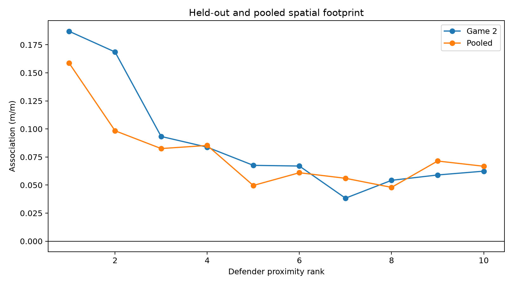
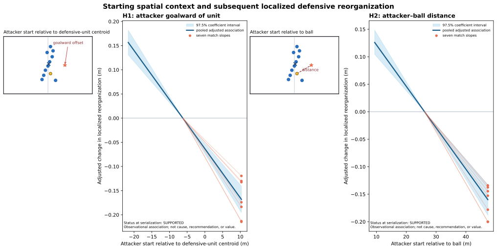
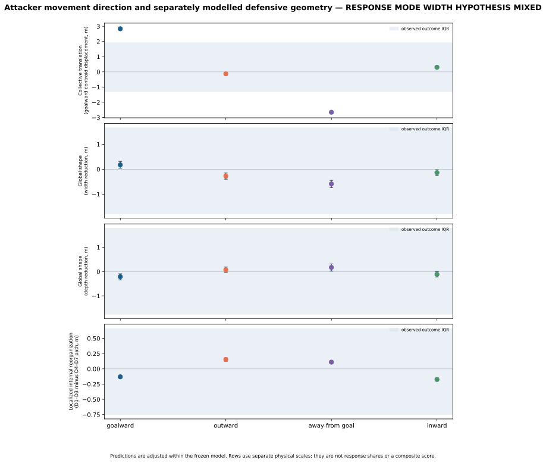

# Supplementary Material

## Measuring Localized Defensive Reorganization Associated with Off-Ball Movement in Football

This supplement accompanies the manuscript and provides technical detail for the closed, governed analyses summarized there. It reports only pre-specified representations, models, robustness checks, and compact results. It does not add a new analysis, tactical labels, or an estimate of attacker influence or value. Raw provider tracking and row-level derivatives are not distributed; the reproducibility route, frozen protocols, and compact result artifacts are linked in [S9](#s9-reproducibility-and-provider-boundaries).

## S1. Data, observation support, and temporal design

The temporal footprint was developed in Metrica Sample Game 1, evaluated on the untouched Sample Game 2, and pooled only under its pre-specified rule. The external temporal analysis used the seven public IDSSE/DFL matches in *An integrated dataset of spatiotemporal and event data in elite soccer* (Bassek et al., 2025; [Figshare DOI](https://doi.org/10.6084/m9.figshare.28196177.v1); CC BY 4.0). The directional analysis used the same seven-match IDSSE environment and a separate nine-match SkillCorner environment under a provider-compatible frozen specification. Analyses were kept separate by provider; no cross-provider effect was pooled.

| Match ID | Present in the public IDSSE/DFL release? | Paper role | Notes |
|---|---|---|---|
| J03WMX | Yes | temporal external replication; context; direction | canonical Figshare filename manifest |
| J03WN1 | Yes | temporal external replication; context; direction | canonical Figshare filename manifest |
| J03WOH | Yes | temporal external replication; context; direction | canonical Figshare filename manifest |
| J03WOY | Yes | temporal external replication; context; direction | canonical Figshare filename manifest |
| J03WPY | Yes | temporal external replication; context; direction | canonical Figshare filename manifest |
| J03WQQ | Yes | temporal external replication; context; direction | canonical Figshare filename manifest |
| J03WR9 | Yes | temporal external replication; context; direction | canonical Figshare filename manifest |

For the temporal estimand, one observation is an eligible `(match, period, t, attacker)` anchor and its complete vector of ten defending outfield players. The prior context is `[t-4, t-2]`, attacker exposure is `[t-2, t]`, and subsequent defensive movement is `[t, t+2]`. Anchors follow the frozen four-second grid, remain within a period, and require complete raw and smoothed support for the attacker and the same ten defending outfield players across the full window. Restarts, ball-out intervals, incomplete support, and goalkeeper/focal-player violations are excluded prospectively. These are support conditions, not tactical labels.

Metrica and IDSSE use native 25 Hz tracking and a centred seven-frame smoother with complete support (nominally 0.28 s). SkillCorner uses native 10 Hz tracking and a centred three-frame arithmetic mean (nominally 0.30 s), frozen as the closest complete-support physical analogue. Coordinates are transformed into a canonical 105 m by 68 m pitch orientation before measuring geometry. The provider-specific support and transformation contracts are preserved in the governed protocols, not re-estimated in this supplement.

## S2. Defender-relative geometry and fixed proximity ranks

For focal defender $d$ at time $s$, with ten defending outfield positions $x_1(s),\ldots,x_{10}(s)$, define the leave-one-out reference

$$c_{-d}(s)=\frac{1}{9}\sum_{j\ne d}x_j(s),\qquad r_d(s)=x_d(s)-c_{-d}(s).$$

The focal-relative path over an interval is the accumulated Euclidean movement of $r_d$. Thus common translation of all ten defenders cancels, while movement of a focal defender relative to the other nine remains observable. The reference is a geometric baseline, not an inferred defensive assignment.

At the boundary $t$, each defender is ranked by Euclidean distance to the attacker and keeps that rank for the subsequent outcome: D1--D3 are near, D4--D7 middle, and D8--D10 far. Ties follow the frozen deterministic rule. Ranks are fixed before the later defender path is measured; a defender is not selected because their later movement appears notable. The near/middle/far groups therefore localize a comparison without asserting marking, responsibility, or tactical role.

*Figure S1. Pooled Metrica defender-rank footprint. The important pre-specified contrast is near minus middle, not an assumed monotonic rank curve.*

## S3. Models and inference

For rank $k$, the temporal model estimates subsequent focal-relative path $Y_{ik}$ from preceding attacker path $X_i$, the corresponding prior focal-relative path $B_{ik}$, and prior defensive-unit-centroid path $C_i$:

$$Y_{ik}=\sum_{r=1}^{10}\mathbb{1}(k=r)\left(\alpha_r+\beta_rX_i+\gamma_rB_{ik}+\eta_rC_i\right)+\epsilon_{ik}.$$

Pooled Metrica adds a common Game 2 indicator; IDSSE adds match indicators. The principal temporal contrast is $\Delta_{NM}=\operatorname{mean}(\beta_{D1:D3})-\operatorname{mean}(\beta_{D4:D7})$. It is a difference in observed associations, not a causal local effect.

The directional model uses a common attacker movement magnitude, goalward and outward signed components, and frozen starting-context covariates:

$$Y_i=\alpha_{m(i)}+\beta_GG_i+\beta_OO_i+\theta^\top Z_i+\epsilon_i.$$

Its main contrast is $\beta_O-\beta_G$. Outward means movement away from the pitch centreline; it is not a tactical label. Context analyses use the same observed near-minus-middle path as outcome. Response-scale summaries retain focal-relative movement and shared defensive-unit translation as separate, non-exhaustive channels.

Inference uses prospectively frozen match-period block resampling, keeping complete rank vectors and simultaneous attacker perspectives together. The temporal analyses use 2,000 60-second block bootstrap replicates; Metrica classification contrasts use 97.5% intervals and IDSSE external temporal contrasts use 95% intervals as frozen. Directional, context, and response-scale analyses use their own frozen 2,000-replicate percentile procedures and reported interval families. No interval in this supplement was recomputed.

## S4. Temporal footprint: held-out Metrica and external replication

The Metrica pooled near-minus-middle association was 0.05029 m/m, with frozen 97.5% interval [0.03433, 0.06858]. It met all frozen final footprint criteria: the sign and interval replicated in Game 1 and untouched Game 2, survived the pre-specified trim, and retained its sign at 1, 2, and 4 seconds. The reverse-time placebo was also positive; the qualifying temporal evidence is the paired primary-minus-placebo excess, not an absence of structure in reverse time.

| Metrica pooled quantity | Estimate | Frozen interval or check |
|---|---:|---|
| Near minus middle, 2 s | 0.05029 m/m | [0.03433, 0.06858] |
| Game 1 / Game 2 near minus middle | 0.04559 / 0.08553 m/m | [0.02979, 0.06428] / [0.02917, 0.15786] |
| Reverse-time near minus middle | 0.02117 m/m | [0.00936, 0.03332] |
| Paired primary minus reverse | 0.02912 m/m | [0.01410, 0.04526] |
| Trimmed near minus middle | 0.04463 m/m | [0.02716, 0.06373] |
| Near minus middle, 1 s / 4 s | 0.02916 / 0.07566 m/m | positive under the frozen sign rule |

The seven-match IDSSE external analysis retained 72,316 attacker-anchor observations. Its pooled near, middle, and far estimates were 0.12253, 0.06137, and 0.04489 m/m, respectively. Near minus middle was 0.06115 m/m [0.05579, 0.06681]; every match had a positive primary and paired primary-minus-reverse sign. The paired excess was 0.02455 m/m [0.01932, 0.02985]. All reported bootstrap families had 2,000/2,000 valid replicates.

| Rank | D1 | D2 | D3 | D4 | D5 | D6 | D7 | D8 | D9 | D10 |
|---|---:|---:|---:|---:|---:|---:|---:|---:|---:|---:|
| IDSSE coefficient (m/m) | .16786 | .11106 | .08866 | .07386 | .06498 | .05375 | .05289 | .04886 | .04150 | .04432 |

The rank profile is irregular and stepped; it is evidence for the frozen near-versus-middle contrast, not a universal distance-decay law. At frozen 1, 2, and 4-second horizons, the IDSSE contrast was 0.03536, 0.06115, and 0.09549 m/m. The external trim retained 95.35% of the full magnitude.

## S5. Directional geometry and external replication

Signed displacement complements path magnitude because similar path lengths can have different goalward and outward components. Conditional on frozen magnitude and starting geometry, the outward-minus-goalward contrast was 0.056856 m/m [0.051358, 0.062430] in IDSSE. It was positive in all seven match and leave-one-match-out fits. The separately governed nine-match SkillCorner analysis estimated 0.048883 m/m [0.042940, 0.054707]; its trim retained 90.19% of rows and the majority-directly-detected sensitivity was 0.046780 m/m.

*Figure S2. Directional contrast replicated under separate provider-compatible specifications. This is replication evidence, not a pooled provider effect or a tactical direction label.*

## S6. Starting-context analyses

In the seven-match IDSSE descriptive context study, the outcome remained observed near-minus-middle focal-relative path. Two frozen starting relationships characterized variation in that outcome:

| Starting relationship | Coefficient (m/m) | Frozen 97.5% interval |
|---|---:|---:|
| Attacker goalward offset relative to defensive unit | -0.010161 | [-0.011805, -0.008499] |
| Attacker--ball distance | -0.007533 | [-0.008864, -0.006245] |

Both signs were negative in all seven match and leave-one-match-out analyses. They characterize observed geometry under the frozen model; they do not tell us why the defensive unit moved or establish a football mechanism.

*Figure S3. Starting-context relationships are descriptive associations with the observed local geometric outcome.*

## S7. Response scale and shared defensive movement

The response-scale analysis separates shared defensive-unit translation from internal focal-relative movement rather than treating either as a complete description. The secondary, nonclassifying goalward centroid displacement was 2.962709 m [2.870720, 3.048322] for the frozen goalward-versus-outward comparison. Width change was mixed (0.134003 m [-0.006622, 0.273430]). These channels are non-orthogonal and non-exhaustive: a shared shift and local change can coexist.

*Figure S4. Response-scale channels remain descriptive; they do not diagnose a tactical response mode.*

## S8. Opportunity-redistribution boundary result

A pre-specified Metrica Game 1 test asked whether greater focal-local defensive geometric change was associated with relatively improved nearest-defender separation for other initially local attackers. The primary estimate was $\beta_D=-0.02407$, 95% bootstrap interval [-0.09392, 0.04776], and the governed development result was negative. A fixed-start-defender check was weakly positive but uncertain (0.00914 [-0.06411, 0.08427]); the three-nearest-defender check was negative (-0.08117 [-0.15251, -0.00282]); and the frozen movement trim remained negative (-0.02852 [-0.10268, 0.04578]).

This is a boundary result, not a metric-selection prompt: the existing evidence does not equate localized defensive reorganization with teammate separation, space creation, attacking value, gravity, tactical success, or causal influence.

## S9. Reproducibility and provider boundaries

The public repository contains source, frozen protocol/configuration artifacts, compact aggregate results, figures, and hash/provenance records. The IDSSE/DFL source XML is publicly downloadable from its canonical Figshare release under CC BY 4.0, but this repository does not duplicate raw source files or detailed locally generated row-level derivatives. The [reproduction guide](../REPRODUCE.md) identifies environment setup, source entry points, public outputs, and the boundary between reproducible public artifacts and local inputs.

| Layer | What is public | What remains provider-bound |
|---|---|---|
| Scientific governance | protocols, configurations, eligibility logic, tests, compact results | locally downloaded source inputs |
| Implementations | loaders, measurement/model code, QC and deterministic-reproduction checks | provider-specific raw and reconstructed rows |
| Presentation | figures, reports, manuscript, supplementary tables | row-level observations and player-level derivatives |

Provider environments were analyzed under frozen compatible specifications, with their own support and cadence rules. Agreement across environments is replication of a measurement result, not proof that providers are interchangeable or that the estimates can be meta-analytically pooled. Public source/access information is documented for submission review; any portal-specific data-policy determination remains the conference's decision.

## S10. Comprehensive compact results table

| Analysis | Environment | Principal result | Status / boundary |
|---|---|---|---|
| Temporal rank footprint | Metrica Games 1--2 | $\Delta_{NM}=0.05029$ m/m [0.03433, 0.06858] | Final footprint A; two-match observational result |
| Temporal rank footprint | IDSSE, 7 matches | $\Delta_{NM}=0.06115$ m/m [0.05579, 0.06681]; paired excess 0.02455 [0.01932, 0.02985] | External observational replication |
| Directional localized geometry | IDSSE, 7 matches | outward minus goalward 0.056856 m/m [0.051358, 0.062430] | Replicated directional association |
| Directional localized geometry | SkillCorner, 9 matches | outward minus goalward 0.048883 m/m [0.042940, 0.054707] | Separate provider-compatible replication |
| Starting context | IDSSE, 7 matches | unit offset -0.010161; attacker--ball distance -0.007533 m/m | Descriptive context, not mechanism |
| Response scale | IDSSE, 7 matches | centroid translation 2.962709 m [2.870720, 3.048322] | Secondary/nonclassifying shared-movement context |
| Opportunity redistribution | Metrica Game 1 | $\beta_D=-0.02407$ [-0.09392, 0.04776] | Negative boundary result |

Across all sections, the supported conclusion is narrow: observed attacker movement is associated with later localized defender-relative geometry under the governed designs. The analyses do not identify tactical intent, responsibility, attention, marking, attacker causation, defensive quality, gravity, or off-ball value.
