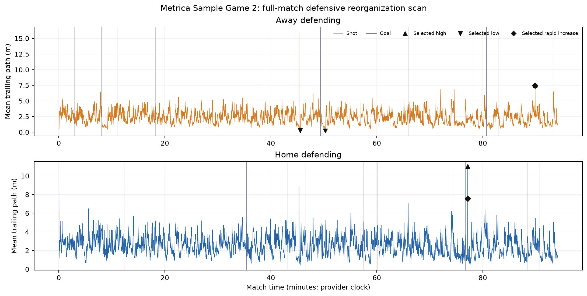
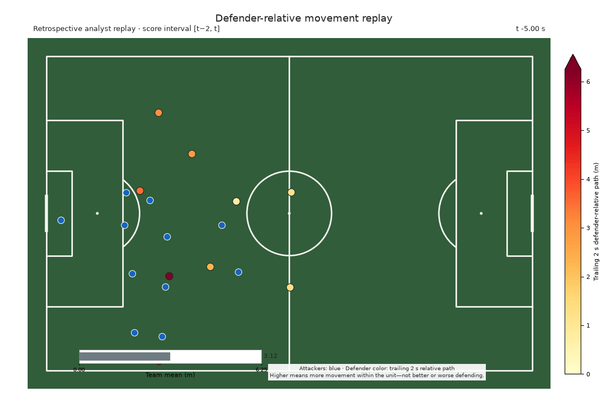
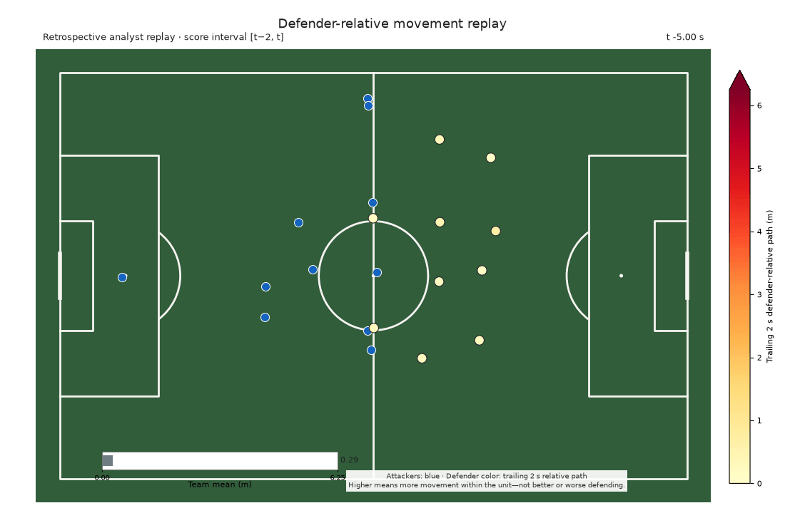

# Applying Defensive Reorganization to a Match

This public case study shows how an analyst can scan a full match, find a small
set of passages, align the timeline to recorded shots and goals, and then decide
what deserves video review. It is an application demonstration, not new
scientific evidence.

## What the tool measures

For each outfield defender, the scorer accumulates movement relative to the
other nine outfield defenders over the trailing two seconds. The player value
is measured in raw metres. The team value is the arithmetic mean of all ten
supported defenders.

The reference percentile compares that raw value with the separate pooled team
distribution from both teams and periods of public Metrica Sample Games 1 and
2. It is descriptive context only—not a probability, rating, bounded DRS, or
measure of defensive quality. The retrospective centered smoother requires
tracking just after the displayed time, so this is not a live detector.

## Match and frozen selection

Metrica Sample Game 2 was fixed before the new event-score join because its
public tracking and events were already supported by the application tooling.
It is not an untouched holdout. The [frozen application protocol](protocols/full_match_application_case_study_v1.md)
defines the reference population, event taxonomy, thresholds, clustering,
alignment tolerance, and media limits.

The pooled reference contained 5,713,060 supported player-frames, 571,306
supported team-frames, and 570,856 finite one-second changes from 18 stable
lineup runs. Its frozen thresholds were:

- sustained high: team mean at or above **4.233 m** (reference P95);
- sustained low: team mean at or below **1.041 m** (reference P05);
- rapid increase: one-second rise of at least **0.625 m** (reference change P95).

High and low passages had to remain beyond their threshold for at least one
continuous second. Selection used raw scores only, retained at most two passages
per category, and preserved overlap between categories.

## Full-match scan



The vertical gray lines are the 24 recorded shots; five heavier lines are goals.
Black symbols show the six frozen selection slots. Because high and rapid
episodes overlap, nearby triangle and diamond symbols identify genuinely
different category peaks inside the same broader movement passage.

| Defending team | Supported frames | Duration | Mean | Median | P75 | P90 | P95 | P99 | Max |
|---|---:|---:|---:|---:|---:|---:|---:|---:|---:|
| Away | 140,987 | 5,639.48 s | 2.407 | 2.352 | 3.071 | 3.763 | 4.149 | 4.901 | 16.042 |
| Home | 140,873 | 5,634.92 s | 2.574 | 2.523 | 3.219 | 3.879 | 4.274 | 5.052 | 11.014 |

Away had 83 sustained-high, 66 sustained-low, and 222 rapid-increase episodes.
Home had 106, 53, and 263 respectively. These are scanner outputs under the
frozen definitions, not counts of tactics or errors.

## Automatically selected passages

| Category | Defending team | Period | Peak time | Raw team mean | Reference percentile | One-second change | Other membership |
|---|---|---:|---:|---:|---:|---:|---|
| High | Away | 2 | 5392.20 s | 7.516 m | 99.97 | +3.091 m | Rapid increase |
| High | Home | 2 | 4630.88 s | 11.014 m | 100.00 | +2.298 m | Rapid increase |
| Low | Away | 2 | 2734.56 s | 0.255 m | 0.03 | −0.055 m | — |
| Low | Away | 2 | 3017.48 s | 0.215 m | 0.02 | −0.047 m | — |
| Rapid increase | Away | 2 | 5391.92 s | 7.471 m | 99.97 | +3.483 m | High |
| Rapid increase | Home | 2 | 4629.20 s | 7.563 m | 99.97 | +4.578 m | High |

The overlap is informative about the retrieval rules: the two strongest rapid
rises lead into the two selected high passages. The workflow does not replace
them with visually different clips. The low passages are long, sustained
periods of comparatively little movement relative to the unit. None of these
descriptions identifies why the defenders moved.

### Representative replays

**Highest sustained passage**



**Lowest sustained passage**



The selected episode qualifies under the frozen sustained-low rule at the marked
moment. The surrounding ten-second review window later contains increasing
reorganization, so “lowest sustained passage” describes the selected episode,
not every frame in the GIF.

The largest rapid-increase selection is retained in the table and static
diagnostic. Its peak is only 0.28 seconds from the highest-passage example, so a
second near-duplicate GIF is intentionally omitted from the public package.

All replays retain the existing raw 0–6.25 m visual scale. Values beyond the
display ceiling remain unchanged in the scorer and are disclosed by the
diagnostics. The six deterministic diagnostic images are stored beside these
GIFs in `figures/presentation/full_match_application_case_study/`.

### Static diagnostics

- [High — Away defending](../figures/presentation/full_match_application_case_study/high_away_p2_5392.20_diagnostic.png)
- [High — Home defending](../figures/presentation/full_match_application_case_study/high_home_p2_4630.88_diagnostic.png)
- [Low — Away defending, 2734.56 s](../figures/presentation/full_match_application_case_study/low_away_p2_2734.56_diagnostic.png)
- [Low — Away defending, 3017.48 s](../figures/presentation/full_match_application_case_study/low_away_p2_3017.48_diagnostic.png)
- [Rapid increase — Away defending](../figures/presentation/full_match_application_case_study/rapid_increase_away_p2_5391.92_diagnostic.png)
- [Rapid increase — Home defending](../figures/presentation/full_match_application_case_study/rapid_increase_home_p2_4629.20_diagnostic.png)

## Event-aligned view

All 24 Game 2 shots matched a supported native tracking frame within the frozen
half-frame tolerance. The source recorded five goals and 11 shots on target
under the predeclared subtype rule. These 24 shots, five goals, and 11 shots on
target are a one-match descriptive inventory only and are too few for
group-comparison inference. The rows are not mutually exclusive: the
shots-on-target row includes goals. Differences between rows are descriptive,
not predictive or causal.

| Event group | Count | Matched | Mean raw score at event | Median reference percentile |
|---|---:|---:|---:|---:|
| All shots | 24 | 24 | 3.099 m | 73.1 |
| Goals | 5 | 5 | 2.781 m | 39.3 |
| Shots on target | 11 | 11 | 3.056 m | 74.3 |

This table answers where the recorded events sat within the descriptive score
distribution. It is not a comparison model.

| Event | P | Time | Attack | Type | On target | At event (m) | Ref pct | Prior 5 s mean | Prior 5 s max |
|---|---:|---:|---|---|:---:|---:|---:|---:|---:|
| 01 | 1 | 176.76 | Home | Shot | No | 2.54 | 53.2 | 2.84 | 3.70 |
| 02 | 1 | 488.08 | Home | Goal | Yes | 2.14 | 39.3 | 2.76 | 3.49 |
| 03 | 1 | 659.36 | Home | Shot | Yes | 3.15 | 74.2 | 3.98 | 4.58 |
| 04 | 1 | 740.60 | Away | Shot | No | 3.08 | 72.0 | 3.11 | 3.82 |
| 05 | 1 | 1093.80 | Home | Shot | No | 4.01 | 92.5 | 4.03 | 4.62 |
| 06 | 1 | 1190.16 | Home | Shot | Yes | 3.80 | 89.4 | 3.29 | 3.80 |
| 07 | 1 | 2121.96 | Away | Goal | Yes | 4.98 | 98.9 | 3.46 | 4.98 |
| 08 | 1 | 2243.16 | Home | Shot | No | 2.64 | 56.7 | 2.66 | 3.45 |
| 09 | 1 | 2534.48 | Away | Shot | No | 3.85 | 90.2 | 4.23 | 4.58 |
| 10 | 1 | 2590.88 | Away | Shot | Yes | 3.51 | 83.9 | 3.54 | 4.28 |
| 11 | 1 | 2682.68 | Home | Shot | No | 2.98 | 68.7 | 3.13 | 4.11 |
| 12 | 2 | 2795.48 | Away | Shot | No | 4.13 | 94.0 | 3.62 | 4.13 |
| 13 | 2 | 2959.32 | Home | Goal | Yes | 2.12 | 38.7 | 2.87 | 3.47 |
| 14 | 2 | 3447.64 | Away | Shot | No | 4.21 | 94.8 | 3.60 | 5.09 |
| 15 | 2 | 3606.60 | Away | Shot | Yes | 3.54 | 84.5 | 3.20 | 3.54 |
| 16 | 2 | 3955.20 | Home | Shot | Yes | 3.79 | 89.3 | 3.91 | 4.33 |
| 17 | 2 | 4470.32 | Away | Shot | No | 2.90 | 66.1 | 3.56 | 3.90 |
| 18 | 2 | 4600.36 | Away | Goal | Yes | 1.51 | 18.8 | 1.75 | 2.54 |
| 19 | 2 | 4688.72 | Home | Shot | No | 2.62 | 55.9 | 2.61 | 3.00 |
| 20 | 2 | 4841.08 | Home | Goal | Yes | 3.15 | 74.3 | 3.30 | 4.42 |
| 21 | 2 | 4973.44 | Home | Shot | No | 3.99 | 92.2 | 3.83 | 4.27 |
| 22 | 2 | 5302.80 | Away | Shot | No | 1.17 | 8.0 | 1.02 | 1.28 |
| 23 | 2 | 5442.40 | Away | Shot | No | 2.64 | 56.5 | 3.60 | 4.39 |
| 24 | 2 | 5595.64 | Home | Shot | Yes | 1.92 | 32.3 | 1.52 | 1.92 |

The local detailed export also contains complete preceding 2-, 5-, and
10-second means, maxima, maximum reference percentiles, exact one-/two-second
changes, subtype text, and anonymized leading contributions. It is intentionally
not committed as a row-level table.

## Reproduce the workflow

With the public Metrica Sample Games 1 and 2 files in the repository's ignored
`data/metrica_sample_game_*/` directories:

```bash
.venv/bin/python src/run_full_match_application_case_study.py \
  --output-dir /tmp/moving_the_defense_full_match_case_study
```

Use `--no-media` for the much faster aggregate/event synchronization check.
Detailed CSV outputs remain in the chosen local directory. The committed public
package contains only the compact case study and selected communication media.

## What this demonstrates—and what it does not

The tool can deterministically score full-match stable support, identify raw
high/low/change passages, align public events without distant snapping, and
prepare a small review queue. An analyst can then open match video and add
football context manually.

The scanner does **not** show that reorganization caused a shot or goal, predicts
events, identifies marking, diagnoses confusion, grades defending, establishes
tactical intent, measures space creation, or values a player. Event alignment
organizes review; it does not turn descriptive tracking geometry into a football
outcome model.
