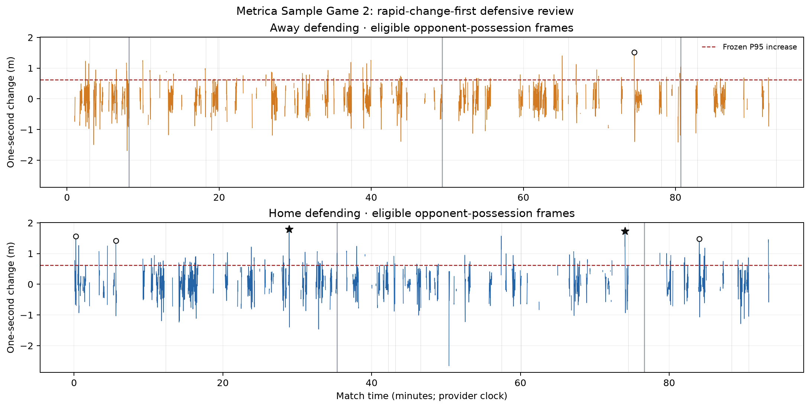
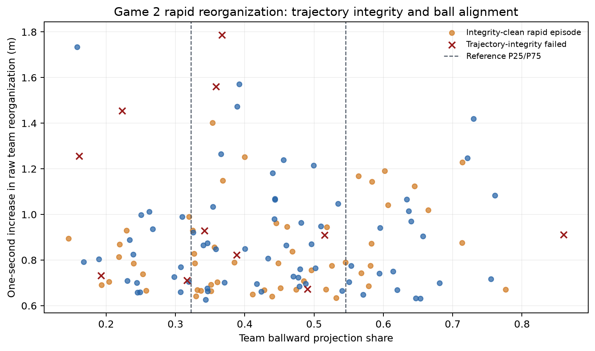
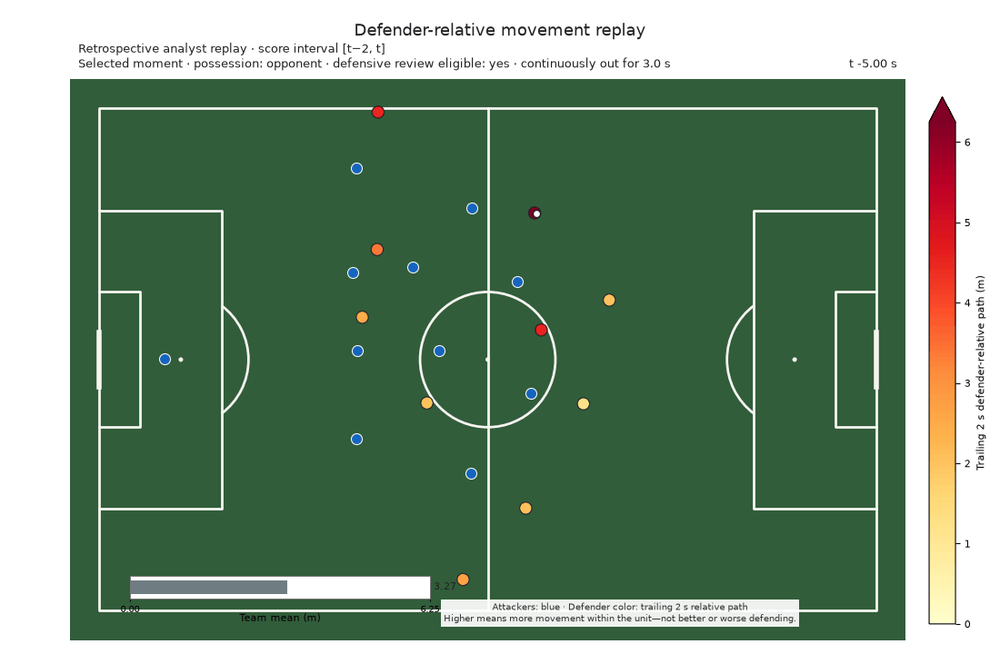
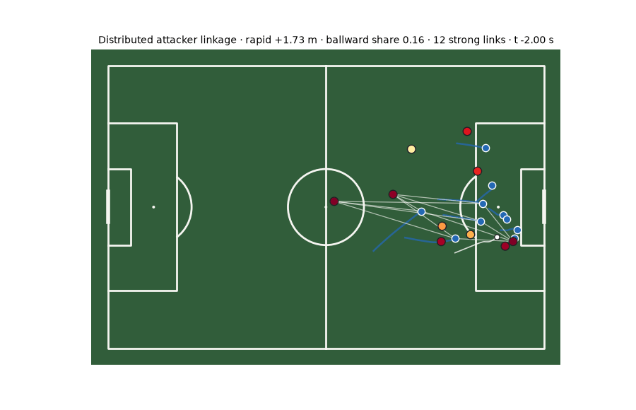
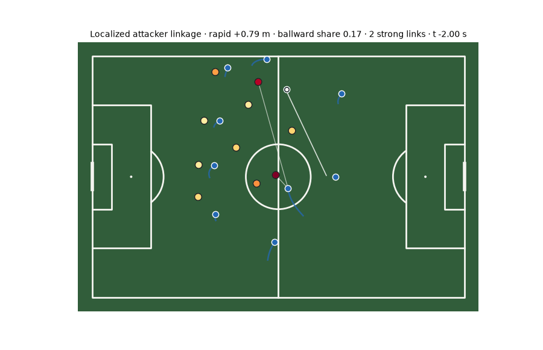
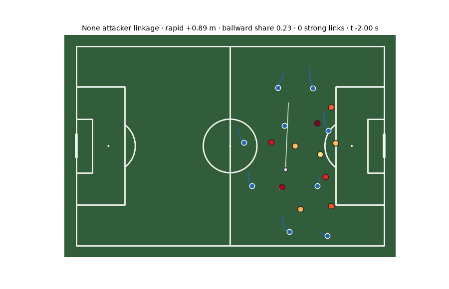
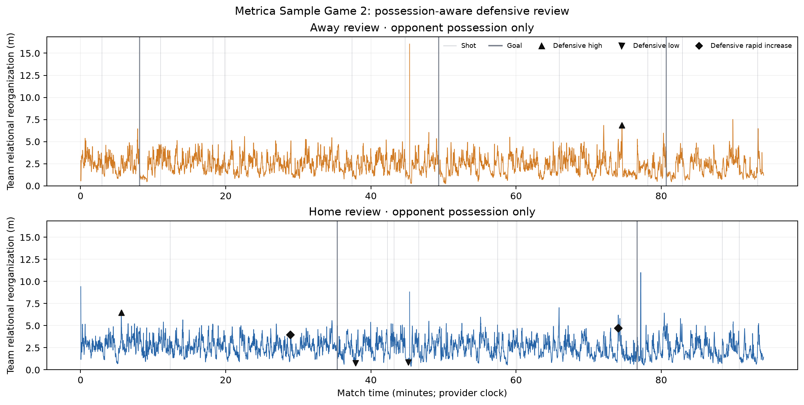
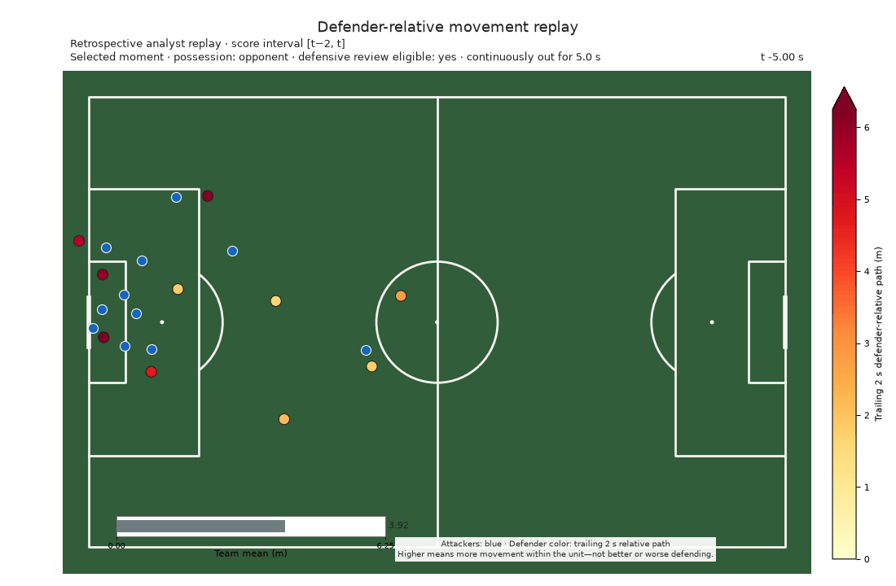
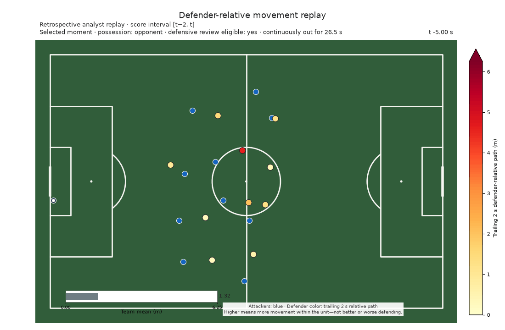
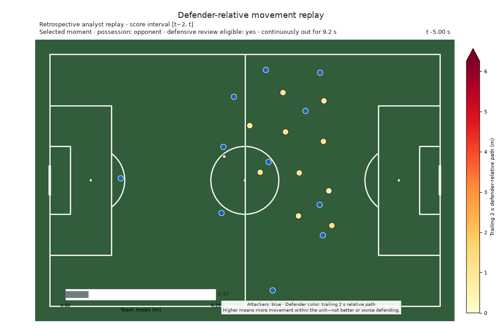

# Applying Team Relational Reorganization to a Match

This public case study shows how an analyst can scan a full match, find a small
set of passages, align the timeline to recorded shots and goals, and then decide
what deserves video review. It is an application demonstration, not new
scientific evidence.

## What the tool measures

For each outfield defender, the scorer accumulates movement relative to the
other nine outfield defenders over the trailing two seconds. The player value
is measured in raw metres. The team value is the arithmetic mean of all ten
supported defenders.

The reference percentile compares that raw value with the separate pooled team
distribution from both teams and periods of public Metrica Sample Games 1 and
2. It is descriptive context only—not a probability, rating, bounded DRS, or
measure of defensive quality. The retrospective centered smoother requires
tracking just after the displayed time, so this is not a live detector.

## Current analyst path

The current landing path composes the closed application layers rather than
treating every historical selection as equally reviewable. It retrieves rapid
defensive reorganization, then applies trajectory integrity, possession/context,
ball alignment and attacker-linked descriptive context.

Valid representative examples, valid special-context diagnostics and rejected
examples are separate outputs. The goalkeeper-distribution passage remains a
valid special-context diagnostic. The old rapid Rank 1 remains visible only as
a rejected QC example.

- Representative: [clean localized low-ballward review](../figures/presentation/attacker_linked_reorganization_review/localized_home_p2_5355.64.gif).
- Representative: [clean high-ballward contrast](../figures/presentation/ball_alignment_reorganization_review/high_ballward_home_p1_336.76.gif).
- Special-context diagnostic: [goalkeeper distribution](../figures/presentation/attacker_linked_reorganization_review/distributed_home_p2_4443.16.gif).
- Rejected QC example: [preserved trajectory failure](../figures/presentation/rapid_change_defensive_review/rapid_increase_home_p1_1734.72_diagnostic.png).

```bash
.venv/bin/python src/run_match_reorganization_demo.py \
  --game 2 --data-root data \
  --output-dir /tmp/moving_the_defense_match_demo --no-media
```

## Match and frozen selection

Metrica Sample Game 2 was fixed before the new event-score join because its
public tracking and events were already supported by the application tooling.
It is not an untouched holdout. The [frozen application protocol](protocols/full_match_application_case_study_v1.md)
defines the reference population, event taxonomy, thresholds, clustering,
alignment tolerance, and media limits.

The pooled reference contained 5,713,060 supported player-frames, 571,306
supported team-frames, and 570,856 finite one-second changes from 18 stable
lineup runs. Its frozen thresholds were:

- sustained high: team mean at or above **4.233 m** (reference P95);
- sustained low: team mean at or below **1.041 m** (reference P05);
- rapid increase: one-second rise of at least **0.625 m** (reference change P95).

High and low passages had to remain beyond their threshold for at least one
continuous second. Selection used raw scores only, retained at most two passages
per category, and preserved overlap between categories.

The original scanner measured relational reorganization anywhere in the match.
The defensive-review layer adds conservative context from the public
Metrica event record: a scored team must be continuously and unambiguously out
of possession for at least two seconds. This event-derived state is a review
aid, not provider-ground-truth possession. Ambiguous, in-possession, restart,
dead-ball, and newly changed-possession frames are excluded rather than guessed.
The score, thresholds, reference percentiles, and event alignment are unchanged.

## Rapid-change-first defensive review

The headline review question is: **When did the defensive unit begin
reorganizing much more strongly than one second earlier?** The raw team level
still describes absolute relational reorganization. The rapid-change view asks
how much that level rose over exactly one second. It ranks the six largest
eligible rises above the unchanged 0.6251746256690309 m threshold, then adds
context without changing the score or selection.



All six leading rises occurred in open play, outside the frozen five-second
restart-adjacency boundary. Their one-second increases ranged from 1.419 m to
1.786 m. Contribution summaries distinguish rises concentrated among three
defenders (`localized`) from broader or mixed patterns; identities are not
published. These are descriptions of the measured movement pattern, not
tactical labels.

| Rank | Defending team | Period | Peak time | Before | After | One-second rise | Ref pct after | Pattern | Out of possession |
|---:|---|---:|---:|---:|---:|---:|---:|---|---:|
| 1 | Home | 1 | 1734.72 s | 2.202 m | 3.988 m | 1.786 m | 92.23 | Localized | 9.16 s |
| 2 | Home | 2 | 4443.16 s | 2.992 m | 4.725 m | 1.733 m | 98.09 | Mixed | 3.72 s |
| 3 | Home | 1 | 14.40 s | 2.793 m | 4.355 m | 1.561 m | 96.01 | Localized | 12.32 s |
| 4 | Away | 2 | 4473.88 s | 3.954 m | 5.467 m | 1.513 m | 99.60 | Broad unit | 3.36 s |
| 5 | Home | 2 | 5042.36 s | 1.903 m | 3.376 m | 1.472 m | 80.61 | Mixed | 9.56 s |
| 6 | Home | 1 | 336.76 s | 5.046 m | 6.465 m | 1.419 m | 99.92 | Localized | 3.00 s |

These are the preserved historical v3 selections. That selection predated the
native-trajectory audit and is not the current valid-example queue.

**Historical Rank 1 — rejected by later trajectory QC**

[Open the preserved historical GIF](../figures/presentation/rapid_change_defensive_review/rapid_increase_home_p1_1734.72.gif)
or [its diagnostic](../figures/presentation/rapid_change_defensive_review/rapid_increase_home_p1_1734.72_diagnostic.png).
Six native player transitions exceeded the frozen 15 m/s integrity limit, so
this passage cannot enter the current representative queue.

**Historical Rank 2 — valid special context**


[Open the rank 2 diagnostic](../figures/presentation/rapid_change_defensive_review/rapid_increase_home_p2_4443.16_diagnostic.png)

The goalkeeper-distribution passage remains valid but is surfaced as a
special-context diagnostic rather than an ordinary default. The markers show
nearby recorded events only as review context. The examples do
not show that an event or opponent caused the rise, or that the defending was
good or bad. Three rapid decreases were inspected locally. They show readable
settling passages, but did not add enough distinct public value to justify a
second retrieval workflow in this pass.

## Trajectory integrity and movement toward the ball

Rapid change answers *when* relational reorganization accelerated. A second,
descriptive review asks whether that movement was directed largely toward the
ball or was only weakly aligned with it. Before making that comparison, native
tracking transitions above 15 m/s fail trajectory integrity; no coordinates or
identities are repaired.



Across 282 possession-eligible rapid episodes in the public Games 1–2
reference, 270 had complete ball-alignment support. The middle half of the
ballward projection share ran from **0.322 to 0.546**. Two of the historical
top-six Game 2 passages failed the frozen impossible-speed check, including the
old rank 1; neither showed the separate identity-swap signature.

The public contrast is deterministic. The strongest integrity-clean
low-ballward rise had a **1.733 m** one-second increase but only **0.158** of
measured movement projected positively toward the ball (signed alignment
**-0.363**). The strongest integrity-clean high-ballward rise had a **1.419 m**
increase and a **0.730** ballward share (signed alignment **0.687**). This shows
why a large rise alone does not describe the direction of the movement.

**Low ballward — strong reorganization, weak ball alignment**


[Open the low-ballward diagnostic](../figures/presentation/ball_alignment_reorganization_review/low_ballward_home_p2_4443.16_diagnostic.png)

**High ballward — movement substantially toward the ball**



[Open the high-ballward diagnostic](../figures/presentation/ball_alignment_reorganization_review/high_ballward_home_p1_336.76_diagnostic.png)

Ball alignment is review context, not a tactical score. It does not establish
that an attacker caused the movement, that the unit defended well or badly, or
that movement toward the ball was desirable. The complete aggregate audit and
media hashes are in the [package manifest](../figures/presentation/ball_alignment_reorganization_review/manifest.json).

## Co-occurring off-ball attacker movement

For integrity-clean, possession-valid, open-play, low-ballward rapid passages,
the next review question is whether substantial off-ball attacker movement
occurred alongside spatially related movement by the leading defender
contributors. At each frame, the attacker nearest the ball is excluded;
eligible attackers must be off ball for at least 41 of the 51 smoothed frames.
The rules do not infer marking or responsibility.

The aggregate Games 1–2 reference froze an attacker-path P75 of **7.699 m** and
an attacker–defender relative-vector-path P75 of **7.981 m** before Game 2
candidate identities were exposed. Among 12 qualifying Game 2 passages, five
had at least three strong attacker–defender links (`distributed`), three had
one or two (`localized`), and four had none.

**Distributed co-occurrence — 12 strong links**



[Open the distributed diagnostic](../figures/presentation/attacker_linked_reorganization_review/distributed_home_p2_4443.16_diagnostic.png)

**Localized co-occurrence — two strong links**



[Open the localized diagnostic](../figures/presentation/attacker_linked_reorganization_review/localized_home_p2_5355.64_diagnostic.png)

**No-link contrast**



[Open the no-link diagnostic](../figures/presentation/attacker_linked_reorganization_review/none_home_p1_978.32_diagnostic.png)

The Home-period-2 passage at 4443.16 s contains substantial off-ball
association under these frozen rules: eight eligible off-ball attackers and 12
strong links across the three leading defender contributors. This means the
passage is not described only by ball flight or a shape reset, but it still does
not show that an attacker caused the defensive movement. See the
[closed result](results/attacker_linked_off_ball_reorganization_review_v1.md)
and [package manifest](../figures/presentation/attacker_linked_reorganization_review/manifest.json).

## Historical possession-gated level review

High and low passages answer a different question: when was the absolute raw
level unusually high or low? They remain available for distribution inspection
and provenance, but are no longer the headline defensive-review workflow.



The timeline shows the unchanged raw score only during eligible opponent-
possession spells. Gaps are deliberate: they represent in-possession,
ambiguous, restart/dead-ball, or insufficient two-second support. Shot and goal
markers remain descriptive context.

| Category | Defending team | Period | Selected time | Raw team mean | Reference percentile | Continuously out of possession |
|---|---|---:|---:|---:|---:|---:|
| High | Away | 2 | 4475.56 s | 6.840 m | 99.96 | 5.04 s |
| High | Home | 1 | 336.92 s | 6.491 m | 99.93 | 3.16 s |
| Low | Home | 1 | 2271.80 s | 0.775 m | 1.36 | 26.48 s |
| Low | Home | 1 | 2707.88 s | 0.837 m | 1.95 | 23.12 s |
| Rapid increase | Home | 1 | 1734.72 s | 3.988 m | 92.23 | 9.16 s |
| Rapid increase | Home | 2 | 4443.16 s | 4.725 m | 98.09 | 3.72 s |

### Representative defensive-review replays

**Highest eligible sustained passage**



**Lowest eligible sustained passage**



**Largest eligible rapid increase**



Each overlay says that the opponent had possession at the selected moment and
reports the uninterrupted out-of-possession duration. It does not claim that
possession caused the movement or that the defending was good or bad.

### Possession-aware static diagnostics

- [High — Away defending](../figures/presentation/possession_aware_defensive_review/defensive_high_away_p2_4475.56_diagnostic.png)
- [High — Home defending](../figures/presentation/possession_aware_defensive_review/defensive_high_home_p1_336.92_diagnostic.png)
- [Low — Home defending, 2271.80 s](../figures/presentation/possession_aware_defensive_review/defensive_low_home_p1_2271.80_diagnostic.png)
- [Low — Home defending, 2707.88 s](../figures/presentation/possession_aware_defensive_review/defensive_low_home_p1_2707.88_diagnostic.png)
- [Rapid increase — Home defending, 1734.72 s](../figures/presentation/possession_aware_defensive_review/defensive_rapid_increase_home_p1_1734.72_diagnostic.png)
- [Rapid increase — Home defending, 4443.16 s](../figures/presentation/possession_aware_defensive_review/defensive_rapid_increase_home_p2_4443.16_diagnostic.png)

## Historical ungated scan

The [original v1 package](../figures/presentation/full_match_application_case_study/manifest.json)
is preserved byte-for-byte as provenance. It shows relational reorganization
across the full match before possession gating was added.


The vertical gray lines are the 24 recorded shots; five heavier lines are goals.
Black symbols show the six frozen selection slots. Because high and rapid
episodes overlap, nearby triangle and diamond symbols identify genuinely
different category peaks inside the same broader movement passage.

| Defending team | Supported frames | Duration | Mean | Median | P75 | P90 | P95 | P99 | Max |
|---|---:|---:|---:|---:|---:|---:|---:|---:|---:|
| Away | 140,987 | 5,639.48 s | 2.407 | 2.352 | 3.071 | 3.763 | 4.149 | 4.901 | 16.042 |
| Home | 140,873 | 5,634.92 s | 2.574 | 2.523 | 3.219 | 3.879 | 4.274 | 5.052 | 11.014 |

Away had 83 sustained-high, 66 sustained-low, and 222 rapid-increase episodes.
Home had 106, 53, and 263 respectively. These are scanner outputs under the
frozen definitions, not counts of tactics or errors.

### Historical automatically selected passages

| Category | Defending team | Period | Peak time | Raw team mean | Reference percentile | One-second change | Other membership |
|---|---|---:|---:|---:|---:|---:|---|
| High | Away | 2 | 5392.20 s | 7.516 m | 99.97 | +3.091 m | Rapid increase |
| High | Home | 2 | 4630.88 s | 11.014 m | 100.00 | +2.298 m | Rapid increase |
| Low | Away | 2 | 2734.56 s | 0.255 m | 0.03 | −0.055 m | — |
| Low | Away | 2 | 3017.48 s | 0.215 m | 0.02 | −0.047 m | — |
| Rapid increase | Away | 2 | 5391.92 s | 7.471 m | 99.97 | +3.483 m | High |
| Rapid increase | Home | 2 | 4629.20 s | 7.563 m | 99.97 | +4.578 m | High |

The overlap is informative about the retrieval rules: the two strongest rapid
rises lead into the two selected high passages. The workflow does not replace
them with visually different clips. The low passages are long, sustained
periods of comparatively little movement relative to the unit. None of these
descriptions identifies why the defenders moved.

### Historical representative replays

**Highest sustained passage**


**Lowest sustained passage**


The selected episode qualifies under the frozen sustained-low rule at the marked
moment. The surrounding ten-second review window later contains increasing
reorganization, so “lowest sustained passage” describes the selected episode,
not every frame in the GIF.

The largest rapid-increase selection is retained in the table and static
diagnostic. Its peak is only 0.28 seconds from the highest-passage example, so a
second near-duplicate GIF is intentionally omitted from the public package.

All replays retain the existing raw 0–6.25 m visual scale. Values beyond the
display ceiling remain unchanged in the scorer and are disclosed by the
diagnostics. The six deterministic diagnostic images are stored beside these
GIFs in `figures/presentation/full_match_application_case_study/`.

### Historical static diagnostics

- [High — Away defending](../figures/presentation/full_match_application_case_study/high_away_p2_5392.20_diagnostic.png)
- [High — Home defending](../figures/presentation/full_match_application_case_study/high_home_p2_4630.88_diagnostic.png)
- [Low — Away defending, 2734.56 s](../figures/presentation/full_match_application_case_study/low_away_p2_2734.56_diagnostic.png)
- [Low — Away defending, 3017.48 s](../figures/presentation/full_match_application_case_study/low_away_p2_3017.48_diagnostic.png)
- [Rapid increase — Away defending](../figures/presentation/full_match_application_case_study/rapid_increase_away_p2_5391.92_diagnostic.png)
- [Rapid increase — Home defending](../figures/presentation/full_match_application_case_study/rapid_increase_home_p2_4629.20_diagnostic.png)

### Audit of the six historical selections

| Historical selection | Possession-aware classification | Reason |
|---|---|---|
| High — Away, 5392.20 s | Transition context | Only 0.56 s continuously out of possession |
| High — Home, 4630.88 s | Restart/dead ball | Event-derived state was not active possession |
| Low — Away, 2734.56 s | Ambiguous | Ownership was not established unambiguously |
| Low — Away, 3017.48 s | Restart/dead ball | Event-derived state was not active possession |
| Rapid — Away, 5391.92 s | Transition context | Only 0.28 s continuously out of possession |
| Rapid — Home, 4629.20 s | Restart/dead ball | Event-derived state was not active possession |

This audit is why v2 does not present the old clips as settled defensive phases.
The old geometry remains valid; only its football-review context has changed.
The separate transition scan found 337 raw high-or-rapid episodes within the
frozen two-second change window. That count is descriptive and is not a tally
of turnovers, tactical transitions, or defensive errors.

## Event-aligned view

All 24 Game 2 shots matched a supported native tracking frame within the frozen
half-frame tolerance. The source recorded five goals and 11 shots on target
under the predeclared subtype rule. These 24 shots, five goals, and 11 shots on
target are a one-match descriptive inventory only and are too few for
group-comparison inference. The rows are not mutually exclusive: the
shots-on-target row includes goals. Differences between rows are descriptive,
not predictive or causal.

| Event group | Count | Matched | Mean raw score at event | Median reference percentile |
|---|---:|---:|---:|---:|
| All shots | 24 | 24 | 3.099 m | 73.1 |
| Goals | 5 | 5 | 2.781 m | 39.3 |
| Shots on target | 11 | 11 | 3.056 m | 74.3 |

This table answers where the recorded events sat within the descriptive score
distribution. It is not a comparison model.

| Event | P | Time | Attack | Type | On target | At event (m) | Ref pct | Prior 5 s mean | Prior 5 s max |
|---|---:|---:|---|---|:---:|---:|---:|---:|---:|
| 01 | 1 | 176.76 | Home | Shot | No | 2.54 | 53.2 | 2.84 | 3.70 |
| 02 | 1 | 488.08 | Home | Goal | Yes | 2.14 | 39.3 | 2.76 | 3.49 |
| 03 | 1 | 659.36 | Home | Shot | Yes | 3.15 | 74.2 | 3.98 | 4.58 |
| 04 | 1 | 740.60 | Away | Shot | No | 3.08 | 72.0 | 3.11 | 3.82 |
| 05 | 1 | 1093.80 | Home | Shot | No | 4.01 | 92.5 | 4.03 | 4.62 |
| 06 | 1 | 1190.16 | Home | Shot | Yes | 3.80 | 89.4 | 3.29 | 3.80 |
| 07 | 1 | 2121.96 | Away | Goal | Yes | 4.98 | 98.9 | 3.46 | 4.98 |
| 08 | 1 | 2243.16 | Home | Shot | No | 2.64 | 56.7 | 2.66 | 3.45 |
| 09 | 1 | 2534.48 | Away | Shot | No | 3.85 | 90.2 | 4.23 | 4.58 |
| 10 | 1 | 2590.88 | Away | Shot | Yes | 3.51 | 83.9 | 3.54 | 4.28 |
| 11 | 1 | 2682.68 | Home | Shot | No | 2.98 | 68.7 | 3.13 | 4.11 |
| 12 | 2 | 2795.48 | Away | Shot | No | 4.13 | 94.0 | 3.62 | 4.13 |
| 13 | 2 | 2959.32 | Home | Goal | Yes | 2.12 | 38.7 | 2.87 | 3.47 |
| 14 | 2 | 3447.64 | Away | Shot | No | 4.21 | 94.8 | 3.60 | 5.09 |
| 15 | 2 | 3606.60 | Away | Shot | Yes | 3.54 | 84.5 | 3.20 | 3.54 |
| 16 | 2 | 3955.20 | Home | Shot | Yes | 3.79 | 89.3 | 3.91 | 4.33 |
| 17 | 2 | 4470.32 | Away | Shot | No | 2.90 | 66.1 | 3.56 | 3.90 |
| 18 | 2 | 4600.36 | Away | Goal | Yes | 1.51 | 18.8 | 1.75 | 2.54 |
| 19 | 2 | 4688.72 | Home | Shot | No | 2.62 | 55.9 | 2.61 | 3.00 |
| 20 | 2 | 4841.08 | Home | Goal | Yes | 3.15 | 74.3 | 3.30 | 4.42 |
| 21 | 2 | 4973.44 | Home | Shot | No | 3.99 | 92.2 | 3.83 | 4.27 |
| 22 | 2 | 5302.80 | Away | Shot | No | 1.17 | 8.0 | 1.02 | 1.28 |
| 23 | 2 | 5442.40 | Away | Shot | No | 2.64 | 56.5 | 3.60 | 4.39 |
| 24 | 2 | 5595.64 | Home | Shot | Yes | 1.92 | 32.3 | 1.52 | 1.92 |

The local detailed export also contains complete preceding 2-, 5-, and
10-second means, maxima, maximum reference percentiles, exact one-/two-second
changes, subtype text, and anonymized leading contributions. It is intentionally
not committed as a row-level table.

## Reproduce the workflow

With the public Metrica Sample Games 1 and 2 files in the repository's ignored
`data/metrica_sample_game_*/` directories:

```bash
.venv/bin/python src/run_rapid_change_defensive_review.py \
  --output-dir /tmp/moving_the_defense_rapid_change_review
```

The command writes the six-item local review queue, all local review media, the
three local rapid-decrease diagnostics, and the bounded public subset. Detailed
frame-state and event tables remain in the chosen local directory. The v1
ungated and v2 possession-aware level packages remain linked above as
byte-identical provenance.

## What this demonstrates—and what it does not

The tool can deterministically score full-match stable support, identify sharp
eligible increases, separate open-play, transition, restart and ambiguous
context, and prepare a small review queue. An analyst can then open match video
and add football context manually. Sustained high/low retrieval remains a
separate extreme-state inspection tool.

The scanner does **not** show that reorganization caused a shot or goal, predicts
events, identifies marking, diagnoses confusion, grades defending, establishes
tactical intent, measures space creation, or values a player. Event alignment
organizes review; it does not turn descriptive tracking geometry into a football
outcome model.
