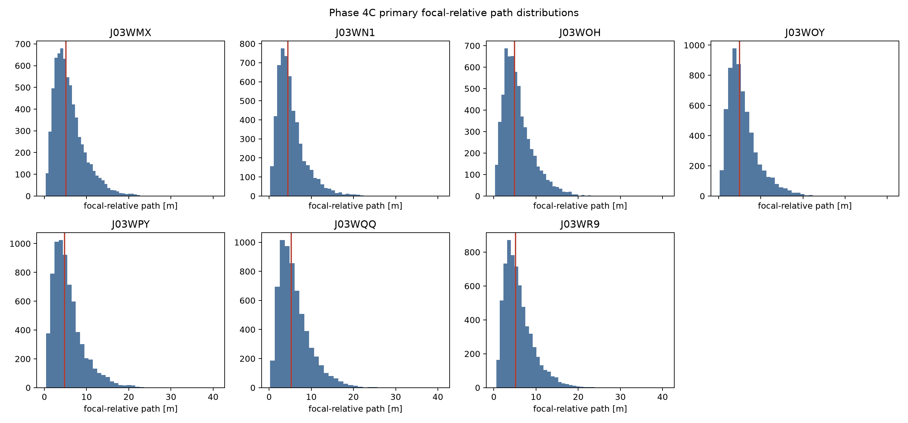
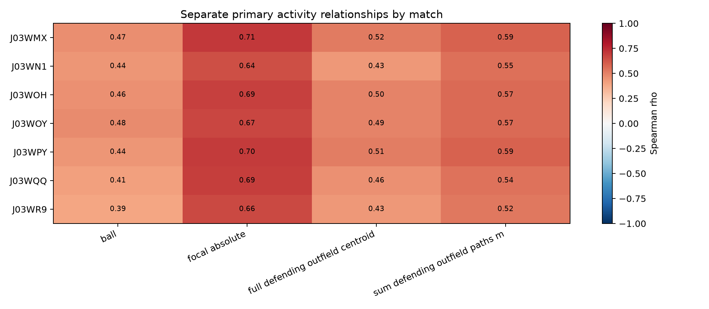
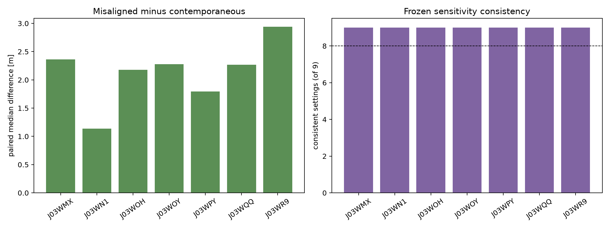

# Phase 4C IDSSE External Replication Results

## Frozen conclusion

Phase 4C executed protocol v1.0 once across the seven-match IDSSE/DFL dataset after the outcome-blind mapping and support gate passed. The deterministic result is:

> **A — strong external replication**

All seven matches were usable and all seven were core-replicating. Common-translation invariance passed, all seven primary misaligned-reference controls passed without a material contradiction, no activity relationship materially reversed, and every match passed all nine frozen window/smoothing settings.

The supported inference remains narrow: **focal-relative path externally replicated as an individual-versus-collective geometric primitive across seven professional matches from an independent tracking dataset/provider environment under the frozen criteria.** IDSSE contributes one additional provider/data environment relative to Metrica, not seven independent providers and not evidence of general provider invariance. Phase 4C did not validate tactical defensive response, contextual expectation, attacker association, pinning, dragging, tracking, covering, handoffs, relational reconfiguration, attribution, causation, defensive quality, gravity, or off-ball value.

## Outcome-blind portability gate

The [mapping audit](phase4c_idsse_mapping_audit.md) found no material protocol issue. All matches exceeded every usability threshold.

| Match | Eligible intervals | Defending-team interval counts | Focals with ≥25 intervals | Usable |
|---|---:|---:|---:|---|
| J03WMX | 695 | 432 / 263 | 27 | Yes |
| J03WN1 | 574 | 316 / 258 | 22 | Yes |
| J03WOH | 612 | 260 / 352 | 25 | Yes |
| J03WOY | 635 | 331 / 304 | 27 | Yes |
| J03WPY | 708 | 447 / 261 | 29 | Yes |
| J03WQQ | 640 | 275 / 365 | 28 | Yes |
| J03WR9 | 656 | 412 / 244 | 27 | Yes |

## Primary distribution and activity relationships

All primary focal-relative paths were finite and nonnegative. Every match had median and IQR well above the $10^{-8}$ m integrity boundary; numerical-zero prevalence was zero.

| Match | Focal observations | Median [m] | IQR [m] | Focal absolute $\rho$ | Full centroid $\rho$ | Aggregate defenders $\rho$ | Ball $\rho$ |
|---|---:|---:|---:|---:|---:|---:|---:|
| J03WMX | 6,949 | 5.142 | 4.395 | 0.710 | 0.523 | 0.588 | 0.467 |
| J03WN1 | 5,436 | 4.425 | 3.787 | 0.644 | 0.433 | 0.547 | 0.441 |
| J03WOH | 6,116 | 4.934 | 4.298 | 0.686 | 0.496 | 0.570 | 0.457 |
| J03WOY | 6,345 | 4.929 | 4.197 | 0.671 | 0.493 | 0.565 | 0.475 |
| J03WPY | 7,077 | 4.770 | 4.218 | 0.702 | 0.509 | 0.586 | 0.443 |
| J03WQQ | 6,298 | 5.231 | 4.533 | 0.688 | 0.457 | 0.542 | 0.410 |
| J03WR9 | 6,558 | 5.149 | 4.187 | 0.660 | 0.434 | 0.524 | 0.395 |

All 28 primary activity relationships were positive; none met the material-reversal boundary $\rho\leq-0.10$. The positive correlations are evidence of stable activity-context structure, but also the strongest limitation: focal departure is not identical to generic activity, yet it remains strongly associated with ordinary movement. The focal absolute-path correlations of 0.644–0.710 are substantially positive. Phase 4C does not estimate an activity-independent effect, control for activity, or isolate defensive adjustment from movement.

## Reference and invariance controls

The common-translation check used an observed eligible IDSSE collective trajectory applied identically to nine fixed relative positions. Maximum residual focal-relative path was $7.11\times10^{-13}$ to $7.54\times10^{-13}$ m across 5/7/9-frame smoothing, below the frozen $10^{-8}$ m boundary.

| Match | Interval support | Paired median: misaligned − contemporaneous [m] | Misaligned larger | Result |
|---|---:|---:|---:|---|
| J03WMX | 94.7% | 2.362 | 77.4% | Pass |
| J03WN1 | 95.8% | 1.137 | 71.7% | Pass |
| J03WOH | 94.9% | 2.176 | 77.7% | Pass |
| J03WOY | 95.6% | 2.277 | 78.1% | Pass |
| J03WPY | 96.2% | 1.794 | 76.1% | Pass |
| J03WQQ | 95.5% | 2.267 | 77.5% | Pass |
| J03WR9 | 93.9% | 2.941 | 80.1% | Pass |

The control supports temporal reference alignment as part of the measurement. It is not a tactical null and does not establish collective coordination.

## Frozen sensitivity family

Every match had 9/9 setting-consistent results across 4/5/6-second windows and 5/7/9-frame centered means. No setting contained a material activity reversal or material control contradiction. Primary settings passed in all matches, so every match passed the complete sensitivity rule.

Median values vary as expected with interval duration—from approximately 3.46–4.01 m at the shortest/lower-path settings to 5.37–6.40 m at the longer/higher-path settings. The protocol did not require numerical equality across durations; it required preserved distributional integrity, direction, control behavior, and absence of material contradiction.

## Metrica physical-cut transport diagnostic

The unchanged Metrica focal-absolute × full-centroid physical cuts populated all nine cells in all seven IDSSE matches. Cell occupancy was uneven: only 35–97 observations occupied the smallest cell depending on match, while the largest cells contained 2,949–3,660 observations. Relative to cuts that formed approximate thirds in Metrica Game 1, IDSSE observations were more concentrated in the low physical-activity strata; for example, 52.8–68.2% of focal observations fell below the frozen low focal-absolute cut, and 58.7–73.1% fell below the low full-centroid cut.

This is useful evidence that the physical strata are computable and span the IDSSE data, but it is not evidence of identical activity distributions or threshold transport in the sense of preserved tercile occupancy. Within-match IDSSE terciles are retained separately as descriptive context and do not contribute to category A.

## Uncertainty and hierarchy

Ten thousand interval-cluster bootstrap resamples per match used seed `20260830`. Median 95% intervals were narrow enough to retain the between-match scale shown above; all activity-correlation intervals remained positive. These intervals summarize uncertainty only and did not override the frozen match-level rules.

Seven matches are the replication units. The 44,779 focal observations and underlying frames support within-match estimation but are not counted as independent external replications. Defending-team and focal-player summaries are provided descriptively in machine-readable outputs.

The external-validity gain is therefore specific: Metrica Game 1 supplied development evidence, Metrica Game 2 supplied held-out same-provider replication, and seven IDSSE professional matches supplied multi-match replication in one independent tracking dataset/provider environment. Remaining limitations include one additional provider environment rather than many, seven matches, the Bundesliga/2. Bundesliga setting, strong generic-activity association, and no football-semantic or attacker-specific validation.

## Evidence balance

The strongest replication evidence is the complete cross-match pattern: 7/7 core matches, finite and nondegenerate distributions, positive focal-activity relationships without any material reversal, 7/7 strict reference-control passes with broad support, common-translation invariance, and 9/9 sensitivity consistency in every match.

The strongest counterevidence to broader interpretation is equally consistent: all activity relationships are positive, focal absolute-path correlations are 0.644–0.710, physical activity distributions differ from the Metrica development distribution, and no opponent or attacking-action relationship was tested. External geometric replication therefore strengthens measurement portability while leaving tactical meaning and attacker influence unvalidated.

## Reproducible artifacts

- frozen protocol: [`phase4c_external_replication_protocol.md`](phase4c_external_replication_protocol.md) and `config/phase4c_external_replication_protocol.json`;
- outcome-blind mapping: [`phase4c_idsse_mapping_audit.md`](phase4c_idsse_mapping_audit.md) and `config/phase4c_idsse_implementation.json`;
- implementation: `src/phase4c_idsse_external_replication.py`;
- executed notebook: `notebooks/phase4c_idsse_external_replication.ipynb`;
- machine-readable tables: `outputs/phase4c/`;
- figures: `figures/phase4c/`.

Raw IDSSE data and parsed caches remain ignored and are not repository artifacts.
