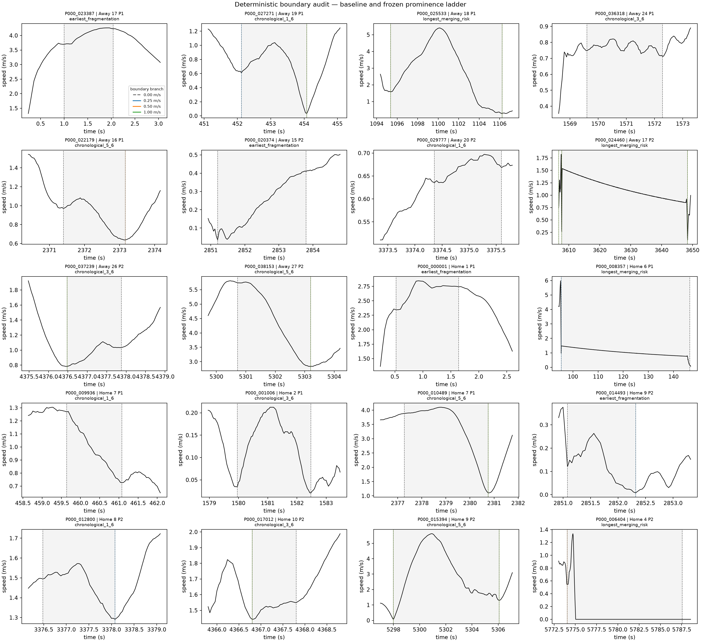

# Post-5B attacking-movement prominence-refinement results

## Result

**B — prominence clearly reduces the frozen fragmentation diagnostic, but no candidate satisfies the complete predeclared package.**

No prominence is selected. Game 2 does not advance under protocol v1.0.

The protocol clarification that removed subjective visual review from classification was saved before any refined segmentation output existed. The [frozen protocol](post5b_attacking_movement_prominence_refinement_protocol.md) and [machine-readable rules](../config/post5b_attacking_movement_prominence_refinement_rules.json) govern this single Game 1 execution.

## Baseline gate

The 0.00 m/s branch reproduced all **38,651** historical episode keys and the saved fragmentation, merging/direction, and Method-B-overlap flags. The maximum numerical difference across the audited continuous fields was $7.11\times10^{-15}$. The baseline gate passed before any nonzero branch was constructed.

## Frozen candidate table

| Prominence | Episodes | Fragmentation | Relative reduction | Merge/direction | Coverage | Relative coverage change | Fragmentation | Safety | Coverage | Eligible |
|---:|---:|---:|---:|---:|---:|---:|:---:|:---:|:---:|:---:|
| 0.00 m/s | 38,651 | 42.224% | 0.000% | 1.974% | 40.995% | 0.000% | baseline | pass | pass | no |
| 0.25 m/s | 11,592 | 7.781% | 81.572% | 35.878% | 71.411% | +74.195% | pass | **fail** | pass | no |
| 0.50 m/s | 8,311 | 2.840% | 93.275% | 52.136% | 77.921% | +90.074% | pass | **fail** | pass | no |
| 1.00 m/s | 5,383 | 1.170% | 97.228% | 69.032% | 81.813% | +99.568% | pass | **fail** | pass | no |

The nonzero branches reduce episode count by 70.01%, 78.50%, and 86.07%. Their all-episode lower-speed/≥3 m joint shares increase, so the frozen coverage criterion passes. That share increase partly reflects the much smaller episode denominator: the corresponding counts decline from 15,845 to 8,278, 6,476, and 4,404. Absolute count is descriptive and was not substituted for the frozen criterion.

Every candidate fails the 3.97% merging/direction cap by a wide margin. The mechanical classification is therefore **B**, with no eligible or selected prominence.

## Fragmentation and merging diagnostics

| Prominence | ≤1.5 s | ≤1 m path | ≤0.5 m displacement | ≥8 s | Displacement/path ≤0.5 | Direction-change flag |
|---:|---:|---:|---:|---:|---:|---:|
| 0.00 | 35.427% | 17.319% | 9.568% | 0.365% | 0.693% | 1.097% |
| 0.25 | 3.364% | 5.202% | 3.131% | 26.872% | 2.381% | 21.265% |
| 0.50 | 1.697% | 1.143% | 0.902% | 40.284% | 3.670% | 37.348% |
| 1.00 | 0.855% | 0.186% | 0.316% | 55.842% | 8.304% | 57.459% |

Prominence removes the dominant tiny-unit symptoms, but at the tested levels it does so mainly by combining movement into much longer and more directionally complex episodes. Median duration rises from 1.88 s to 5.16, 6.68, and 8.80 s; median displacement/path declines from 0.987 to 0.950, 0.934, and 0.905.

Under this frozen protocol, scalar prominence is therefore too aggressive as a standalone boundary-refinement mechanism: it removes trivial valleys, but it also removes boundaries needed to keep longer and directionally complex movements separated. This is a useful B result about the tested representation, not a tactical interpretation or an invitation to optimize another threshold.

This is not a narrow miss. Even the least restrictive candidate exceeds the safety cap by 31.91 percentage points.

## Boundaries and prominence

| Prominence | Retained boundaries | Historical boundaries removed | Newly retained versus baseline |
|---:|---:|---:|---:|
| 0.00 | 40,241 | 0 | 0 |
| 0.25 | 13,079 | 27,339 | 177 |
| 0.50 | 9,756 | 30,581 | 96 |
| 1.00 | 6,720 | 33,588 | 67 |

Median prominence among historical boundaries removed is 0.0216, 0.0321, and 0.0439 m/s for the three thresholds. The 0.25 and 0.50 branches can remove a small number of historically retained boundaries whose own prominence exceeds the threshold because prominence filtering occurs before the unchanged one-second consolidation: removing one candidate can allow a previously suppressed neighbor to be retained instead. Newly retained-versus-baseline counts make that deterministic consequence explicit.

## Tracking-QC sensitivity

Removing episodes whose required raw/smoothing support intersects the confirmed Home 10 period-1 frames 2911–2945 excludes one baseline episode, two 0.25 m/s episodes, and one episode from each higher branch.

The sensitivity remains **B**, with no eligible or selected candidate. The 0.25 m/s merging/direction rate remains 35.876%; the other safety failures are likewise unchanged substantively. The diagnosed tracking discontinuity does not explain the prominence trade-off.

Home 3 and Away 22 remain in the primary and sensitivity results because no prospective automatic support rule exists for them.

## Team, period, and player concentration

The changes are not concentrated in one team or half. Across thresholds, the largest team-share shift is 0.385 percentage points, the largest period shift is 1.101 points, and the largest team-period shift is 0.750 points. Away Player 23 has the largest player-share change at each nonzero threshold (−0.692, −1.045, and −1.157 points). These are descriptive composition shifts, not tactical or quality effects.

## Deterministic visual audit

The frozen rule produced 20 unique historical episodes spanning both teams and periods, including chronological, fragmentation, and merging-risk cases. Machine checks confirm that all displayed boundaries match the retained-boundary table, every nonzero displayed boundary satisfies its implemented prominence rule, and player/time identities agree.



The plots descriptively show the same trade-off as the frozen metrics: small historical units disappear while broad intervals often span multiple speed and directional phases. Appearance did not determine selection or classification and did not trigger tuning.

## Supported claim

> **Under the frozen Game 1 ladder, an outcome-blind speed-valley prominence requirement strongly reduced the historical fragmentation diagnostics and preserved the predeclared lower-speed coverage share, but every tested nonzero threshold produced merging/direction rates far above the frozen safety cap. No tested prominence value qualifies as a balanced refinement.**

## Claim boundaries and stopping rule

This result does not validate movement episodes, tactical runs, pinning, dragging, tracking, defensive response, defender assignment, attacker influence, causation, off-ball value, or gravity.

Protocol v1.0 forbids extending the ladder, adding direction splitting, changing smoothing, spacing, or duration, or opening Game 2 after this B result. The correct next action is conceptual reassessment, not threshold repair.

## Reproducibility

Run once from the repository environment:

```bash
MPLCONFIGDIR=/tmp/sda-mpl .venv/bin/python src/post5b_attacking_movement_prominence_refinement.py
```

Machine-readable results are in [`outputs/post5b_attacking_movement_prominence_refinement/`](../outputs/post5b_attacking_movement_prominence_refinement/). `qc_results.json` records source, config, historical-rule, historical-episode-table, and raw-input hashes.
