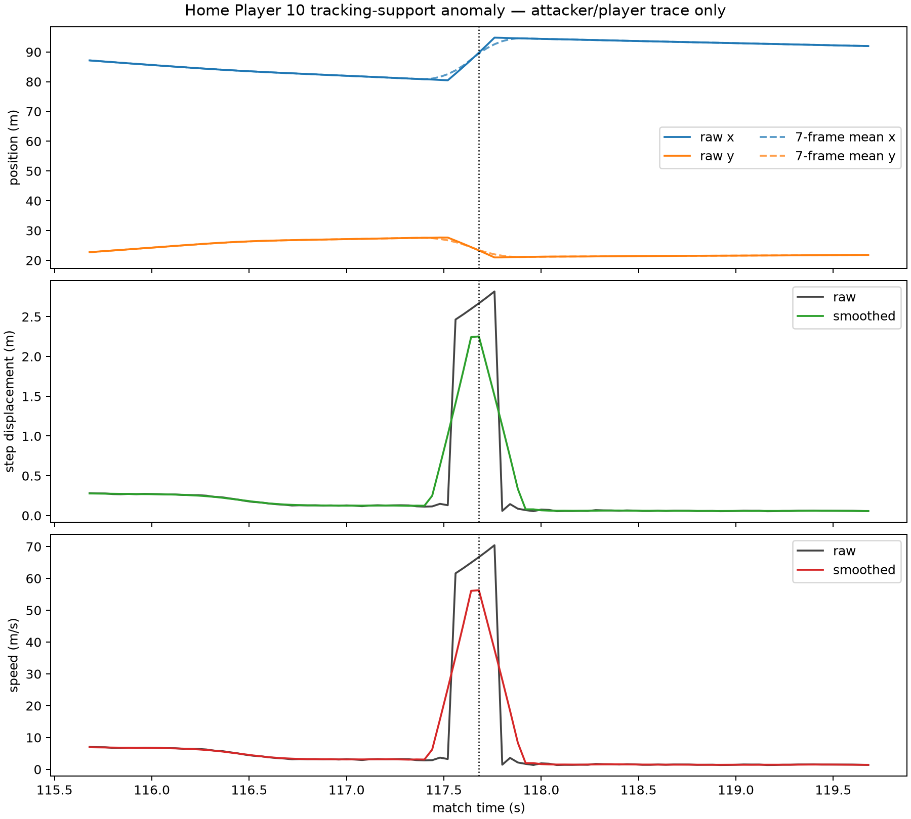

# Post-5B tracking-support / QC audit

## Purpose and firewall

The completed attacking-movement segmentation audit retained a 56.30 m/s maximum rather than deleting it after inspection. This outcome-blind follow-up asks what produced that observation and what kind of trajectory-support rule should precede later movement segmentation.

The audit uses Metrica Sample Game 1 player coordinates, frames, timestamps, team/player identity, and player-only kinematics. It does not use defensive outcomes, opponent association, events, tactical labels, or Sample Game 3. It does not change the completed segmentation implementation, its outputs, or its **B — mixed** classification.

## Result

**A — the anomaly has an identifiable tracking-support mechanism and a defensible prospective support-rule direction is clear.**

The best-supported failure-mode classification is:

> **D — identity discontinuity / duplicated player trace followed by positional restoration.**

This describes the observable source trace. It does not establish the provider's internal cause.

The supported methodological claim is:

> **Extreme derived kinematics can arise from failures of player-identity/trajectory continuity even when frame, timestamp, and coordinate support appear complete. Tracking-support validity should therefore be evaluated on the underlying trajectory before movement segmentation rather than repaired through post-hoc clipping of derived speed.**

## Exact location

The retained smoothed maximum belongs to **Home Player 10**, period 1, frame **2942**, match time **117.68 s**.

| Quantity | Value |
|---|---:|
| Raw coordinate immediately before (frame 2941) | (87.36315, 24.43036) m |
| Raw coordinate at frame 2942 | (89.78130, 23.30224) m |
| Raw coordinate immediately after (frame 2943) | (92.26560, 22.14352) m |
| Seven-frame mean immediately before | (87.49080, 24.37052) m |
| Seven-frame mean at frame 2942 | (89.53065, 23.41677) m |
| Seven-frame mean immediately after | (91.23645, 22.62593) m |
| Smoothed step displacement | 2.251805 m over 0.04 s |
| Smoothed speed | 56.295117 m/s |
| Largest raw speed in the passage | 70.438767 m/s at frame 2944 / 117.76 s |

The centered-mean step has a transparent identity: the change from the seven-frame mean at frame 2941 to that at frame 2942 equals `(raw frame 2945 - raw frame 2938) / 7`. The underlying coordinates move from (80.48250, 27.63928) m at frame 2938 to (94.76145, 20.96304) m at frame 2945. Thus the smoother attenuates and spreads an existing raw discontinuity; it does not create it.

## Local trace evidence

The bounded ±2 s trace contains:

- no missing focal coordinates;
- no skipped frame numbers;
- no duplicated timestamps;
- no unexpected timestamp intervals (all supported steps are 0.04 s);
- six consecutive frames, 2911–2916 (116.44–116.64 s), where Home 10 and Home 1 have exactly identical source coordinates;
- continued near-coincidence between the two identities before the discontinuity;
- six large Home 10 raw steps from frames 2939–2944, with speeds increasing from 61.61 to 70.44 m/s;
- an immediate return to 1.47 m/s at frame 2945 on a distant, subsequently continuous trace.

This combination argues against an ordinary continuous movement, missing-frame bridge, irregular timestamp, coordinate conversion, or smoothing-only explanation. The diagnosis depends on the **combined temporal pattern**: cross-identity duplication/near-coincidence, discontinuous restoration to a distant trace, and extreme raw positional changes.



The figure is a player-trace QC diagnostic, not a football-behaviour result.

## Distribution context

Across the 26 outfield-player traces used by the prior segmentation audit, the central kinematic distribution is far below the anomaly:

| Quantity | 99th percentile | 99.9th | 99.99th | Maximum |
|---|---:|---:|---:|---:|
| Raw speed | 6.321 | 8.139 | 14.684 | 557.025 m/s |
| Seven-frame smoothed speed | 6.295 | 8.032 | 10.935 | 300.954 m/s |

Home 10 has the third-largest per-player raw maximum and third-largest per-player smoothed maximum. Home 3 and Away 22 contain still larger discontinuities. Exact same-coordinate frames also occur for 43 distinct outfield identity pairs somewhere in the match; these occurrences are descriptive flags and are not all presumed to share one cause.

Exact cross-identity coordinate equality alone is therefore **not** proof of an invalid trajectory and must not become a standalone exclusion rule.

The 56.30 m/s observation is therefore an extreme tail event but not an isolated tracking-support phenomenon. The broader tail supports a prospective continuity audit across every trajectory rather than a one-off deletion of Home 10.

No biological or “humanly possible” cutoff was selected, and no observation was removed.

## Prospective support-rule directions

Future formal segmentation validation should prospectively consider rules at the trajectory-support layer:

1. require contiguous expected frames;
2. require expected timestamp continuity;
3. require complete raw-coordinate support across every smoothing window;
4. use trajectory-continuity checks capable of identifying unresolved identity/discontinuity events;
5. invalidate a downstream movement episode if its supporting raw trajectory crosses an unresolved positional/identity discontinuity.

Numeric tolerances for near-duplication or positional discontinuity are not frozen here. A pure rule of “speed above X is invalid” is not recommended from this audit: it targets the derived symptom, risks circular cleanup, and does not identify whether the underlying trajectory is supported.

## Existing provenance

Carrilho et al. (2020) establish optical football tracking as an input to downstream coordination analysis, while Penn, Donnelly, and Bhatt (2025) make player-identity assignment explicit in a football tracking-reconstruction pipeline. The project’s prospectively written Phase 4C protocol already treats discontinuities traceable to identity, coordinate, period, or substitution errors as data-quality failures requiring implementation audit before behavioural interpretation. Together these sources support validating identity and trajectory continuity before downstream kinematics; they do not identify the provider-internal cause of the present Metrica trace or supply a universal exclusion threshold.

## Why this is outcome-independent

The intended order is:

> raw tracking support → trustworthy player trajectory → attacking movement segmentation → defensive geometric relationship testing

None of the candidate rule types depends on whether an episode later looks coherent, produces a desirable segmentation, or coincides with defensive movement. The prior anomalous observation remains in the historical segmentation audit.

## Relation to future valley refinement

These are separate methodological questions:

- **Tracking support:** “Can the underlying player trajectory be trusted for this interval?”
- **Segmentation:** “Given a trustworthy trajectory, which changes in the player's own movement should divide one movement effort from another?”

The tracking anomaly does not select a valley-prominence rule, threshold, separation, or hysteresis parameter. The planned outcome-blind prominence question remains unimplemented.

## Reproducibility

Run:

```bash
MPLCONFIGDIR=/tmp/sda-mpl .venv/bin/python src/post5b_tracking_support_qc_audit.py
```

Machine-readable results are in [`outputs/post5b_tracking_support_qc_audit/`](../outputs/post5b_tracking_support_qc_audit/). The source records input and source hashes in `qc_results.json`.

## Nonclaims

This audit does not establish a validated tracking-support filter, a numeric plausibility threshold, validated attacking movement episodes, tactical attacking movement, defensive response, attacker influence, attacker causation, tactical assignment, relational reconfiguration, gravity, off-ball value, or the validity of a refined segmentation method.
