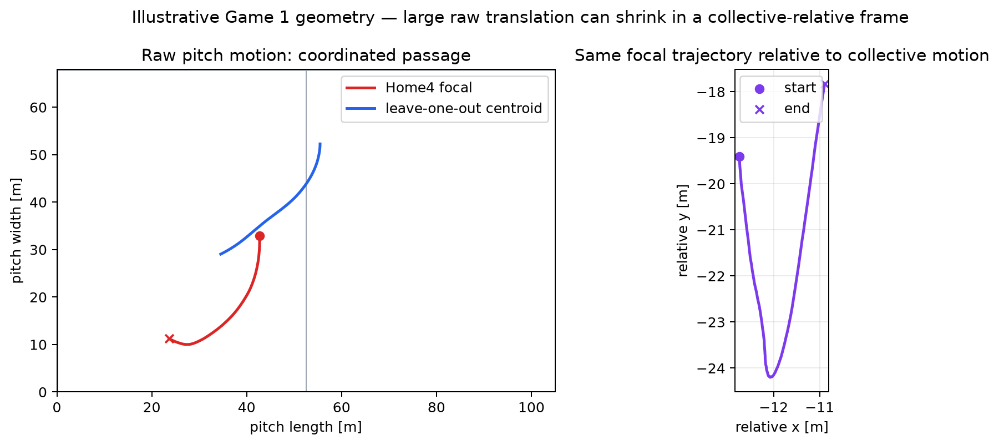
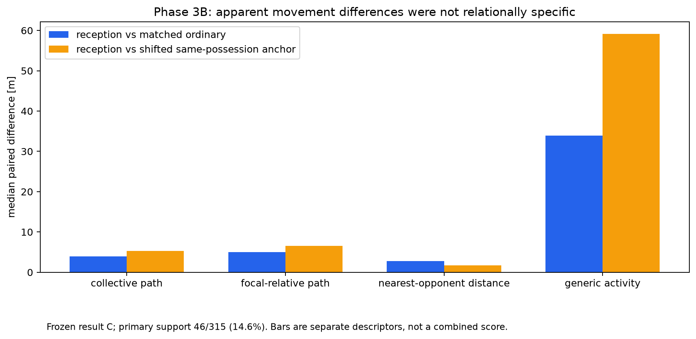

# Explaining the Project

This is the football-first guide to the repository. Technical definitions follow the intuition; historical terminology is retained only where it explains how the research changed.

## 1. What football problem are we trying to measure?

In association football, an attacker can affect defenders without touching the ball. A winger can hold a full-back, a striker can threaten the space behind, or a midfielder can appear between lines. Analysts describe these actions as pinning, dragging, tracking, covering, handing off, or stretching.

Tracking data records where players moved. It does not record why. The project asks how to build defensible measurements of attacking movement and defensive change before attaching those football meanings.

## 2. What is the one-minute explanation?

If the whole back line slides five metres left, that is mostly a defensive shift. If three defenders slide and one steps away from the unit, we want to separate that individual adjustment from the shared shift. The project has validated a narrow geometric measurement of that difference, shown that recent movement predicts much of it, and found only weak extra information from simple nearest-opponent geometry. It is now working upstream on how to break an attacker’s own movement into finite efforts without using what the defence subsequently did.

The project can measure movement. It cannot yet say that an attacker caused, deserved credit for, or tactically required a defensive action.

## 3. Why can’t we just count sprints, passes, or receptions?

- Sprint filters omit lower-speed movement that may still change position materially.
- Passes and receptions describe ball events, not every off-ball action.
- A reception-based validation in this project mostly selected active passages; shifted control times reproduced the apparent effect.
- Counting an event after movement would leak outcome information into the definition of the attacking action.

The attacking movement itself therefore needs an outcome-independent temporal representation.

## 4. Why are defensive shifts a problem for measurement?

A defender can travel 20 m while maintaining nearly the same place within a shifting unit. Raw pitch distance mixes individual movement with team movement. The project uses the other defending outfield players as a transparent moving reference.



For focal defender $d$,

$$
\mathbf c_{-d}(t)=\frac{1}{N-1}\sum_{j\neq d}\mathbf x_j(t),
\qquad
\mathbf r_d(t)=\mathbf x_d(t)-\mathbf c_{-d}(t).
$$

The accumulated path of $\mathbf r_d(t)$ measures how much the defender moved differently from the other outfield defenders. The centroid is a baseline for shared movement, not a complete representation of defensive structure.

## 5. What did the project first try?

The original framing treated Structure, Track, Close, and Recover as possible defensive states. Diagnostics showed that the behaviours overlap, fixed attacker-relative stability was not a general Track representation, and local interpretations changed under reasonable prospective relationship choices.

Those terms remain useful football prompts and part of the research history. They are not validated states or labels.

## 6. What failed prospectively?

Phase 3 froze a reception-anchored matched design intended to validate relational reconfiguration. Only 46 of 315 candidates matched, far below the required support. Shifted anchors reproduced or exceeded the main contrasts, and activity-matched contrasts disappeared in a very small subset. The result was **C**.

This failure established that generic active-play movement can masquerade as meaningful defensive structure. Relational reconfiguration remains unvalidated.



## 7. What measurement eventually replicated?

Focal-relative path—the accumulated amount a defender moves relative to the other defending outfield players—replicated from development Game 1 to held-out Metrica Game 2. A separately frozen protocol then externally replicated its geometric behaviour across seven IDSSE professional matches from one independent dataset/provider environment.

It is a validated, reproducible movement-magnitude primitive. It is not an activity-free effect, tactical response, marking decision, or attacker influence measure.

## 8. Why didn’t replication solve the football problem?

The primitive says **how much movement differed from the unit**, not:

- what triggered it;
- which opponent mattered;
- whether the defender stepped, held, dropped, tracked, or recovered for a tactical reason;
- whether the movement was correct;
- whether an attacker deserves credit.

Those are later evidentiary levels.

## 9. What did contextual prediction tell us?

Phase 5A showed that future focal-relative path contains reproducibly predictable structure. The best simple model reduced median held-out MAE by 20.58% versus an unconditional baseline and improved all seven matches. Most of that gain—about 90%—was already present in the focal defender’s recent movement. Collective, ball, and spatial context added small directional improvements but no material adjacent step under the frozen rule.

This is statistical expectation, not tactical expectation. A residual is not a tactical error or attacker-induced response.

## 10. What did opponent information tell us?

Phase 5B added prospectively selected opponent geometry. The best opponent model improved median held-out error by only 0.43%, improved six of seven matches, and did not show that nearest opponents were materially more informative than nonlocal controls.

The result is **B — mixed/partial**: a small opponent-information association under one tested representation. It does not establish marking, responsibility, local opponent primacy, tactical response, or causation.

## 11. What did the direction/onset audit add?

Scalar path measures amount but loses sign and axis. Signed focal-relative displacement is therefore retained as a complementary descriptive view.

A simple constant-velocity continuation innovation did not survive as a response-onset measure. Neutral windows overlapped historical anchors, and several movements were already developing inside the preceding two seconds. Future work may need to describe geometric change over a finite interval rather than force one universal onset instant.

## 12. Why define attacker movement independently?

A later bridge test must not choose attacking actions because the defence reacted interestingly. The movement-segmentation audit therefore used only each attacker’s own trajectory plus global match-state exclusions.

Its speed-valley implementation produced 38,651 candidate episodes and retained substantial lower-speed movement: 15,845 episodes peaked below 5.5 m/s while displacing at least 3 m. But 42.22% met a fragmentation diagnostic, compared with 1.97% meeting a merging/direction diagnostic. The result is **B — mixed**.

The attacker-only approach remains promising, but the current rule is not ready for formal validation. A 56.30 m/s maximum also requires a separate prospective tracking-QC investigation.

## 13. Where does the evidence stop?

```text
football question
→ attacking movement
→ defensive movement
→ defender relative to unit
→ magnitude + direction
→ contextual expectation
→ opponent association
→ tactical interpretation
→ attacker attribution
→ value
```

Every arrow is conditional. Current evidence reaches externally replicated defender-relative geometry, contextual-prediction feasibility, and a small mixed opponent-information association. Tactical interpretation and everything after it remain unsupported.

## 14. What is the current methodological frontier?

> **Can attacking movement and defensive geometric change be represented as defensible finite units before testing their relationship?**

This is a representation problem, not yet an attacker-response experiment. No next-phase protocol has been designed or frozen.

## 15. What could the work eventually support?

Conditional future applications include defensive-style profiling, opponent- or zone-specific tendency analysis, scouting descriptions, candidate-moment surfacing, video indexing, and—only after semantic validation—coaching feedback.

The project does not currently evaluate quality, identify correct decisions, label tactical concepts automatically, prescribe actions, measure gravity, or assign off-ball value.

## The rule to remember

> **Football concept ≠ tracking measurement ≠ theoretical mechanism.**

“Consistent with a defender stepping out” is not the same as “the defender was responsible for this attacker,” and neither establishes that the attacker caused the movement.
