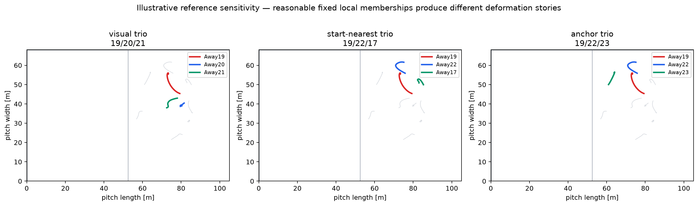

# Explaining the Project

This document is a verbal guide for explaining the work accurately to a technically literate soccer audience.

## 1. What originally motivated the project?

The original idea was that attackers influence defenders even when they do not receive the ball. A checked run, rotation, or threatening position may cause defensive movement that conventional event data misses. The first framing tried to describe defenders as moving through Structure, Track, Close, and Recover states.

## 2. What does “asking questions” mean?

It is soccer shorthand for posing a credible tactical problem. A winger holding width, a striker threatening depth, or a midfielder appearing between lines may require some defensive response. “Question” is theoretical language; the data do not reveal whether a defender consciously recognized it.

## 3. Why can we not measure defensive cognition directly?

Tracking gives coordinates. It does not record instructions, gaze, communication, intention, attention, recognition, or responsibility. We can calculate movement consistent with an interpretation, but we cannot equate the calculation with the hidden mental or tactical process.

## 4. What does tracking data give us?

At 25 Hz, the Metrica files provide anonymized player and ball positions plus event timestamps. After converting normalized coordinates to 105 × 68 m, we can calculate trajectories, distances, relative positions, centroids, paths, and velocity components. Missing ball and player coordinates remain explicit; nothing is interpolated where a protocol prohibits it.

## 5. Why are reference frames important?

A defender can travel 20 m on the pitch while maintaining nearly the same position relative to the defensive block. Raw coordinates describe absolute movement; a moving reference describes movement relative to something else. The same trajectory can therefore look like large translation in one frame and little departure in another.

## 6. What is collective translation?

Collective translation is shared movement of the defending group. A simple baseline is the centroid of the defending outfield players. For focal defender $d$, the leave-one-out centroid is

$$
\mathbf c_{-d}(t)=\frac{1}{N-1}\sum_{j\neq d}\mathbf x_j(t).
$$

It is useful but not “the structure.” Opposing movements can cancel, and a mean cannot preserve local spacing, rotation, opponents, or ball context.

## 7. What is focal departure?

Focal departure is the movement of one defender relative to that leave-one-out collective baseline:

$$
\mathbf r_d(t)=\mathbf x_d(t)-\mathbf c_{-d}(t).
$$

Phase 4 proposes the path length of $\mathbf r_d(t)$ over a five-second interval as the primary magnitude. It measures accumulated relative motion, including leaving and returning. It does not say why the defender moved differently.

## 8. Why did the original Track concept fail?

The simple proposal was that a defender following an opponent should have a stable attacker-relative x/y vector. In the visually strongest Game 1 Track candidate, that vector was not more stable than the collective-relative alternative. Movement coupling and opponent geometry may capture other aspects, but fixed Cartesian stability is not a general Track primitive.

## 9. Why did local compression become local deformation?

Some selected defenders clearly converged in one interior-threat sequence. Later prospective selection showed that different reasonable local memberships contained contraction, expansion, and mixed anisotropic change. “Deformation” accurately includes shrinking, stretching, rotation, and reordering; “compression” is only one subtype.

## 10. What did Phase 3 test?

Phase 3 froze a reception-anchored matched design before viewing outcomes. Receptions were candidate clocks, ordinary open-play pseudo-anchors were controls, and typed collective, focal, local, opponent, ball, and generic-activity descriptors stayed separate.

## 11. Why did Phase 3 fail?

Only 46 of 315 candidates matched, far below the frozen 70% support threshold. Reception windows showed more movement, but shifted anchors inside the same possession reproduced or exceeded the main apparent effects. When the sparse sensitivity also matched pre-anchor activity, the contrasts disappeared. The frozen conclusion was C.

## 12. Why is that failure useful?

It rules out a convenient shortcut: receptions cannot be treated as positive reconfiguration cases. It also shows that generic passage activity must be central in future designs and that one match cannot support strict contextual matching.

## 13. Why is Game 2 held out?

If the metric or thresholds change after looking at Game 2 outcomes, the second match becomes another development sample. Freezing the protocol first creates a genuine chance for failure and makes replication interpretable.

## 14. What exactly will Phase 4 test?

It will sample deterministic non-overlapping five-second intervals, calculate focal-relative path for every eligible outfield defender, characterize Game 1 distributions and activity relationships, and test those once in Game 2. Events provide possession/context, not positive labels.

## 15. What would support focal departure?

The quantity should reproduce its distributional shape and contextual relationships in held-out Game 2, retain variation after activity conditioning, behave sensibly under contemporaneous versus misaligned collective references, and remain qualitatively stable across frozen interval and smoothing sensitivities.

## 16. What would falsify or weaken it?

It weakens if it is almost completely determined by absolute movement, if collective/ball/team activity explains all structure, if Game 1 relationships reverse in Game 2, if membership or substitutions destabilize the reference, if results depend on arbitrary windows, or if the only interpretation is “this defender moved differently.”

## 17. How far are we from defensive reconfiguration claims?

At least one major empirical layer away. Focal departure must first validate as a primitive. Then it would need contextual or semantic interpretation and integration with other validated scales. The umbrella construct already failed one prospective validation design.

## 18. How far are we from gravity or off-ball value?

Several conditional layers away. Gravity requires attacker attribution and an expected-response baseline; value additionally requires downstream soccer consequences. A reproducible defensive movement quantity would not by itself establish either.

## A useful one-minute summary

The project started by asking whether attackers cause defenders to switch among tactical states. Diagnostics showed that the states overlap, simple Track failed, and local stories depend on reference choice. A prospective reception-based validation then mostly detected active passages, not a relational signature. The project has therefore narrowed to a basic held-out question: does one defender’s movement relative to the rest of the defense contain reproducible structure beyond ordinary activity? Game 1 developed the protocol; Game 2 remains untouched for the test.
