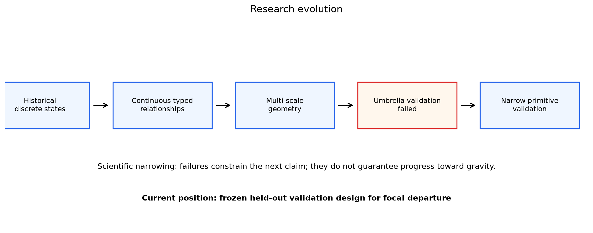

# Research Roadmap

This roadmap shows logical dependencies rather than promising a predetermined destination.



## Conditional inference chain

```text
Physical movement
        ↓
Collective defensive movement
        ↓
Individual/local behavior relative to collective movement
        ↓
Contextual expectation
        ↓
Defensive response
        ↓
Attacker association
        ↓
Attribution
        ↓
Attacking value
```

Every arrow is conditional. Geometry does not become cognition, responsibility, or value merely by adding more descriptors.

## Current location

> **Current project position:** Phase 4B has validated focal-relative path narrowly at the individual-relative-to-collective geometric level in two Metrica sample matches. Tactical defensive response and every later inference remain unvalidated.

The completed frozen Phase 4 design asked whether

$$
\mathbf r_d(t)=\mathbf x_d(t)-\mathbf c_{-d}(t)
$$

has stable distributional and contextual structure under frozen activity diagnostics. It did, while remaining substantially activity-associated.

## What each layer requires

### 1. Tracking geometry

Required: synchronized player/ball coordinates, known sampling, documented missingness, physical units, period boundaries, and stable player availability. Established for the two Metrica sample matches at the schema/readiness level.

### 2. Reference frames

Required: transparent definitions and failure modes. A leave-one-out centroid is useful for translation but insufficient for full structure. Local and opponent references remain selection-sensitive.

### 3. Scale-specific primitives

- **Collective translation:** descriptively established as a baseline.
- **Focal departure:** reproducible across Games 1 and 2 under the frozen test; still geometric and activity-associated.
- **Local deformation:** descriptively useful but membership-sensitive.
- **Opponent-relative geometry:** mathematically clear but semantically weak without justified opponent selection.

### 4. Validation beyond activity

Required: outcome-independent sampling, adequate support, development/test separation, negative controls, frozen sensitivities, and explicit falsification. Phase 3 failed here; Phase 4B passed narrowly at the geometric level.

### 5. Relational reconfiguration

One possible intermediate form of defensive response, requiring several validated primitives to show coherent, temporally localized change not adequately described by baseline movement. It remains unvalidated and is no longer the mandatory center of the program.

### 6. Tactical interpretation

Requires soccer context or external semantic evidence. Tracking alone cannot establish intention, instruction, attention, or assignment.

### 7. Attacker association and attribution

Association requires comparable contexts and separation from ball, team, phase, and opponent effects. Attribution is a higher causal bar. No such analysis has been executed.

### 8. Gravity or value

Requires an expected-response baseline, attacker attribution, robustness across matches and teams, and separation of response from downstream value. This is not an inevitable endpoint.

## Legitimate stopping points

- **External replication fails:** retain the Metrica result as same-provider geometry and stop broader generalization.
- **Primitive replicates but lacks soccer meaning:** useful as geometry, not as a tactical construct.
- **Primitive replicates and earns contextual interpretation:** proceed cautiously to broader multi-match analysis.
- **Umbrella construct remains unsupported:** retain validated primitives without forcing them into reconfiguration; project success does not require reconfiguration.
- **Attacker attribution fails:** stop before gravity or value claims.

A scientifically successful project can end at any of these points if it clearly establishes why the next arrow is unsupported.

The prospectively stated dataset sequence and likely—but unexecuted—external replication phase are in the [post–Phase 4 data strategy](post_phase4_data_strategy.md).
