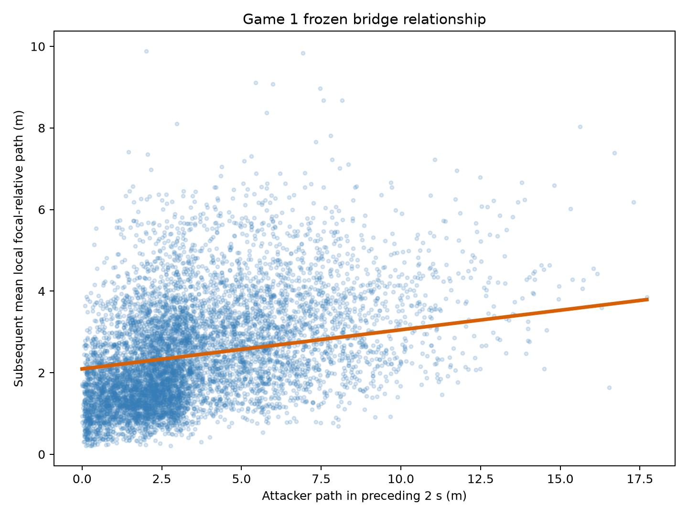
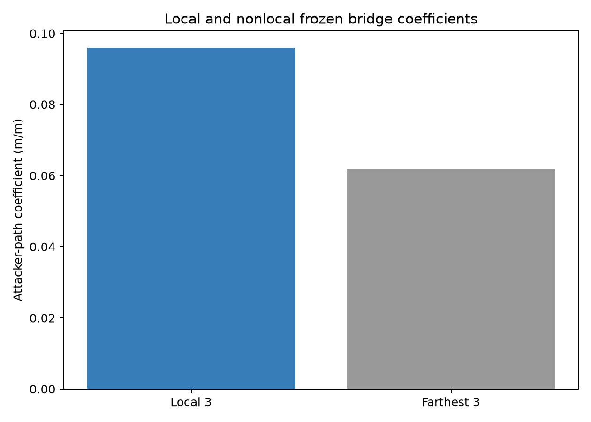

# Attacker-to-Defender Bridge v1 — Game 1 Development Result

## Status and chronology

**GAME 1 DEVELOPMENT COHERENT.** The [authoritative protocol](../protocols/attacker_defender_bridge_v1.md), its Game-1-only decision tree, bootstrap mechanics, and all comparisons were frozen before any bridge observation or result. This is development evidence from Metrica Sample Game 1, not the protocol's final two-match A/B/C result. Game 2 bridge quantities were not computed and Game 3 remained untouched.

The frozen question was whether an attacker's path over $[t-2,t]$ is associated with subsequent mean focal-relative path among the three nearest defending outfield players over $[t,t+2]$, conditional on the same defenders' focal-relative movement and the defending-outfield centroid path during the strictly earlier $[t-4,t-2]$ interval.

## Implementation and eligibility

Evaluation times followed the period-origin four-second grid. Possession at $t$ identified the attacking team; the response did not require continued possession. Linkage used distance at $t$ only, with canonical player ID as the deterministic tie-break. The nearest three were the local geometric set and the farthest three the matched nonlocal control. Proximity does not imply assignment.

The first implementation attempt stopped before observation construction because the optional PyArrow bridge was unavailable. The completed implementation uses native Polars Parquet writing and a deterministic row-dictionary conversion where pandas tables are required. After the initial completed run, the already-passing hard audit was made explicit as a 24-row machine-readable table and the unchanged pipeline was rerun in full twice. These are non-scientific plumbing/QC clarifications: no sample rule, measurement, model, bootstrap, threshold, or criterion changed.

The primary sample contains **7,823** attacker-time observations at **804** unique evaluation times: 5,936 in period 1 and 1,887 in period 2; 4,483 for Home and 3,340 for Away. The 1,448 candidate endpoints included eight without a possession team. Observation-level exclusions were:

| Reason | Count |
|---|---:|
| attacker exposure unavailable | 4,198 |
| attacker full support unavailable | 8 |
| complete ten-defender support unavailable | 3,974 |
| restart or ball-out in governed span | 2,717 |
| no possession team at endpoint | 8 endpoints |

Simultaneous-attacker multiplicity had median 10, IQR 9–10, and range 8–10. The separately eligible four-second analysis retained 7,328 observations.

## Descriptive sample

| Quantity (m) | Mean | SD | Median | IQR | Range | p95 | p99 |
|---|---:|---:|---:|---:|---:|---:|---:|
| attacker preceding path | 3.555 | 2.675 | 2.802 | 3.300 | 0.000–17.717 | 8.835 | 12.198 |
| local subsequent response | 2.434 | 1.286 | 2.195 | 1.737 | 0.204–9.887 | 4.878 | 6.183 |
| nonlocal subsequent response | 2.477 | 1.326 | 2.210 | 1.662 | 0.204–9.929 | 5.006 | 6.532 |
| local prior baseline | 2.497 | 1.371 | 2.206 | 1.756 | 0.204–10.026 | 5.215 | 6.573 |
| nonlocal prior baseline | 2.493 | 1.304 | 2.252 | 1.664 | 0.204–9.845 | 4.976 | 6.488 |
| defending-centroid prior path | 2.963 | 2.232 | 2.335 | 3.102 | 0.067–10.901 | 7.384 | 9.294 |

Signed attacker displacement remained secondary: mean x/y changes were −0.294/0.007 m, with ranges −16.557–17.168 m and −13.253–11.024 m. Straightness was defined for 7,819 observations; its median was 0.989 and IQR 0.059.

## Frozen models and bootstrap results

The primary point estimate was

$$
Y_{local}=0.877779+0.095957X_a+0.398536B_{local}+0.074068C_D.
$$

Thus $\beta_1=0.095957$ m/m, with a blocked-bootstrap 95% percentile interval of **[0.075594, 0.114331]**. All 2,000 replicates were valid; none failed.

| Analysis | $\beta_1$ | 95% interval | Valid / attempted |
|---|---:|---:|---:|
| primary local, 2 s | 0.095957 | [0.075594, 0.114331] | 2,000 / 2,000 |
| farthest-three nonlocal, 2 s | 0.061782 | [0.038697, 0.085993] | 2,000 / 2,000 |
| reverse-time placebo | 0.051661 | [0.032612, 0.069670] | 2,000 / 2,000 |
| local response, 1 s | 0.048565 | [0.036976, 0.059255] | 2,000 / 2,000 |
| local response, 4 s | 0.165981 | [0.133695, 0.196585] | 2,000 / 2,000 |
| exposure-trimmed local, 2 s | 0.093386 | [0.071695, 0.113094] | 2,000 / 2,000 |

The local-minus-nonlocal point difference was **0.034175** m/m; its paired interval was [0.012751, 0.058236]. The local-minus-placebo point difference was **0.044296** m/m; its paired interval was [0.027172, 0.061203]. These controls constrain the development association but do not establish causation.

The frozen p99 exposure threshold was **12.198443 m**. Excluding the 79 observations above it (1.0098%) retained 7,744 observations. The trimmed coefficient was 97.32% of the full-sample coefficient.

## Development decision

| Frozen criterion | Result |
|---|---|
| hard QC | PASS |
| deterministic reproduction | PASS |
| at least 1,900 valid replicates for every governed interval | PASS |
| $\beta_{1,local}>0$ | PASS |
| $\beta_{1,local}>\beta_{1,nonlocal}$ | PASS |
| $\beta_{1,local}>\beta_{1,placebo}$ | PASS |
| $\beta_{1,trimmed}>0$ | PASS |
| $\beta_{1,trimmed}\geq0.5\beta_{1,full}$ | PASS |
| 1 s and 4 s not both negative when 2 s is positive | PASS |

All 24 explicit hard-QC checks passed. An independent complete rerun was byte-identical across all 15 governed pre-reproduction files. The primary model RMSE was 1.009 m, design condition number 13.96, maximum leverage 0.00648, and maximum Cook's distance 0.01044; these are descriptive numerical diagnostics, not tactical evidence.

## Figures

## Supported interpretation and limits

> In Game 1, greater observed attacker movement was associated with greater subsequent local defensive movement relative to the defensive unit after the frozen strictly earlier defensive-motion adjustment, and the prespecified local, temporal, sensitivity, and influence diagnostics were directionally coherent.

This is observational development evidence. It does **not** establish causation, marking assignment, tactical responsibility, intention, dragging, pinning, tracking, covering, handoff, disruption, defensive quality, gravity, or off-ball value. It does not yet establish a bridge result across matches.

## Frozen Game 2 inheritance and firewall

[`game2_inheritance.json`](../../outputs/attacker_defender_bridge_game1_v1/game2_inheritance.json) freezes the two-second path exposure; $[t-4,t-2]$ baseline; 1/2/4-second responses; $K=3$ nearest/farthest linkage; mean aggregation; four-second period-origin cadence; model formula; 2,000-replicate 60-second period-block bootstrap and RNG lineage; comparison rules; horizon rule; robustness rule; and the Game 1 p99 threshold of 12.198443 m. The final two-match A/B/C rules remain those in the authoritative protocol.

No Game 2 bridge observation, linkage, response, coefficient, bootstrap, placebo, sensitivity, figure, or classification was computed. Game 3 was not accessed.
