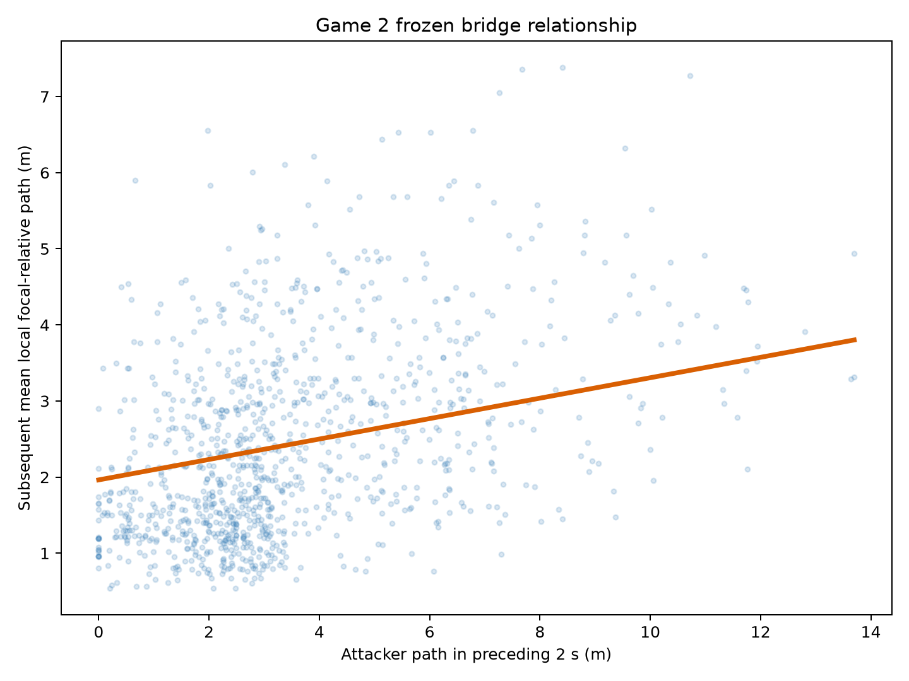
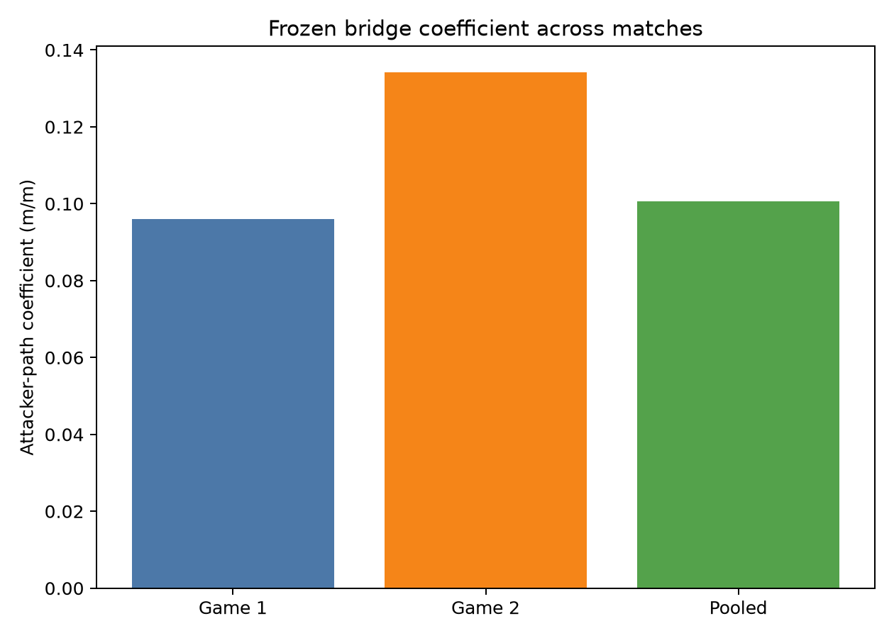
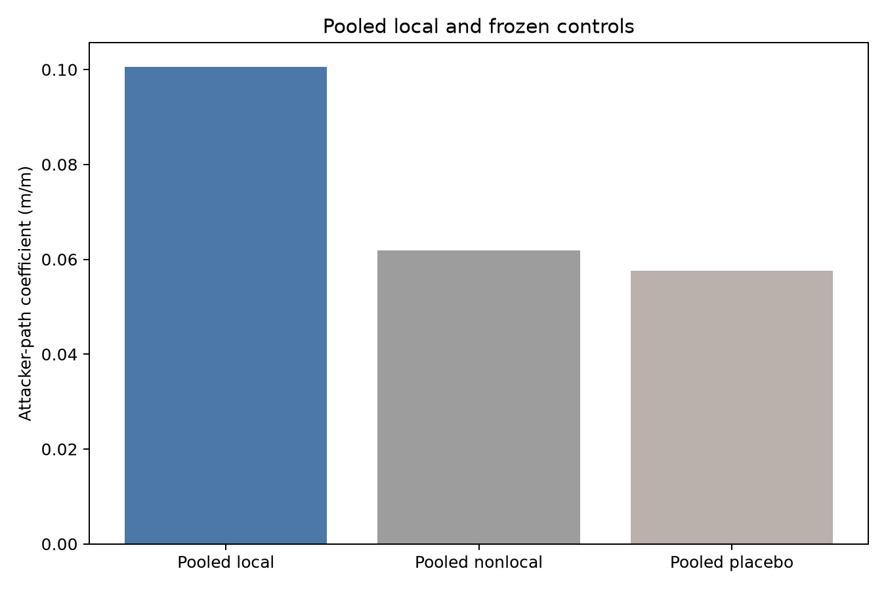

# Attacker-to-Defender Bridge v1 — Held-Out Game 2 and Final Result

## Final classification

**FINAL BRIDGE A — supported first geometric bridge.** The unchanged [frozen protocol](../protocols/attacker_defender_bridge_v1.md) executed on conditionally bridge-held-out Metrica Sample Game 2 after the coherent Game 1 result. The pooled two-match analysis then applied the prospectively frozen model, independent within-match-period block resampling, reserved RNG child, and final A/B/C rules.

This classification supports an observational geometric association across the two Metrica sample matches. It does not establish causation, assignment, tactical response, or value.

## Pre-execution firewall

Execution began from clean, synchronized commit `c7c62c9e3569077481d9c65d5935e9946b84526d`. The protocol SHA-256 remained `62321620a3007bf0c9686d99595caa0f9e39e2ac7ea2ba78b935ddfefd308bbb`. The Game 1 final ledger, held-out Game 2 attacker ledger, and Stage-A support ledger validated before bridge construction. Stage A remained READY with 2,093,028 valid rows in 134 support segments. No prior Game 2 bridge artifact existed. Game 3 was not accessed.

## Game 2 sample

The primary sample contains **1,087 observations** at **115 unique anchor times**: 849 in period 1 and 238 in period 2; 697 Home-attacking and 390 Away-attacking. The four-second sensitivity retained 1,070 observations. Simultaneous-attacker multiplicity had median 10, IQR 9–10, and range 7–10.

There were 1,409 candidate endpoints and no endpoint lacked an event-derived possession team. Observation exclusions were:

| Reason | Count |
|---|---:|
| attacker exposure unavailable | 5,635 |
| attacker full support unavailable | 39 |
| complete ten-defender support unavailable | 7,643 |
| restart or ball-out in governed span | 2,563 |

These counts reflect the prospectively frozen Stage-A trajectory-support registry and open-play rules; no support rule was changed after the bridge result.

## Game 2 descriptive geometry

| Quantity (m) | Mean | SD | Median | IQR | Range | p95 | p99 |
|---|---:|---:|---:|---:|---:|---:|---:|
| attacker preceding path | 3.475 | 2.428 | 2.844 | 2.649 | 0.000–13.697 | 8.385 | 11.591 |
| local subsequent response | 2.429 | 1.281 | 2.148 | 1.770 | 0.535–7.384 | 4.838 | 6.122 |
| nonlocal subsequent response | 2.424 | 1.295 | 2.091 | 1.865 | 0.339–7.384 | 4.803 | 5.868 |
| local prior baseline | 2.544 | 1.367 | 2.276 | 1.875 | 0.536–8.341 | 4.977 | 6.598 |
| nonlocal prior baseline | 2.458 | 1.284 | 2.154 | 1.758 | 0.267–8.341 | 4.870 | 6.318 |
| defending-centroid prior path | 3.013 | 1.767 | 2.675 | 2.437 | 0.192–9.431 | 5.917 | 8.803 |

The Game 2 empirical p99 of 11.591495 m is descriptive only. Trimming used the inherited Game 1 threshold of **12.198443079831405 m**, unchanged.

## Game 2 models and controls

The primary Game 2 fit was

$$
Y_{local}=0.926171+0.134222X_a+0.346742B_{local}+0.051263C_D.
$$

| Analysis | $\beta_1$ | 95% interval | Valid / attempted |
|---|---:|---:|---:|
| primary local, 2 s | 0.134222 | [0.081738, 0.183570] | 2,000 / 2,000 |
| farthest-three nonlocal, 2 s | 0.064756 | [−0.003064, 0.134934] | 2,000 / 2,000 |
| reverse-time placebo | 0.100264 | [0.057770, 0.141784] | 2,000 / 2,000 |
| local response, 1 s | 0.071017 | [0.043210, 0.098225] | 2,000 / 2,000 |
| local response, 4 s | 0.275066 | [0.190169, 0.365322] | 2,000 / 2,000 |
| inherited-threshold trimmed local, 2 s | 0.137772 | [0.086843, 0.186155] | 2,000 / 2,000 |

Local minus nonlocal was **0.069466 m/m**, paired interval [0.016845, 0.123824]. Primary minus placebo was **0.033958 m/m**, paired interval [0.006189, 0.066336]. Both frozen point comparisons passed. The positive placebo remains important evidence of shared temporal movement; its smaller coefficient and paired difference do not prove causal direction.

The inherited threshold excluded 4/1,087 observations (0.3680%), retaining 1,083. The trimmed/full ratio was **1.02645**; both robustness rules passed.

## Pooled two-match analysis

The pooled sample contains **8,910 observations**. The frozen fit was

$$
Y_{local}=0.885774+0.100592X_a+0.392161B_{local}+0.071181C_D-0.018316I_{Game2}.
$$

| Analysis | $\beta_1$ | 95% interval | Valid / attempted |
|---|---:|---:|---:|
| pooled primary local, 2 s | 0.100592 | [0.082406, 0.119233] | 2,000 / 2,000 |
| pooled nonlocal, 2 s | 0.061854 | [0.040284, 0.084376] | 2,000 / 2,000 |
| pooled reverse-time placebo | 0.057599 | [0.041129, 0.075296] | 2,000 / 2,000 |
| pooled local, 1 s | 0.051220 | [0.040917, 0.061736] | 2,000 / 2,000 |
| pooled local, 4 s | 0.179952 | [0.149399, 0.210588] | 2,000 / 2,000 |
| pooled trimmed local, 2 s | 0.099103 | [0.079920, 0.118125] | 2,000 / 2,000 |

Pooled local minus nonlocal was **0.038738 m/m**, paired interval **[0.018392, 0.062082]**. Pooled primary minus placebo was **0.042994 m/m**, paired interval **[0.027143, 0.058787]**. Both intervals excluded zero positively.

The inherited threshold excluded 79 Game 1 and 4 Game 2 observations, 83/8,910 total (0.9315%), retaining 8,827. The pooled trimmed/full ratio was **0.98519**. The pooled trimmed result is descriptive under the frozen protocol; the final A robustness gate is the within-match rule, which passed in both matches.

## Frozen final criteria

| Requirement for Final A | Numerical evidence | Result |
|---|---|---|
| local $\beta_1>0$ in both matches | Game 1 0.095957; Game 2 0.134222 | PASS |
| pooled primary interval positive | [0.082406, 0.119233] | PASS |
| local−nonlocal positive in both matches | Game 1 0.034175; Game 2 0.069466 | PASS |
| pooled local−nonlocal interval positive | [0.018392, 0.062082] | PASS |
| primary−placebo positive in both matches | Game 1 0.044296; Game 2 0.033958 | PASS |
| pooled primary−placebo interval positive | [0.027143, 0.058787] | PASS |
| inherited-threshold coefficient positive and ≥50% in both | Game 1 97.32%; Game 2 102.65% | PASS |
| 1 s and 4 s do not both reverse primary sign | all six match-specific coefficients positive | PASS |
| support, invariance, bootstrap, hard QC, reproduction | 2,000 valid throughout; 32/32 checks; 16/16 files identical | PASS |

Every prospectively frozen Final A requirement passed. No coefficient-size threshold, p-value, interaction, new horizon, or Game 2-derived rule was added.

## Numerical and influence diagnostics

The Game 2 primary model RMSE was 1.050 m, condition number 14.28, maximum leverage 0.0241, and maximum Cook's distance 0.0449. Signed attacker displacement means were +0.003 m x and +0.057 m y. Straightness was valid for 1,066 observations, with median 0.987 and IQR 0.050. These are descriptive numerical diagnostics, not tactical evidence.

## Figures

## Supported interpretation

> Greater observed attacker movement was associated with greater subsequent local defensive movement relative to the defensive unit, beyond prespecified strictly prior defensive-motion context. The association replicated across the two Metrica sample matches under the frozen within-provider bridge protocol.

In plain football language, when an attacker covered more ground during the preceding two seconds, the nearby defenders subsequently tended to move more differently from the rest of the defensive unit. The same frozen pattern appeared in both sample matches. This does not show that the attacker caused the movement or explain its tactical meaning.

## Unsupported interpretations

Final A does **not** establish attacker causation; marking, matchup, assignment, responsibility, attention, or intention; pinning, dragging, tracking, covering, handoff, space creation, or tactical disruption; correct or successful defending; attacker or defender quality; positional or functional play; energy expenditure; coaching usefulness; gravity; off-ball value; cross-provider portability; native-frequency portability; or general professional-football validity.

Game 2 was conditionally held out for this bridge relationship, not pristine generally. Game 3 remained untouched.
