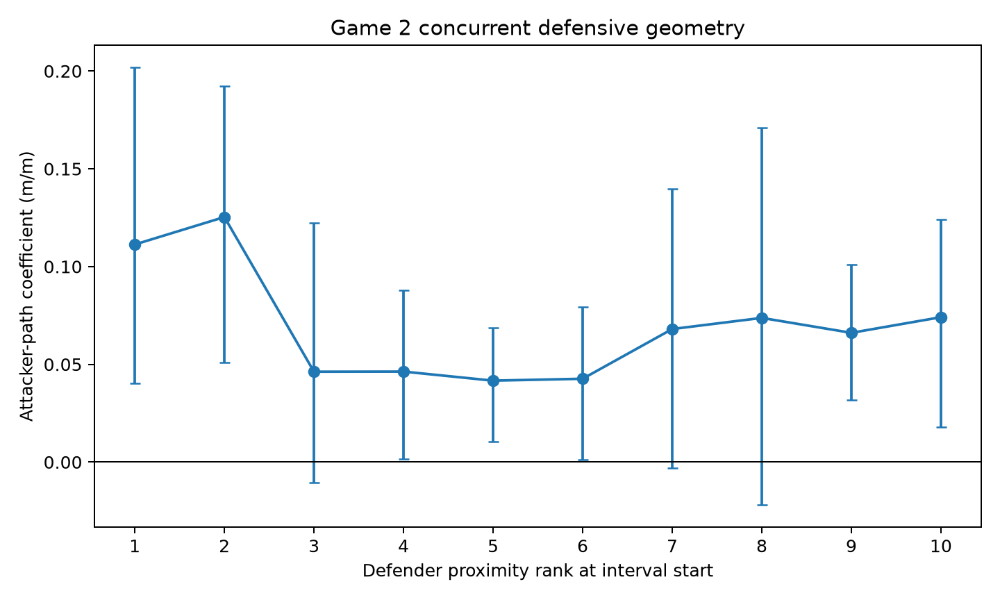

# Concurrent Attacker–Defensive Geometry v1 — Game 2 Heldout Replication

**Status:** **GAME 2 CONCURRENT GEOMETRY REPLICATION SUPPORTED**

**Execution:** Tier 3 heldout replication; frozen before any Game 2 concurrent-geometry result

All six authoritative protocol, configuration, replication, ledger, and closed Game 1 identities matched before execution. Game 3, IDSSE, opportunity redistribution, and pooling were not accessed.

## Sample and temporal support

The period-origin four-second grid retained 1,182 attacker-anchor observations at 125 distinct period/time anchors, producing 11,820 complete D1–D10 defender rows. Away attacked in 420 observations and Home in 762; period counts were 898 and 284. Simultaneous attackers had median 10, IQR 9–10, and range 7–10. Every observation contained ten unique defending outfield players exactly once, with Home11 and Away25 excluded as goalkeepers.

The exact inherited endpoint convention retained positions at $t-2$, $t$, and $t+2$. Prior paths used increments ending in $(t-2,t]$ and concurrent paths used increments ending in $(t,t+2]$; the intervals shared the position at $t$ but no increment. Seven-frame centered smoothing, 25 Hz support, no interpolation, start-fixed ranks, deterministic canonical-ID tie handling, and the closed Stage A support registry were unchanged.

Exclusions were 6,025 attacker-support failures, 8,123 incomplete-ten-defender cases, and 1,711 restart/ball-out spans. These categories overlap the grid through attacker-specific candidate rows and are retained in the governed ledger.

Concurrent attacker path had median 2.800 m, IQR 1.914–4.420 m, and range 0–15.230 m. Prior attacker path had median 2.809 m, IQR 1.884–4.704 m, and range 0–15.121 m.

## Rank distances

| Rank | Median (m) | IQR (m) | p10–p90 (m) |
|---|---:|---:|---:|
| D1 | 5.950 | 3.818–9.045 | 2.150–12.476 |
| D2 | 10.899 | 7.921–15.103 | 5.872–18.643 |
| D3 | 14.854 | 11.189–19.676 | 8.899–24.105 |
| D4 | 17.919 | 13.756–23.233 | 11.018–27.402 |
| D5 | 21.080 | 16.385–26.219 | 13.313–30.648 |
| D6 | 24.273 | 19.148–29.606 | 15.909–34.206 |
| D7 | 27.184 | 22.223–32.624 | 18.301–36.976 |
| D8 | 30.505 | 25.088–35.923 | 20.449–39.859 |
| D9 | 34.056 | 27.628–39.522 | 23.052–43.890 |
| D10 | 37.763 | 31.365–43.594 | 25.764–48.945 |

Adjacent distributions overlap; proximity ranks are ordered memberships, not isolated distance bands.

## Primary focal-relative movement

| Rank/region | Coefficient (m/m) | Frozen 95% interval |
|---|---:|---:|
| D1 | 0.11129 | [0.04028, 0.20191] |
| D2 | 0.12532 | [0.05093, 0.19245] |
| D3 | 0.04623 | [-0.01044, 0.12248] |
| D4 | 0.04629 | [0.00167, 0.08797] |
| D5 | 0.04164 | [0.01032, 0.06863] |
| D6 | 0.04262 | [0.00131, 0.07942] |
| D7 | 0.06805 | [-0.00321, 0.13990] |
| D8 | 0.07374 | [-0.02194, 0.17111] |
| D9 | 0.06610 | [0.03190, 0.10108] |
| D10 | 0.07411 | [0.01775, 0.12402] |
| Near D1–D3 | 0.09428 | [0.05677, 0.13585] |
| Middle D4–D7 | 0.04965 | [0.01860, 0.07632] |
| Far D8–D10, descriptive | 0.07132 | [0.02968, 0.10827] |
| **Near minus middle** | **0.04463** | **[0.02151, 0.07848]** |

All 2,000 bootstrap replicates were valid. The sole primary contrast was positive and its interval was strictly above zero.

The figure displays the governed primary rank coefficients and intervals. It is heldout geometric-association evidence, not a tactical-response or causal visualization.

## Frozen robustness and secondary deformation

The inherited 12.198443079831405 m trim excluded 4 anchors (0.3384%). The trimmed primary contrast was 0.04359 [0.01146, 0.08603], retaining 97.67% of the full magnitude and its positive sign.

For endpoint RMS deformation, near was 0.09151 [0.05246, 0.13814], middle 0.05405 [0.02119, 0.08907], and descriptive far 0.08080 [0.04151, 0.11390]. Near minus middle was 0.03746 [0.02325, 0.05493], classified separately as **SUPPORTIVE**. It did not determine the primary status.

Directional quantities remained descriptive. Median attacker-axis-parallel focal-relative displacement was +0.266 m at D1 and declined unevenly to -0.369 m at D10. Twenty-eight attacker anchors had an undefined attacker axis under the frozen numerical rule. Orthogonal and radial summaries remain machine-readable without inferential or tactical status.

## Frozen decision and comparison after closure

Every prospective primary criterion passed: valid execution and construct QC, positive near-minus-middle point estimate, interval strictly above zero, positive trimmed estimate, at least 50% retained magnitude, and no construct-validity failure. The exact heldout status is therefore:

> **GAME 2 CONCURRENT GEOMETRY REPLICATION SUPPORTED**

Only after the Game 2 outputs were serialized, hashed, and reproduced byte-for-byte was comparison with Game 1 made. Game 1 and Game 2 both had a positive primary contrast with intervals above zero, positive robust trimmed contrasts, supportive secondary deformation, and nonmonotonic rank curves. Game 1's near elevation was especially D1-heavy; Game 2 had elevated D1 and D2. Far exceeded middle descriptively in both matches.

Strongest permitted statement:

> Across the two Metrica sample matches, greater attacker movement within fixed two-second intervals was associated with a stronger concurrent focal-relative defender-movement coefficient among near than middle defender ranks after conditioning on the prospectively specified pre-interval movement context.

This remains observational, within-provider evidence. Common pre-context activity was included, but the design does not eliminate all concurrent common-motion confounding. It does not establish causation, reaction, latency, influence, attention, responsibility, assignment, marking, tracking, pinning, dragging, covering, handoff, defensive error, space or opportunity creation, tactical success, player quality, gravity, or attacking value.

## Reproduction

The independent Tier-3 rerun reproduced all 10 governed machine-readable artifacts byte-for-byte. All primary, secondary, and trimmed bootstrap families completed 2,000/2,000 valid replicates. The full hash ledger and observation-level governed sample are retained with the result.
