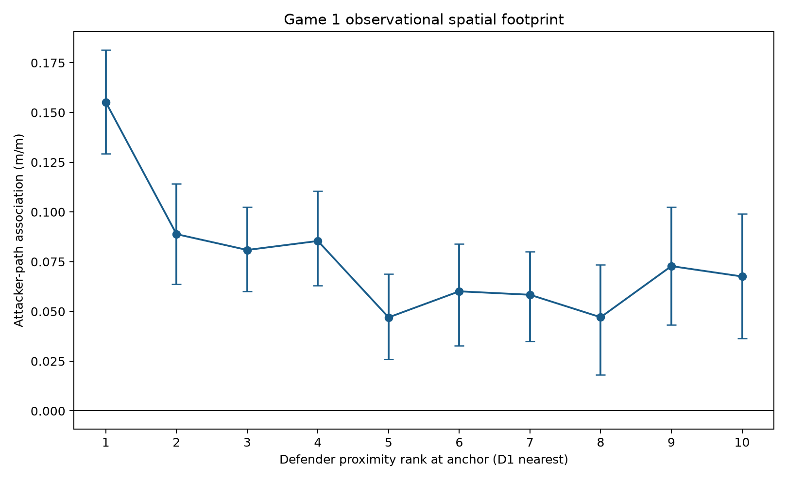
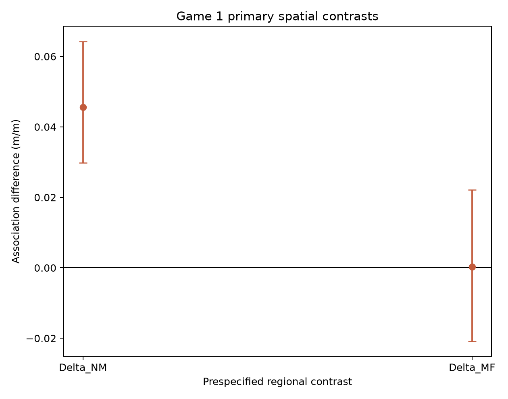
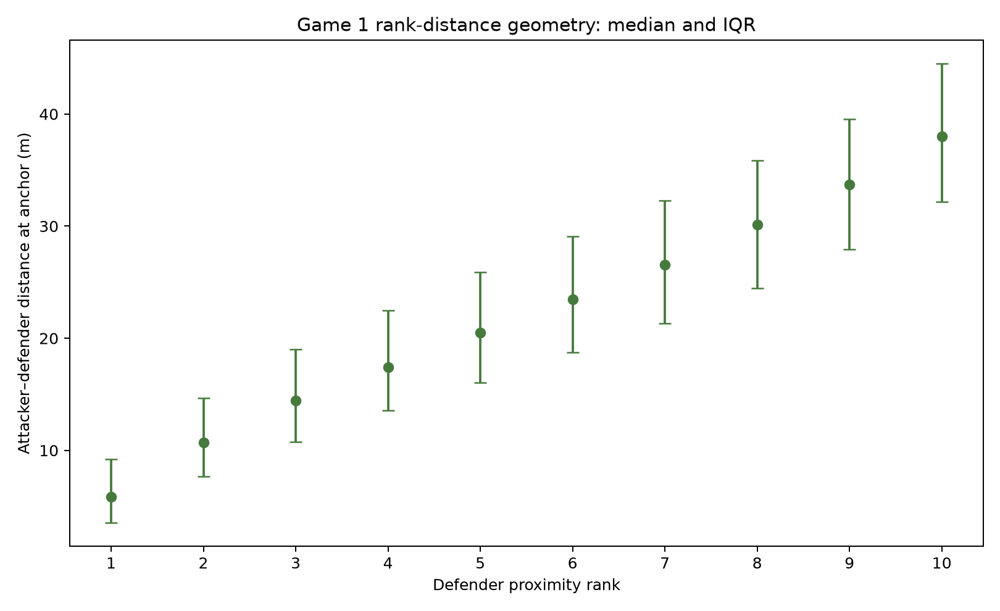
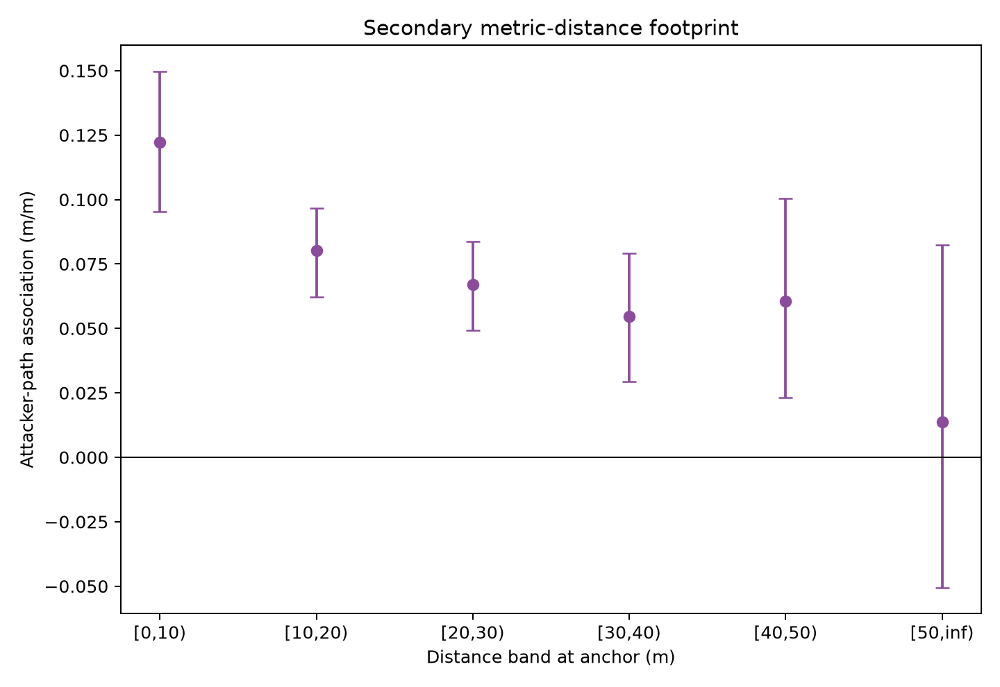

# Spatial Defensive-Response Footprint v1 — Game 1 Development Result

**Status:** **GAME 1 FOOTPRINT DEVELOPMENT COHERENT**

**Scope:** first governed execution of the [frozen protocol](../protocols/spatial_defensive_response_footprint_v1.md) on Metrica Sample Game 1 only. Game 2 remains unobserved for this relationship; Game 3 was not accessed. This is not a Final Footprint A/B/C classification.

## Result in one paragraph

The prospectively fixed D1–D10 footprint was valid and reproducible. The association between preceding attacker path and subsequent defender-relative path was strongest for the nearest region D1–D3: $N=0.10831$ m/m, versus $M=0.06272$ for D4–D7 and $F=0.06247$ for D8–D10. The new near-minus-middle contrast was $\Delta_{NM}=0.04559$ with its frozen 97.5% block-bootstrap interval [0.02979, 0.06428]; it passed trimming and 1/4-second horizon robustness. Middle-minus-far was effectively null: $\Delta_{MF}=0.00025$, interval [-0.02084, 0.02216]. The shape is therefore stepped and non-monotonic rather than a smooth rank-by-rank decline. This is a Game 1 observational spatial-association result, not evidence of assignment, tactical responsibility, or causation.

## Governed model

For each eligible attacker-anchor $i$ and fixed defender rank $k$:

$$
Y_{ik}=\sum_{r=1}^{10}I(k=r)
\left(\alpha_r+\beta_rX_i+\gamma_rB_{ik}+\eta_rC_i\right)+\varepsilon_{ik}.
$$

$X_i$ is attacker path on $[t-2,t]$; $Y_{ik}$ is the rank-$k$ defender's focal-relative path on $[t,t+2]$; $B_{ik}$ is that defender's focal-relative path on $[t-4,t-2]$; and $C_i$ is defending-outfield-centroid path on $[t-4,t-2]$. Each defender is referenced to the other nine defending outfield players. Rank is fixed by attacker distance at $t$ with canonical-player-key tie-breaking.

## Sample

- 7,823 eligible attacker-anchor observations at 804 unique anchor times.
- 78,230 complete defender rows; every anchor contains D1–D10 exactly once.
- Period 1: 5,936 observations; period 2: 1,887.
- Home attacking: 4,483; Away attacking: 3,340.
- Simultaneous-attacker multiplicity: median 10, IQR 1, range 8–10.
- Four-second sensitivity: 7,328 complete anchors.

The inherited exclusion ledger records 4,198 unavailable attacker exposures, 8 unavailable full attacker-support cases, 3,974 incomplete ten-defender cases, 8 no-possession endpoints, and 2,717 restart/ball-out-span cases. These categories apply at different candidate units and should not be summed as a single-anchor attrition denominator.

## Rank footprint

| Rank | $\beta_k$ (m/m) | 95% interval |
|---|---:|---:|
| D1 | 0.15518 | [0.12934, 0.18153] |
| D2 | 0.08885 | [0.06373, 0.11416] |
| D3 | 0.08089 | [0.05998, 0.10254] |
| D4 | 0.08541 | [0.06288, 0.11045] |
| D5 | 0.04700 | [0.02584, 0.06893] |
| D6 | 0.06010 | [0.03284, 0.08398] |
| D7 | 0.05837 | [0.03490, 0.08017] |
| D8 | 0.04707 | [0.01807, 0.07349] |
| D9 | 0.07278 | [0.04317, 0.10242] |
| D10 | 0.06757 | [0.03653, 0.09913] |

The point pattern is not monotonic. D1 is highest; D2–D4 are similar; D5–D10 vary around a lower level with an uptick at D9–D10. No adjacent-rank significance claim is made.

## New classifying contrasts

| Estimand | Estimate | Frozen 97.5% interval | Valid replicates | Excludes zero |
|---|---:|---:|---:|---:|
| $N$, D1–D3 | 0.10831 | [0.08570, 0.13059] | 2,000 | descriptive |
| $M$, D4–D7 | 0.06272 | [0.04241, 0.08180] | 2,000 | descriptive |
| $F$, D8–D10 | 0.06247 | [0.03487, 0.08804] | 2,000 | descriptive |
| $\Delta_{NM}$ | **0.04559** | **[0.02979, 0.06428]** | 2,000 | **PASS** |
| $\Delta_{MF}$ | 0.00025 | [-0.02084, 0.02216] | 2,000 | FAIL |

Only $\Delta_{NM}$ qualifies. The protocol requires at least one, not both, and does not require monotonicity.

## Rank-distance geometry

| Rank | Median (m) | IQR (m) | p10–p90 (m) | Overlap with next rank |
|---|---:|---:|---:|---:|
| D1 | 5.87 | 5.72 | 1.96–13.10 | 0.604 |
| D2 | 10.67 | 7.01 | 5.41–18.83 | 0.740 |
| D3 | 14.43 | 8.26 | 8.13–23.72 | 0.807 |
| D4 | 17.42 | 8.93 | 10.64–27.13 | 0.824 |
| D5 | 20.50 | 9.85 | 12.94–30.51 | 0.848 |
| D6 | 23.45 | 10.33 | 15.27–33.76 | 0.852 |
| D7 | 26.57 | 10.98 | 17.46–37.03 | 0.840 |
| D8 | 30.14 | 11.36 | 20.48–40.61 | 0.835 |
| D9 | 33.72 | 11.60 | 23.40–44.71 | 0.806 |
| D10 | 38.03 | 12.37 | 27.20–50.08 | — |

The substantial adjacent-rank distribution overlap confirms that relative rank and absolute distance are related but not interchangeable.

## Secondary metric-distance complement

| Anchor distance | Defender rows | Anchors represented | Coefficient | 95% interval |
|---|---:|---:|---:|---:|
| [0,10) m | 12,214 | 6,172 | 0.12213 | [0.09526, 0.14979] |
| [10,20) m | 22,663 | 7,445 | 0.08018 | [0.06207, 0.09677] |
| [20,30) m | 21,936 | 7,504 | 0.06690 | [0.04937, 0.08363] |
| [30,40) m | 14,851 | 6,202 | 0.05470 | [0.02933, 0.07923] |
| [40,50) m | 5,480 | 3,074 | 0.06053 | [0.02328, 0.10036] |
| [50,∞) m | 1,086 | 799 | 0.01371 | [-0.05053, 0.08251] |

All six fixed bands were estimable. This secondary pattern is broadly attenuated with distance but is neither constrained to be monotonic nor permitted to classify development status.

## Frozen controls and robustness

### Temporal placebo

The reverse-time placebo regional estimates were $N=0.06037$, $M=0.04362$, and $F=0.03423$. Its contrasts were $\Delta_{NM}=0.01675$, interval [0.00494, 0.02869], and $\Delta_{MF}=0.00939$, interval [-0.00700, 0.02638]. The paired primary-minus-placebo $\Delta_{NM}$ difference was 0.02884, interval [0.01213, 0.04611]; the corresponding $\Delta_{MF}$ difference was -0.00914, interval [-0.02578, 0.00742]. The placebo is diagnostic and nonclassifying under the frozen protocol.

### Inherited near/far consistency

The exact closed-bridge local and farthest-three coefficients reconstructed as 0.0959574524304469 and 0.06178225235033675. Both equal their governed values exactly; the reconstructed local-minus-far difference is 0.03417520008011015, also exactly equal to the governed construction. The maximum absolute difference was 0 against the $10^{-12}$ tolerance. This passes pipeline consistency but is not new footprint evidence.

### Extreme exposure

The inherited threshold was exactly 12.198443079831405 m. It excluded 79/7,823 anchors (1.0098%), leaving 7,744. For the qualifying $\Delta_{NM}$, the trimmed estimate was 0.03840, interval [0.02143, 0.05860], retained the positive sign, and retained 84.23% of the full magnitude: **PASS**.

### Response horizons

| Contrast | 1 s | 2 s primary | 4 s | Frozen sign rule |
|---|---:|---:|---:|---:|
| $\Delta_{NM}$ | 0.02731 | 0.04559 | 0.06190 | PASS |
| $\Delta_{MF}$ | -0.00079 | 0.00025 | 0.01210 | PASS |

The cumulative path scale increases with window length; this is not interpreted as persistence.

## Validity and reproduction

All **28/28 frozen hard checks passed**. Every governed bootstrap quantity had 2,000/2,000 finite replicates. Checks covered frozen hashes, complete rank membership, goalkeeper and duplicate exclusion, distance/tie ordering, focal exclusion, support and temporal ordering, grouped resampling, estimability, contrast identities, closed-bridge consistency, units, geometric invariances, prohibited labels, and deterministic reproduction.

An independent complete rerun reproduced all **24 governed pre-reproduction files byte-for-byte**. Machine-readable results and hashes are under `outputs/spatial_defensive_response_footprint_game1_v1/`.

## Supported and unsupported claims

**Strongest permitted Game 1 claim:**

> In Metrica Sample Game 1, the association between preceding attacker movement and subsequent defender-relative movement was stronger across the three nearest defender ranks than across the four middle ranks under the frozen observational footprint protocol.

This development result does not establish replication. Game 2 must execute unchanged before any Final Footprint classification.

It does not establish attacker causation or influence; attention; marking; assignment; tactical responsibility; pinning; dragging; tracking; covering; handoffs; space creation; tactical success or failure; attacker or defender quality; positional or functional play; fatigue; energy efficiency; gravity; off-ball value; general professional-football validity; or cross-provider bridge portability.
