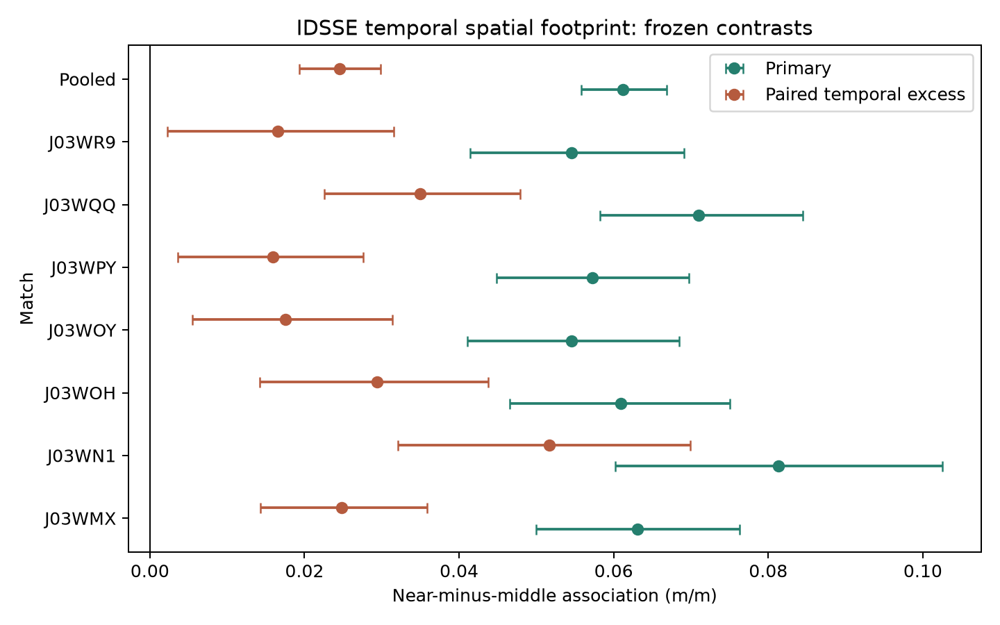

# Spatial Defensive-Response Footprint v1 — IDSSE External Replication

**Final status:** **IDSSE TEMPORAL FOOTPRINT EXTERNAL REPLICATION SUPPORTED**

The prospectively frozen temporal footprint was executed across the seven
governed IDSSE matches. Every match passed the all-match provider-equivalence
gate. The pooled near-minus-middle association and its paired excess over the
reverse-time control were both strictly positive, every match had positive
primary and paired-excess point estimates, and the frozen trim and horizon
conditions passed.

## Frozen design and provider gate

The execution retained the Metrica timing unchanged: strictly earlier context
`[t-4,t-2]`, attacker path `[t-2,t]`, and subsequent focal-relative defender
path `[t,t+2]`; ranks were fixed at `t`, with D1–D3 near and D4–D7 middle.
IDSSE's native 25 Hz cadence preserved the frozen centred seven-frame 0.28 s
support exactly; no smoothing, window, rank, or control was adapted.

The all-seven raw-to-Kloppy provider-equivalence comparisons had already been
closed and byte-hashed for the governed IDSSE concurrent-geometry execution.
This run verified that complete hash ledger and every match's prior passed
gate, then reconstructed its temporal-specific support, event/open-play
context, ranks, and path components from the identical native caches. This
execution-memory arrangement did not substitute a representation, relax a
tolerance, or modify the frozen scientific design. All seven checks passed:
raw time/frame, player/team/goalkeeper identity, coordinate/mask equivalence,
25 Hz cadence, event context, complete ranks, and finite derived components.

## Match-level results

| Match | Attacker anchors | Unique times | Near | Middle | Far (descriptive) | Primary near − middle [95% interval] | Placebo | Paired excess [95% interval] |
|---|---:|---:|---:|---:|---:|---:|---:|---:|
| J03WMX | 12,071 | 1,208 | 0.12627 | 0.06317 | 0.03484 | 0.06309 [0.04994, 0.07629] | 0.03825 | 0.02484 [0.01433, 0.03586] |
| J03WN1 | 4,791 | 523 | 0.13590 | 0.05456 | 0.05670 | 0.08134 [0.06018, 0.10254] | 0.02970 | 0.05164 [0.03206, 0.06995] |
| J03WOH | 10,975 | 1,098 | 0.12230 | 0.06137 | 0.05223 | 0.06093 [0.04655, 0.07500] | 0.03153 | 0.02940 [0.01424, 0.04379] |
| J03WOY | 11,238 | 1,124 | 0.10009 | 0.04557 | 0.03736 | 0.05452 [0.04105, 0.06844] | 0.03703 | 0.01749 [0.00554, 0.03140] |
| J03WPY | 12,171 | 1,218 | 0.13313 | 0.07586 | 0.04958 | 0.05727 [0.04483, 0.06969] | 0.04132 | 0.01595 [0.00356, 0.02760] |
| J03WQQ | 9,792 | 1,001 | 0.13578 | 0.06482 | 0.04495 | 0.07097 [0.05826, 0.08445] | 0.03599 | 0.03497 [0.02253, 0.04793] |
| J03WR9 | 11,278 | 1,128 | 0.11515 | 0.06061 | 0.04697 | 0.05454 [0.04139, 0.06913] | 0.03803 | 0.01651 [0.00222, 0.03159] |

The primary and paired-excess signs were positive in **7/7** matches. Individual
match intervals are transparent descriptive evidence; they were not separate
significance gates.

## Pooled precision summary

The observation-weighted pooled model used 72,316 attacker-anchor observations,
7,300 unique match/period/time anchors, and 723,160 defender rows.

| Rank | Coefficient (m/m) | 95% interval |
|---|---:|---:|
| D1 | 0.16786 | [0.15665, 0.17899] |
| D2 | 0.11106 | [0.10201, 0.11969] |
| D3 | 0.08866 | [0.07981, 0.09762] |
| D4 | 0.07386 | [0.06522, 0.08244] |
| D5 | 0.06498 | [0.05688, 0.07294] |
| D6 | 0.05375 | [0.04642, 0.06128] |
| D7 | 0.05289 | [0.04477, 0.06041] |
| D8 | 0.04886 | [0.04070, 0.05664] |
| D9 | 0.04150 | [0.03274, 0.04977] |
| D10 | 0.04432 | [0.03453, 0.05382] |

Near was 0.12253, middle was 0.06137, and descriptive far was 0.04489. The
pooled primary near-minus-middle estimate was **0.06115 m/m [0.05579,
0.06681]**. The reverse-time placebo was 0.03661 [0.03224, 0.04111], so the
prospectively paired primary-minus-placebo excess was **0.02455 [0.01932,
0.02985]**.

## Frozen robustness

The transported trim excluded 836 anchors and retained 95.35% of the primary
magnitude: 0.05831 [0.05301, 0.06395]. The primary near-minus-middle signs
were positive at each frozen horizon: 0.03536 at 1 s, 0.06115 at 2 s, and
0.09549 at 4 s. All 2,000/2,000 bootstrap replicates were valid for every
governed family and match.

## Exact status evaluation

| Frozen condition | Result |
|---|---|
| Valid equivalence, support, rank, solver, bootstrap, and reproduction | PASS |
| Pooled primary positive with interval strictly above zero | PASS |
| At least 5/7 positive primary estimates | PASS: 7/7 |
| Pooled paired excess positive with interval strictly above zero | PASS |
| At least 5/7 positive paired-excess estimates | PASS: 7/7 |
| Positive trim retaining at least half the magnitude | PASS: 95.35% |
| 1 s and 4 s not both opposite to the 2 s sign | PASS |

The exact frozen result is therefore **IDSSE TEMPORAL FOOTPRINT EXTERNAL
REPLICATION SUPPORTED**.

## Interpretation boundary

**Strongest permitted claim:**

> Across two Metrica sample matches and an independent seven-match IDSSE
> dataset, greater observed attacker movement in a fixed preceding interval was
> associated with greater subsequent defender-relative movement among near than
> middle defender ranks under the frozen observational design.

In plain football language: in the fixed two seconds after an attacker had
moved, the nearby defenders tended to move differently from the rest of their
defensive unit more strongly than the middle-ranked defenders did. This is an
observational, time-ordered geometric association—not proof that the attacker
caused a reaction or that it was tactically useful.

All pooled rank coefficients and the reverse-time control were positive. The
paired comparison is therefore important: it supports a larger correctly
ordered contrast, not absence of unrelated temporal structure. The stepped
rank profile is not a monotonic distance law. Seven matches are one independent
provider environment, not seven providers. The result does not establish
causation, reaction time, attention, marking, assignment, responsibility,
pinning, dragging, tracking, covering, handoffs, space creation, tactical
success, gravity, or off-ball value.

## Reproducibility and provenance

All seven match reconstructions and the primary fit were independently rebuilt
in a separate ignored provider-data location. The seven governed compact
outputs reproduced byte-for-byte. Frozen protocol, configuration,
provider-equivalence note, and hash-ledger SHA-256 values remained respectively
`0336ad…97db1`, `a3d5ea…7dbe2`, `57e823…69d1`, and `260502…939e4`.

The result-hash ledger is
[`outputs/spatial_defensive_response_footprint_idsse_v1/final_hashes.json`](../../outputs/spatial_defensive_response_footprint_idsse_v1/final_hashes.json).
Provider-derived observation rows and temporary staging are intentionally
ignored and not published. Metrica Sample Game 3 was not accessed.
